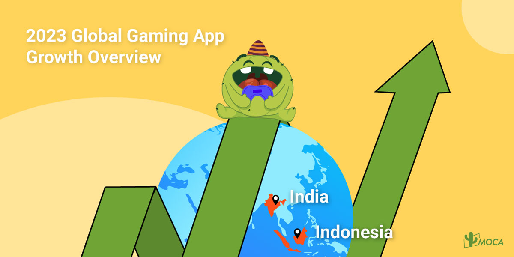
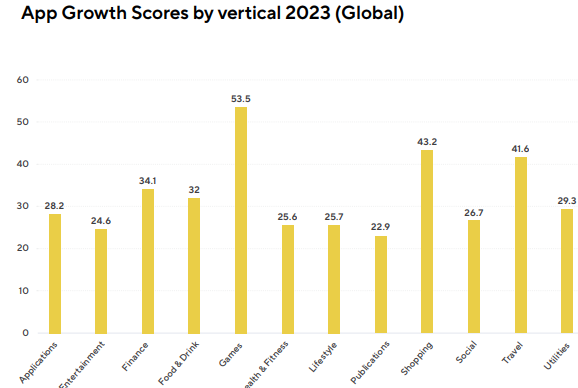
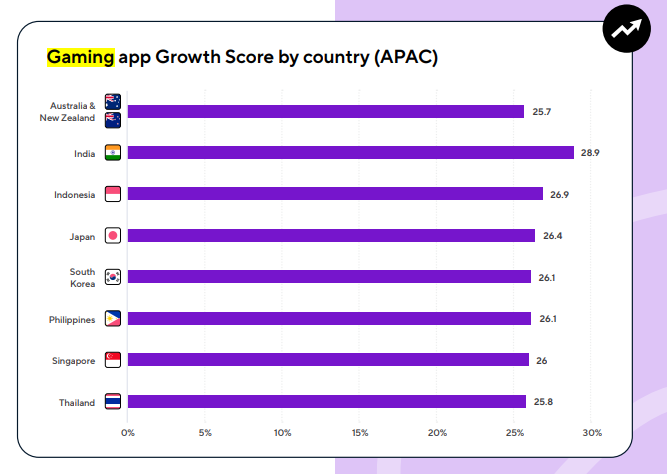
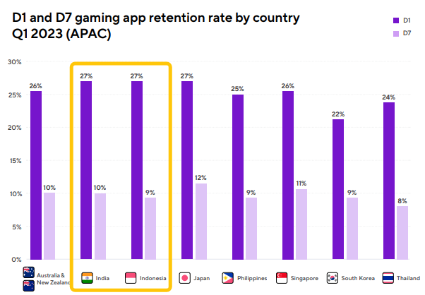

In 2023, the global mobile gaming industry is experiencing a remarkable resurgence. Mobile games consumer spending from the first half of 2023 are reported to have hit a massive $41.0 billion, and game downloads skyrocketed to 30.4 billion, according to latest The mobile app growth report by Adjust.

[Mobile gaming](/news/the-impact-of-ipl-on-india-advertising-and-gaming) is thriving in the APAC region. The number of mobile gamers is expected to soar to 1.37 billion by 2027. In India, the number of mobile gamers skyrocketed to over 193 million in 2022, and is expected to hit 209 million by the end of 2023. The boost is largely attributed to the increasing availability of affordable smartphones and mobile data plans.

In terms of revenue, India is projected to generate $390 million revenue by 2023. This makes India one of the best spaces to launch a mobile gaming UA campaign. Indonesia, as the third largest mobile gaming market, generated 3.4 billion downloads on Google Play in 2022, with esports growing at the fastest space.

Moreover, India and Indonesia game users have high engagement with 27% retention rate in D1 and 10% and 9% on D7, respectively.

In Latin America, over half of its population (54%) are mobile users and spend 18x more time in apps than on websites. Mobile gaming generated $2.24 billion revenue in 2022 and expected to surpass $3.40 billion by 2026.

MENA experienced significant growth in 2022. The app store spending was increasing by 10.3% year-on-year to $3.1 billion. Saudi Arabia is a major player for games category over 21 million mobile gamers. Almost 60% of users spend money on mobile games, generating $1.8 billion of revenue in 2022, which accounts for approximately 45% of total MENA games revenue. Of those, casual gamers is anticipated to generate $176 million by 2023.

For more insights, contact MOCA at business@moca-tech.net.
