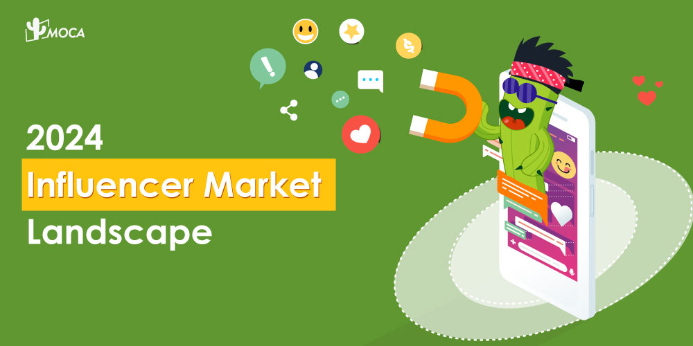
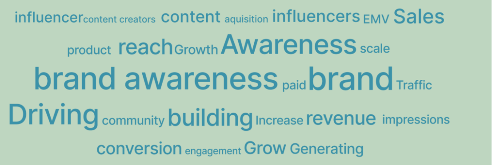
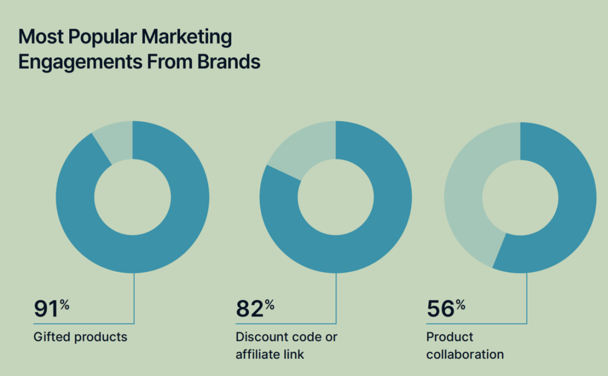
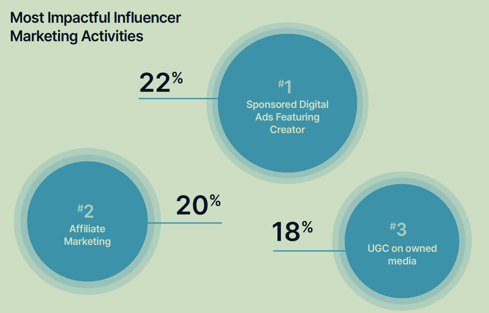
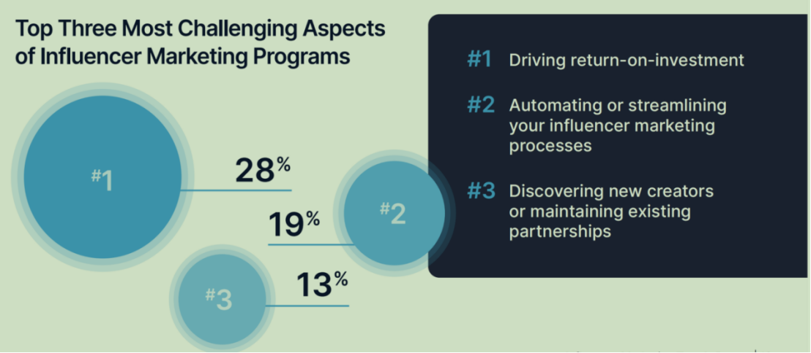

The global influencer marketing market size has more than tripled since 2019. In 2024, the market was estimated to reach a record of $24 billion, according to Influencer Marketing Trends Report by CreatorIQ.

In terms of categories, FMCG is the top sector in leveraging influencer marketing in India, accounting for 18.5% of the total industry involvement. It is followed by the banking, financial services, and insurance sector at 16.6%, and automobiles at 15.9%, as per Dentsu India.

**Part 1: Influencer market s****pend**

Regarding spending, 54% respondents said they allocated up to 25% of their marketing budget toward influencer marketing, and 21% said they spent more than 50% of the total marketing budget on influencer marketing.

55% of organizations reported an increase in influencer marketing investment year-over-year, with one in four brands investing $1million or more, including 16% said they significantly increased the investment.

In terms of team size, 33% of respondents claimed more than six dedicated influencer marketing personnel, while 47% reported that the number of team members focusing on influencer marketing has grown YoY.

**Part 2:  How Influence marketing Strategy Works**

The majority of brand respondents (51%) selected developing an [influencer marketing](/news/indonesias-influencer-marketing-boom-19b-in-2023-projected-30b-by-2027) strategy that drives performance, and conversion was the most selected performance metric, feedback by 26% of brand respondents. However, “brand awareness” is the top priority over “conversion”, as three times marketers set “brand awareness” as their top priority than “conversion”.

As the influencer marketing space has emerged as a favoured component of brand promotion, consumers rely on influencers’ perspectives for their purchasing decisions.

According to a report released by Dentsu India and Boomlet Group,  21% respondent said that they are “extremely likely” to purchase a product or service promoted by influencers, while 31% said that they are “very likely” and 26% said that they are “somewhat likely” to do so.

**Part** **3****:** **How** **Influencer marketing** **driv****es** **ROI**

66% of brand respondents reported that digital ads with influencer promotion drove more ROI than traditional digital advertising (without influencers) over the past year. 22% of brand marketers identified sponsored digital ads featuring influencers as the most impactful marketing strategy, edging out other creator driven strategies like affiliate marketing and user-generated content.

This marks a change from last year, when 33% of brand respondents chose gifting/seeding as the most effective marketing strategy. Gifted products leads with 91%, followed by discount code or affiliate link with 82%, and product collaboration with 52%.

**Part 4: How influencer marketing Is Tracked**

In terms of influencer marketing performance tracking, 48% of brands said influencer marketing tool is the most effective method for tracking influencer marketing performance, outpacing methods like website traffic analytics or search performance, tracking sales, and affiliate links or promo codes.

Want to know how to maximize your influencer marketing performance? Contact MOCA at business@moca-tech.net.
