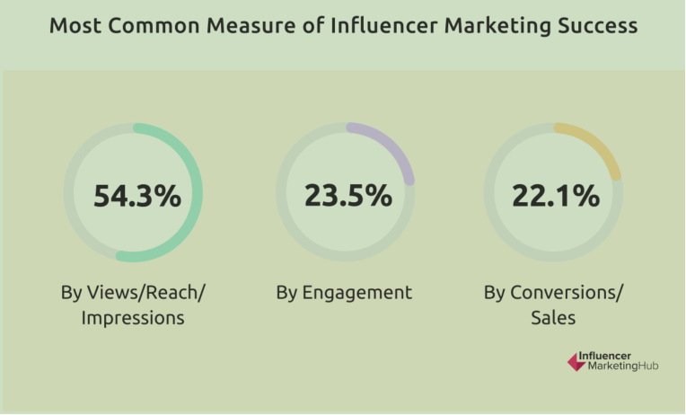
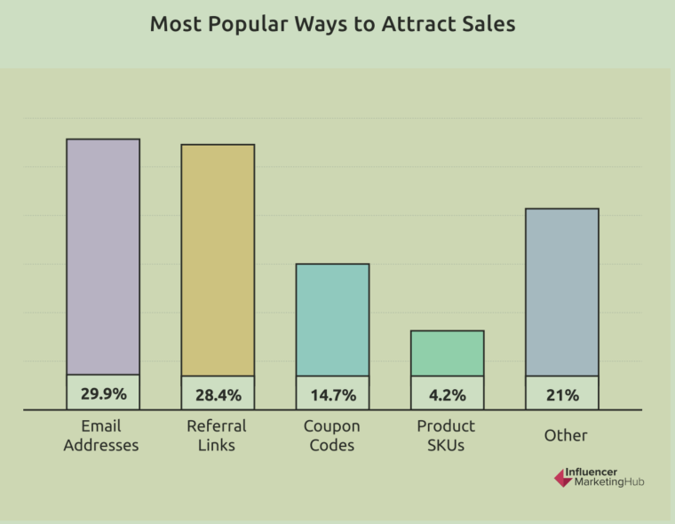
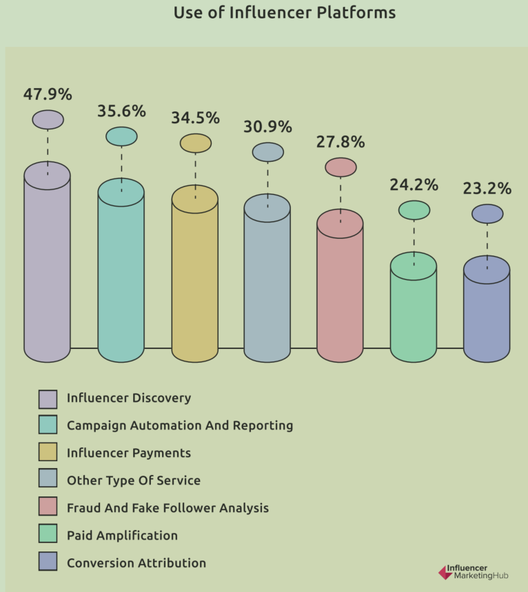

Influencers marketing has become a potent strategy to drive business growth, offering marketers opportunities to expand their user reach and discover untapped customers. Integrating influencers into a brand’s marketing approach has evolved into a pivotal strategy.

**Discover five key insights about influencer marketing in 2024.**

**Influencer Marketing Contributes High-Quality Consumers**

Today, increasing digital advertisers are optimistic about influencer marketing performance. A striking 83.8% stated that the quality of customers acquired through influencer marketing is better than that of other marketing channels. This put increasing brands take influential marketing as an important channel into their marketing. About 85.8% respondents said they would allocate budget for influencer marketing in 2024 and 60% said they would increase the budget, according to Influencer Marketing Hub.

In fact, 49% of consumers depend on influencer recommendations, according to Digital Marketing Institute. Furthermore, 69% of consumers trust what influencers say and recommend.

**Performance Tracking Is Prioritized**

Brands are increasingly paying attention to the importance of tracking influencer marketing performance. Approximately 80% of brands reported tracking sales generated from influencer campaigns while in 2023, the number was just 74%. A similar number of brands (70%) also measure the ROI from their influencer campaigns.

However, the most common measure of influencer marketing success is views/reach/impressions. 54.3% respondents stated that views/reach/impressions is the bench mark used to assess influencer marketing success，while 23.5% measured by engagement or clicks, and 22.1% by conversation/sales.

In terms of tracking methods, email addresses is the most popular way to attract sales, with 29.9% preferred, followed by referral link with 28.4%, and coupon codes with 14.7%.

**Half Influencer Campaigns Run Monthly Basis**

Nearly 50% respondents said they run influencer campaigns on a monthly basis, while another 15% respondents opt for quarterly campaigns, and only 14.4% run annual campaigns. Interestingly, 21.5% respondents reserve influencer campaigns for new product launches.

**More Brands Explore New Influencer Partnerships**

Normally, brands prefer to build relationships with existing influencers or influencers they know rather than go through the entire influencer selection process every time they run a campaign. Well, this year, a significant shift has been observed, with 63.2% of brands opting for different influencers compared to the previous year, indicating a growing inclination towards diversification in influencer collaborations to enhance campaign effectiveness.

**Most Brands Use 3rd Party Influencer Marketing Platforms**

The key to successful influencer marketing is precisely matching brand with influencers whose fans closely mirrors their target customers, and whose values align with those of the brand.

Almost 60% of respondents are leveraging third-party platforms for influencer discovery and campaign management. The most popular use of the platforms is for influencer discovery and communication. Other popular use of the influencer marketing platforms including campaign automation and reporting at 35.6%, fraud and fake followers analysis at 27.8%, paid amplification at 24.2%, and conversion attribution at 23.2%.

Moreover, AI-Powered influencer marketing platforms gains popularity. According to the survey, 63% of respondents expressed their intention to leverage AI for identifying influencers and creating impactful campaigns.

Want to know more how MOCA AI-powered [influencer marketing](/news/2024-influencer-market-landscape) platform help you stand out in the evolving influencer market landscape? Contact MOCA at business@moca-tech.net.
