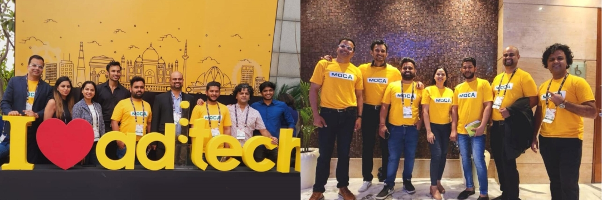

On March 15th, 2023, in New Delhi, the MOCA team is honored to attend the Ad:tech event, one of the top events in the digital advertising industry.

This was the 11th Ad:tech event held in New Delhi with the theme “Driving Business Growth,” focusing on improving customer journeys and efficiency while preparing for economic issues, rising tech expenses, CAC, data privacy, and data security concerns.

It brought together all industry experts, including prominent brands, agencies, app developers, ad networks, affiliates, service providers, and all other professionals from around the world.

### **4 Key Topic From Ad:tech**

-   Driving Stronger Performance with focus areas on the rise of platforms, exchanges, and marketplaces by notable brands.

-   Tackling the common challenges of attribution and enhancing the power of personalization to overcome the challenges of a connected digital experience.
-   Talking about the human side of marketing, and addresses a range of topics, including persuading a billion faces with a million tongues, creating moments, human values driving trends, marketing to and with communities and fans, and more.
-   Exploring how retail organizations and retail media are evolving and what the best trends are in e-commerce, CAC, etc.

In the event, the MOCA team took the chance to meet lots of friends and partners, and talked about business opportunities in branding, social, e-commerce marketing, CTV solution, user acquisition, etc.

As an OEM consolidator and innovative ad agency, MOCA works with variable top premium media partners. The objective of MOCA is to help advertisers find the new tech opportunities and new media in a fast-growing market to take advantage of the traffic bonus in the first place in order to reach potential audiences cost-effectively in a proper scenario.

Email to [business@moca-tech.net](mailto:business@moca-tech.net) or connect with us on LinkedIn [@MOCA-TECH](http://@MOCA-TECH "@MOCA-TECH") for more details
