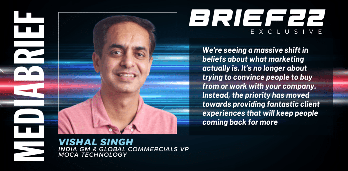
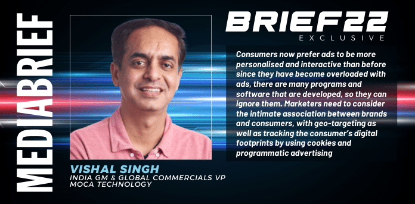

### ***Vishal Singh, India GM & Global Commercials VP, MOCA Technology, writes on the invitation and exclusively for*** ***our special series BRIEF22,*** ***where industry stalwarts, thought leaders, industry captains, business heads, brand custodians and other C-suite heads share their learnings from 2021, and guidance and inspiration for the year ahead.***

#### ***Looking Back***

The covid-19 pandemic has been a global disaster like no other and the last few months, since the first lockdown in March 2020 have seen economic activity disrupted like nothing else. Marketing plays a key role in stimulating demand for goods and services, many of whose value chains had been severely disrupted.

While the pandemic decimated the economy, the job market, and consumer confidence, it seems to have done little to quash a bonanza in digital ad spending which was caused by the stunning increase in traffic in online business.

Businesses responded to the increased traffic in online businesses by investing more than would otherwise have been justifiable. This includes brand advertising to promote e-commerce platforms, performance advertising to direct traffic to them, OEM advertising, and advertising within these platforms (‘retailer media advertising’) to promote specific products, all of which have surged.

Many local Indian marketers wanted to direct traffic from international publishers, as about 90% of apps in India are from app developers from outside of India, especially the top 10 apps.

Indian advertisers also wanted to expand to other markets. As Moca works with global top publishers, we have a strong inventory in the South East Asian market, therefore, we could help Indian local advertisers in acquiring new users from other geographies easily and cost-effectively.

Moca’s solutions cover multiple user touchpoints – from social, sticker, keyboard, music, beauty, game, weather, scenario, SMS to air-preinstall, OEM Appstore, and re-engagement which helped advertisers to customise an innovative and contextual advertising solution and make their brand top of mind to the potential audience.

Digital advertising has therefore been stronger in the second half of this year than previously expected.

The pandemic accelerated trends in 2021 that were already fundamentally reshaping the economy, and will continue to do so in 2022.

2021 was definitely the most challenging year across every industry globally. The year tested our resolve, commitment, and solidarity. Our goal was to compete with out former self and be better every year and help all our partners to get better along and we surely have achieved all our goals and have done better than expected.

The pandemic forced OEMs to rely on digital communications, which caused many manufacturers to pay closer attention to their marketing and OEM advertising strategies. In a digital world, it’s more important than ever to effectively communicate your brand story through different digital mediums to engage existing and new customers.

Current times have made the world adopt digital equipment at a faster pace to sustain businesses in such unprecedented times. Total worldwide smartphone shipment grew 12% in Q2 2021. For brands, there was a great opportunity for utilising Original Equipment Manufacturer (OEMs) as they offered an extra amount of clean traffic to optimise app developers’ marketing plans.

Handset consumer behaviours suggest that 50~70% of users use OEM App Stores to download various apps because they provided easy ways for users to download apps without making any account registration and supports one click to download a pack of apps. That’s why OEM app-store marketing is the new trend among app developers.

In a time where the world was moving quickly towards smartphones and OEM Marketing, Moca took the initiative to help the marketers and provided the services to shorten the app uploading process, reduce the risk of rejection, control the cost and provided value-added services for branding on OEM traffic. It also helped advertisers to customise an innovative and contextual advertising solution and make their brand top of mind to the potential audience.

The agency has collaborated with global top publishers for branding advertising, and ensures ROI for performance campaigns with in-house ad platforms and anti-fraud tools. It has assisted brands to penetrate untapped markets in localising, branding, and innovating. Moca has been working directly with more than 500 brands across all categories for years, providing a customised shortcut for advertisers to be the top of mind name for their audience and has excelled in 2021 inspite of all the hurdles.

We will keep working on providing innovative and efficient marketing solutions to the market. We were more robust than before and more determined to continue marching forward from strength to strength which lead to several achievements along the way all because of the combined help of team Moca and all our partners.

### ***Brief22 – Looking Forward***

The pandemic had a tremendous impact on shaping our habits, and digital has become a new norm to do many things. Even when the pandemic is over, consumer habits will remain and 2022 will be the defining year for all organisations.

Marketing in 2022 is going to require business owners who are willing to take risks, invest in their branding, listen more intently than ever before when engaging with customers online or face failure as competition continues to grow at unprecedented rates.

Moreover, in 2022,The pandemic times have made the world adopt digital equipment at a faster pace to sustain businesses in such unprecedented times. Total worldwide smartphone shipment grew 12% in Q2 2021. For brands, there is a great opportunity for utilising Original Equipment Manufacturer (OEMs) as they offer an extra amount of clean traffic to optimise app developers’ marketing plans.

Handset consumer behaviours suggest that 50~70% of users use OEM App Stores to download various apps because they provide easy ways for users to download apps without making any account registration and supports one click to download a pack of apps. That’s why OEM app-store marketing is the new trend among app developers.

Among all the marketing trends for 2022, we are sure about certain things though.

1.  Digital marketing will become even more critical.
2.  OEM advertising will become more important.
3.  Direct-to-Consumer (D2C) marketing will take the lead.
4.  Brands will need to learn about their consumers without relying on second- or third-party data.
5.  Brands will need to look for new ways to connect to their younger audience
6.  Shoppable advertising will be next frontier for brands aiming to speed up the customer acquisition process from discovery to purchase
7.  Brands will need to send a tailored message through their advertising.

In 2022, we will see more and more data-driven marketing campaigns being used across a broader scope of industries. For instance, adding marketing automation to your digital marketing strategy will make it more efficient and effective since marketers will be able to automate their workflows and spend less time on repetitive tasks.

For marketers, it is important to keep up with this momentum to keep high exposure in all top entries reach and acquire a huge number of new users. OEM appstores could be the solution as they provide a fast and cost-effective solution that helps marketers to be able to acquire a greater number of new users at a fixed price in the short term without traffic overlap issues.

Nevertheless, marketers will be able to build consumer profiles and nurture them down the sales funnel. The “one size fits all” approach would stop in 2022, and it’s about time for marketers to look at segmenting different strategies, content, and sizes based on the audience you have.

Customers are becoming much more intelligent and savy as they’re exposed to the internet more and more. So if you want to remain the one they see whenever they search online for information about your product or service, you must track what they see online: article titles, links being shared from other websites, or social media posts about your brand that can help them in their decision-making process.

In short, it is important to keep up with this momentum to keep high exposure in all top entries to reach and acquire a huge number of new users. OEM App stores could be the solution as they provide a fast and cost-effective solution that helps marketers to be able to acquire a greater number of new users at a fixed price in the short term without traffic overlap issues.

However, for marketers, it could be much more complicated to deal with multiple OEMs with limited time and resources. Hence, Moca Technology presents as a consolidator to provide a one-stop portal, in which marketers could save their time and energy on the huge back and forth detailed issues of apps onboard on OEM App store. Thus, they can focus on media strategy, plan, data analysis, and creative design.

### ***Brief22 – Priorities, going ahead***

Advertisers and publishers are looking for ways to extend innovations to match consumers’ willingness to experiment with new experiences and products (now at an all-time high).

Companies are changing their approach to creating marketing collateral. That’s where the term *content selling* comes into the play. Marketing teams need to have a strategic approach to content creation and align content strategy with the customer journey. What is more, it becomes crucial to measure the impact of content marketing on sales which can be achieved by setting the right KPI’s for content marketing.

According to research by Digital Connections, 49% of people will disregard a brand if it bombards them with ads or if they perceive the advertising to be irrelevant; while 36% of respondents are more likely to buy from a brand that sends them tailored messages.This means, that the future of digital advertising is exposing users only to hyper-relevant ads and using precise targeting audiences.

At Moca, our vision is to be the most trusted and reliable partner for marketers/ advertisers in providing a one-stop solution, by improving efficiency and effectiveness in communications across all OEMs and Top publishing platforms. We endeavour to help them reach relevant target audiences and create a top-of-mind brand recall.

As Moca is one of the largest OEM consolidators across the globe and an advertising innovator, it is our earnest effort to help advertisers to make innovative formats and combinations for contextualised promotion, we are always committed to providing a customized shortcut for advertisers to be the next Unicorn.

Furthermore, we have a wide range of mobile marketing solutions, including user acquisition on OEM, branding solutions as we are partnered with global top-ranking apps in the Asia market such as Camera 360, CamScanner, Tiktok, WeTV, iQiyi, WPS, BeautyPlus, etc. We also have a re-engagement solution to nudge inactive users to engage with the app again, which is a super cost-effective way to help advertisers retain their users and keep a large, valuable and active user base.

In short, our purpose is to not only sell their inventory, but also help the marketers to analyse and exploit their value, and design advertising solutions to meet variable demand. Besides, we will give advertisers tech support to help publishers go for a shortcut on R&D and make their system meet IAB and other international standards.

### ***Advice for young professionals***

We’re seeing a massive shift in beliefs about what marketing actually *is*. It’s no longer about trying to convince people to buy from or work with your company. Instead, the priority has moved towards providing fantastic *c**lient experiences* that will keep people coming back for more. When you focus on building a positive business culture and providing great service, the marketing almost takes care of itself.

If you’re starting out on your career as a marketer, the first few years can be challenging, to say the least.

What do you prioritize? How do you stay on top of a rapidly evolving industry? Why are management’s decisions so baffling?

Here are some tips that would help the younger generation in their marketing career:

1\. Stop worrying about your “brand image”. If you deliver consistently excellent work, you’re emotionally mature and you’re of good character, your “brand” will take care of itself. But if you’re more concerned about image than substance, it will eventually catch up to you.

1.  Get to know your consumer well enough that you can be her advocate and guardian. Do right by her, and you’ll never go too far wrong.
2.  Stay Humble and be nice to your consumers and your department. Everyone plays a part in bringing the brand to life, and no one succeeds without help.
3.  Be clear in you conversation since it reflects your thinking and know when and how to best employ a meeting, a phone call and email.
4.  Marketing requires a unique blend of skills, and nobody is born with them all. If you feel deficient in a particular area, seek help — formal training, mentoring, tutoring or whatever you need. Don’t let pride inhibit your growth.
5.  Always stay updated and watch out for the current trends since the digital world is forever evolving and you don’t want to be left behind.
6.  Experimentation is key to balancing ‘shiny new syndrome’ with ‘missing the boat. After all, you don’t know unless you try! Not experimenting enough can lead you to miss the boat on some exciting new platforms.

### ***Brief22 – Learnings and realizations across 2021***

COVID-19 has made people spend a lot of their time at home. As people adjust to the ‘new normal’, they tend to implement new ways of working, entertaining themselves, socialising, and studying, which most of the time is online. We learned that many of them are willing to try new activities such as ordering food deliveries, online health consultation, even gardening, cooking, or baking through online mediums.

Most of them also spend much of their time on their mobile phones for listening to music, watching movies/ shows, playing games, searching for cooking tips or baking recipes, and many more which led to a significant growth in mobile phone users up to 5.27 billion and consumers today are spending approximately 7 hours on the Internet per day, more than twice the time they spend on TV.

Given these facts, marketers need to reshuffle their strategies to survive the post-COVID-19 era. To increase conversion and consumer acquisition, marketers now need to be more data-driven as to be able to customise the needs of different target consumers in various channels.

Consumers now prefer ads to be more personalised and interactive than before since they have become overloaded with ads, there are many programs and software that are developed, so they can ignore them. Marketers need to consider the intimate association between brands and consumers, with geo-targeting as well as tracking the consumer’s digital footprints by using cookies and programmatic advertising.

Marketers have been overwhelmed by the number of marketing technology vendors. Thus, one of the emerging trends in digital marketing is switching to an all-in-one Marketing Solution like Moca which works to improve marketers’ work efficiency and save their time.
