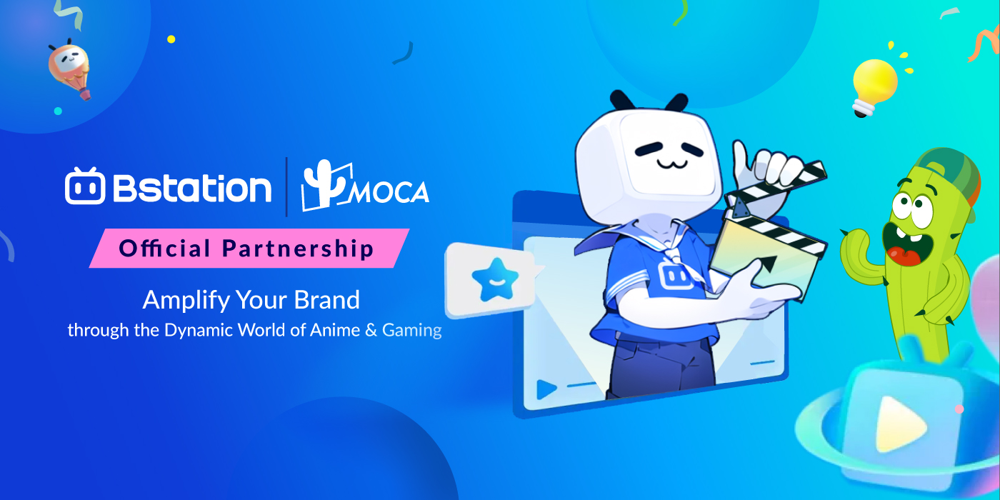
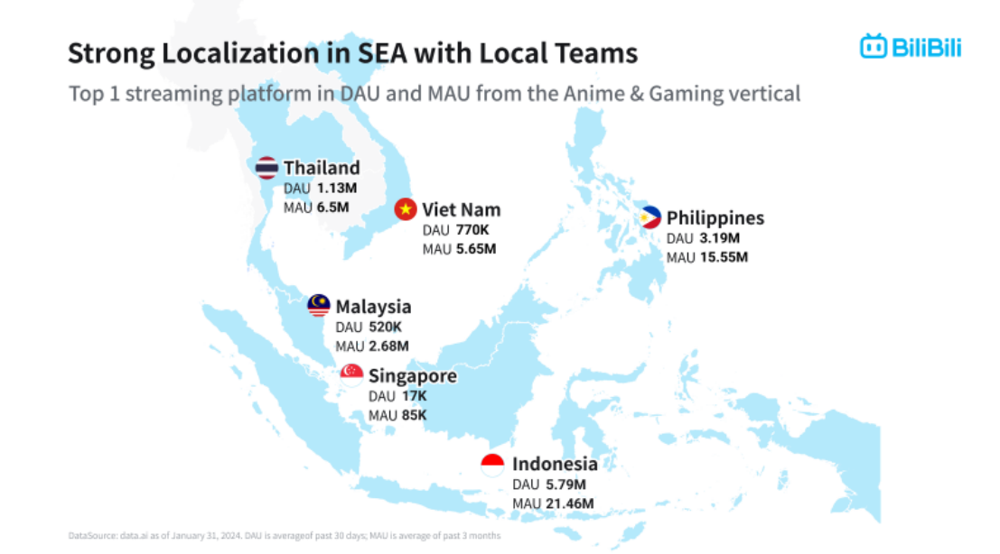
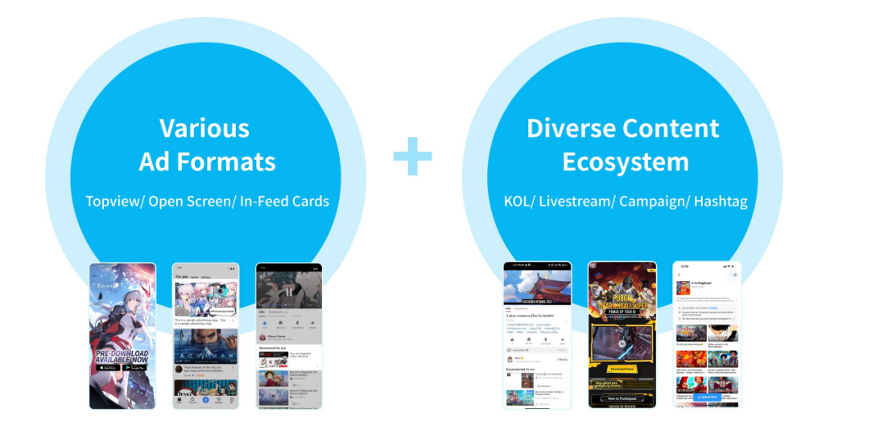

Bstation (the overseas version of BiliBili), the largest anime platform in Southeast Asia. According to the latest data from data.ai, It has over 11 million daily active users and 52 million monthly active users across six Southeast Asian countries, significantly covering the young player demographic in the region.

*In the crowded landscape of social media, Bstation stands out as a unique platform dedicated to anime and gaming enthusiasts. While giants like Facebook, Instagram, and Twitter cater to a broad audience, Bstation carves out a niche that appeals specifically to fans of anime and gaming, creating a vibrant community with distinct features that set it apart from other social media platforms. Bstation zeroes in on what matters most to its users: high-quality anime series, gaming streams, fan art, and discussions. This focused content approach ensures that users are always engaged with material that resonates with their passions.Bstation’s features are designed to foster a strong sense of community. The platform includes forums and groups dedicated to specific anime shows, game titles, and genres. This allows users to connect with like-minded individuals, share their thoughts, and participate in deep, meaningful conversations. The sense of belonging and community on Bstation is unparalleled. Bstation offers state-of-the-art streaming services that rival those of dedicated streaming platforms. Users can watch their favorite anime series in high definition, stream live gaming sessions, and even create their own content using Bstation’s robust suite of tools. Content creators on Bstation benefit from features tailored specifically to anime and gaming, such as customizable stream overlays, fan interaction tools, and monetization options that reward them for their efforts.Bstation often collaborates with anime studios and game developers to bring exclusive content to its platform. These partnerships result in early access to new releases, exclusive trailers, and special events that can only be found on Bstation. This exclusivity not only attracts users but also keeps them engaged and coming back for more. Bstation’s user base is predominantly young and highly engaged. This demographic is not only tech-savvy but also highly passionate about anime and gaming. They actively participate in community events, contribute to discussions, and are eager to support content creators. This vibrant user base creates a dynamic and energetic atmosphere on the platform, distinguishing it from more general social media sites.*

### **Tailored Advertising Solutions**

Recognizing the unique interests of its user base, Bstation has recently opened its advertising solutions to brands for the first time in Asia. This move allows brands to connect with a highly targeted audience through tailored advertising campaigns that align with users’ interests in anime and gaming. Brands can leverage Bstation’s rich data and analytics to create effective, relevant ads that resonate with the community.

*Bstation is poised to remain the premier destination for anime and gaming enthusiasts worldwide, providing a unique and enriching advertising solutions that other platforms simply can’t match.*

As Bstation’s strategic partner in Asia, MOCA is thrilled to announce our collaboration aimed at helping local brands harness the power of Bstation’s unique advertising platform. Through MOCA’s comprehensive support, strategic insights, and educational initiatives, we help brands unlock the full potential of Bstation’s advertising solutions, driving growth and achieving their marketing goals.

Reach out to MOCA to learn more about how we can support your brand’s journey into the Southeast Asian market through Bstation. Contact us at business@moca-tech.net.
