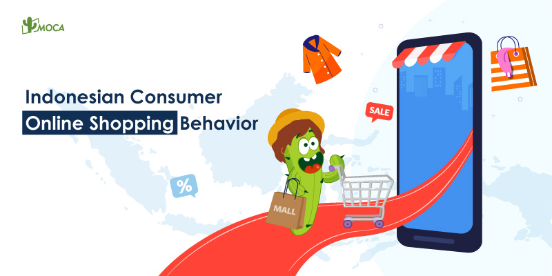

The global consumers will spend $3.2 trillion more in 2025, representing nearly 6% growth compared with 2024, according to World Data Lab. Despite looming uncertainty around geopolitical crises, economic stability, and environmental health, consumers are becoming resilient and are spending where it matters most. In Asia Pacific, seven out of 14 markets have seen positive volume growth in CPG category, with India, the Philippines, and Malaysia growing faster year-on-year.

The Mid-year Consumer Outlook 2025 of NielsenIQ reveals that Asia Pacific consumers are shifting from a cautious to a purpose-driven spending mindset. They plan to cut back on out-of-home dining and entertainment, alcoholic beverages, salon or grooming services, large domestic appliances, and snacks and confectionery. However, there remains a desire for leisure and lifestyle activities, with many choosing to prioritize **in-home entertainment** and socializing as more financially responsible options. Additionally, consumers in this region have indicated a desire to **invest in education for themselves or family members**, highlighting their focus on personal growth and long-term goals.

What’s more, the consumers are more open to AI involvement in their shopping decisions. 40% would accept a product recommendation from their AI assistant, like siri on iPhone, Amazon Alexza, etc, and early half of Gen Z (46%) and Millennial (48%) consumers would use AI to automate or speed up their everyday shopping decisions. Additionally, while 35% would allow smart devices to automatically order new products when requires.

When asked about how they will manage their spending on grocery and household items in the next 12 months, they responded that priorization would be given to **fresh produce, health and wellness products, fresh meat, dairy products, home essentials** (i.e., kitchen and bathroom products), and **personal and beauty care items****.**

**Indonesian Consumer Trends and Spending Habits**

Despite a decline in FMCG spending, food spending in Indonesia, particularly among lower-income groups, remained stable. Spending on technology goods such as mobile phones, TVs, and laptops rose over the past year. 71% of Indonesian consumers are **willing to pay for premium, long-lasting products**, as they prefer to replace their devices every three years or more.

Moreover, Indonesian FMCG consumers are increasingly experimental in their purchases to enhance their experience. Nearly half of consumers purchase more than five product categories for cooking, 50.1% buy more than two for snacking, and 22.8% buy more than three for beauty. To save on FMCG spending, 46% of consumers find online shopping helpful for better deals.

Besides quality, Indonesian consumers are also willing to pay more for comfort and convenience, with 58% spending extra for special moments, 64% opting for at-home experiences to save on dining and entertainment, and 57% preferring easy-to-use product formats.

**Social Media Drives Consumer Discovery and Purchase**

The social commerce revolution has led to the evolution of omni, with an 11.6% increase in global online sales performance and the rise of gamification, with 36% of consumers saying **they would spend more on a purchase because of an in-app experience.**

In Asia Pacific, social media is strongly influencing product discovery and driving direct purchases. 60% of consumers surveyed in the MYCO report said social media influences their product discovery, while 59% claimed that they are more likely to seek out products in-store or online after seeing them featured on social media platforms.

To get more information about products, **in APAC,** **54% of consumers will search on social media before using a traditional search engine**. Livestream shopping and shoppable pins are also popular, with 46% and 45% of consumers, respectively, making purchases through these features. While social media is the dominant platform, video games and online games are also gaining traction. Although direct purchases within these platforms are less common, they represent a niche market worth exploring, as consumers claim they are likely to spend more on a purchase because of in-app challenges, point systems, or rewards.
