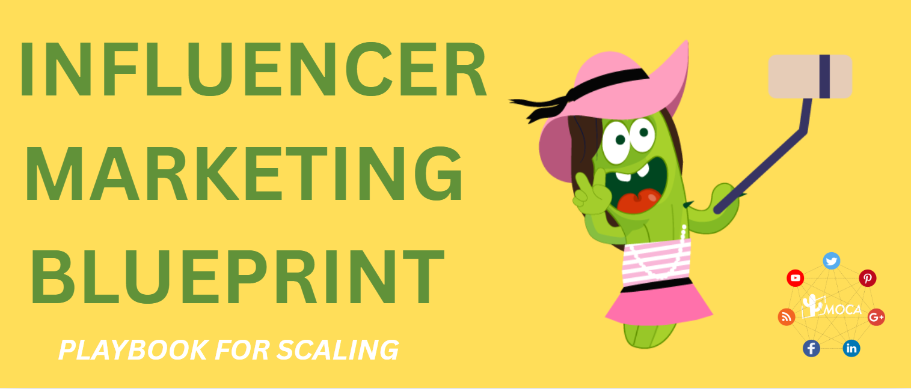

In the ever-evolving landscape of digital marketing, **influencer marketing** has emerged as a pivotal strategy for brands seeking to connect with their target audiences. However, many brands, in their pursuit of reach, often fall into the trap of prioritizing follower numbers as the sole metric for influencer value.

While 87% of brands overemphasize follower counts in influencer marketing, MOCA’s collaborations with various big brands reveal the truth: precise strategic frameworks drive sustainable growth, not blind outreach.

****Redefining Influencer Value: Beyond Traffic, Building Ecosystems****

Traditional influencer marketing treats creators as mere traffic channels. But the real power lies in **building a trusted ecosystem** where brands, influencers, and audiences grow together.

Our research highlights a key insight: **Micro-influencers (10,000–100,000 authentic followers)** often outperform macro-influencers. These creators, due to their established expertise within specific niches and their closer relationships with their communities, often exhibit significantly higher engagement rates and conversion potential compared to their macro-influencer counterparts.

To facilitate a more scientific approach to influencer selection, we propose an influencer campaign management framework of three strategically matched collaboration archetypes:

✅**Lifestyle Influencers** – Showcase products in real-life, relatable ways.

✅**Expert Endorsements** – Leverage industry specialists for credibility.

✅**Viral Amplifiers** – Partner with entertainment creators for shareable, trend-driven content.

At the execution level, empowered by [KOLPlanet](http://www.kolplanet.com), we adhere to a rigorous Four-Step Influencer Audit to ensure brands partner with truly valuable creators.

✅**Content Alignment** – Does their style match your brand values?
✅**Engagement Quality** – Are their followers genuinely interacting?
✅**Cross-Platform Consistency** – Is their personal brand cohesive?
✅**Follower Growth Health** – Is their audience growth organic?

**Crafting Content That Resonates**
Today’s consumers are savvy – they can spot an ad from a mile away. The most successful branded content feels native to the platform and authentic to the creator’s usual style. We have observed that content formats such as DIY tutorials, behind-the-scenes glimpses, and relatable, humorous scenarios consistently outperform traditional, direct product placements.

A key element in fostering successful content creation is granting influencers creative autonomy. Rather than imposing rigid scripts, brands should provide clear guidelines regarding core messaging while empowering creators to present this information in a manner that feels natural and authentic to their audience. This balance preserves the influencer’s credibility and ensures that brand objectives are effectively communicated.

T**he Content Resonance Law: Balancing Brand Needs and Creator Authenticity**
Successful influencer marketing content transcends mere promotional messaging; it is a harmonious blend of brand objectives and the creator’s unique voice and style. Based on extensive cross-platform experimentation data at MOCA, we have formulated the **70/30 Content Model**, a golden ratio that advocates for empowering creators with 70% native creative freedom, allowing them to resonate authentically with their audience, while strategically integrating 30% of core brand messaging to ensure key information is effectively communicated.

Our analysis reveals that high-converting content shares a common thread: a non-promotional storytelling approach. Content presented as tutorials, behind-the-scenes glimpses, or relatable everyday scenarios fosters greater audience engagement and trust. Furthermore, content creation must align with the consumption rhythms of different platforms.

✅**TikTok：**60-90 second story arcs necessitate concise and captivating narratives.
✅**Instagram Reels:** Favors polished and visually appealing short-form video clips, typically around 30-45 seconds.
✅**YouTube Shorts:** Performs best with attention-grabbing, high-energy content designed to hook viewers quickly. The initial 5 seconds must deliver high information density to capture fleeting attention

**Data-Driven Traffic Management: Cracking the Synergy of Organic Reach and Paid Amplification**

Once compelling content is live, effectively reaching the target audience is paramount for maximizing marketing impact.

✅**Organic Reach Testing Phase (3-7 days):** involves meticulously monitoring key metrics such as genuine completion rates, share rates, and in-depth interaction levels to identify content with inherent potential for sustained organic spread.
✅**Precision Paid Boost Phase:** strategically allocates paid budget to content demonstrating interaction rates exceeding the industry average by 50% during the organic testing phase.

This approach avoids the pitfalls of evenly distributed spending, instead focusing resources on high-performing content to achieve optimal traffic generation.

It is crucial to acknowledge the varying algorithms across different platforms, which can lead to fluctuations in traffic patterns. For example, the decay rate of the same content on TikTok and Instagram Reels can differ significantly, necessitating the development of platform-specific traffic management strategies.

**Why Choose a Professional Partner?**
Brands attempting to navigate the complexities of [influencer marketing](/news/why-global-brands-are-moving-budgets-to-influencer-marketing) in-house often face three significant limitations: a lack of access to comprehensive cross-regional influencer databases and historical performance tracking capabilities, the inherent difficulty in balancing localized creative execution with maintaining brand consistency, and optimization lag due to a limited understanding of the often opaque platform algorithms.

[MOCA](http://www.moca-tech.net) offers a strategic solution to these challenges. Our experience is built upon proven strategies honed through collaborations with leading brands across diverse industries. Our regional expertise is manifested in our local teams, providing invaluable cultural vetting and real-time trend responsiveness. Furthermore, our proprietary technological infrastructure, including our advanced influencer marketing system, enables precise matching and performance prediction, empowering brands to unlock the true potential of influencer marketing and drive sustainable business growth.

Contact us at business@moca-tech.net today for a free consultation and discover how MOCA can tailor a winning influencer marketing strategy for your brand in the dynamic marketplace.
