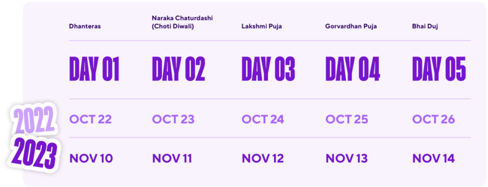
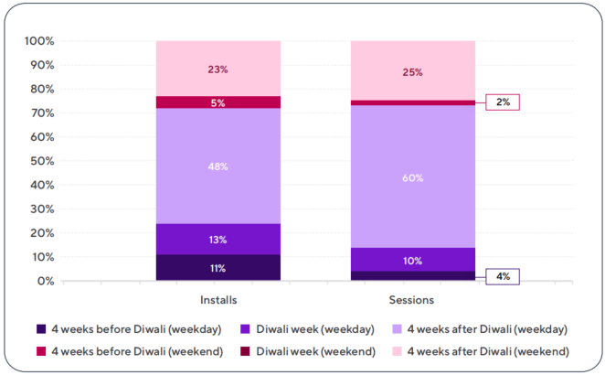
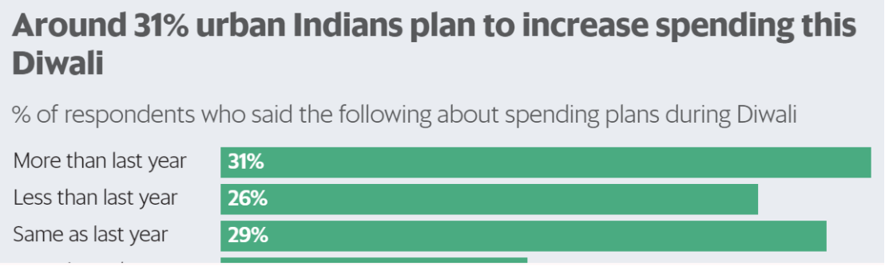
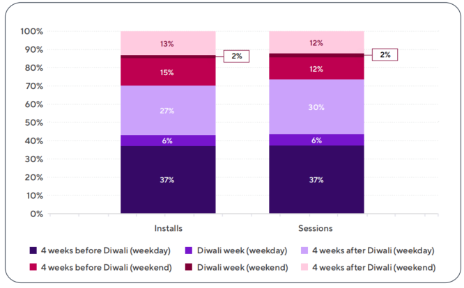
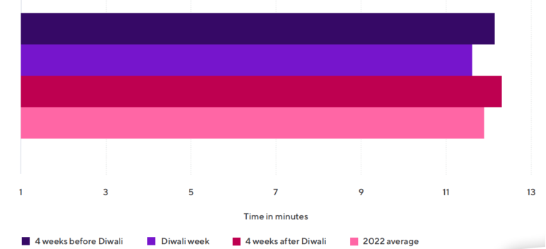
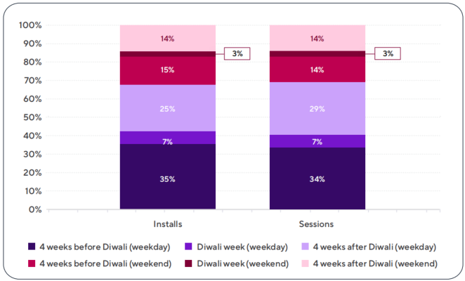
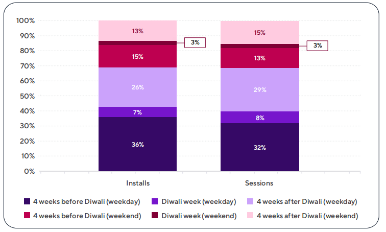
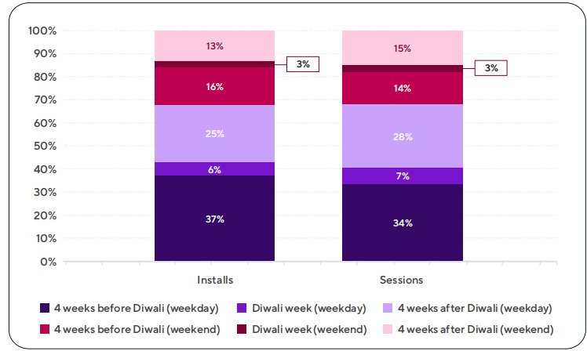

Mobile apps have become indispensable tools for celebrating Diwali in India. Recently, Adjust and data.ai released Diwali decoded: India festive report 2023. According to the report, 78% Indian consumers use mobile to purchase, giving brands more opportunities to build advertising campaigns tailored to consumer interests and preferences.

**The Five Days of Diwali**

The following are five categories performance observed during Diwali 2022, covering shopping, fintech, entertainment, travel, and food & drink.

**Shopping Category**

During Diwali week (Oct. 22 – 26), shopping app installs and sessions were 47% and 14% higher than the 2022 average. The installs increased significantly between Dhanteras and Lakshmi Puja or Big Diwali. Dhanteras is considered one of the luckiest days for making purchases, especially for big-ticket items, which is likely why we see an increase in shopping app installs around this time.

**Shopping app install and session share weekday vs.** **w****eekend**

**2022/9 to 2022/11 (India)**

Most of the shopping app installs and sessions occurred four weeks after Diwali, with **weekdays accounting for 48%** and 60% of the total installs and sessions, respectively.

During the week after Diwali (Oct 30 – Nov 5), revenue events of shopping category were 23% above the 2022 average and consistently grew for the next three weeks.

YouGov India also observed this trend. It showed 52% of respondents said they would indulge in spending this Diwali, and 31% urban Indians planned to increase spending.

Source: YouGov India, July 2023

**Fintech Category**

However, **Fintech app** installs were down during the festive period. On Lakshmi Puja, installs saw a significant 28% drop in comparison to the time period analyzed (Sep 18-Nov 26). Lakshmi is the Goddess of wealth and represents money, so many Indian Hindus want to preserve it and keep it in the house symbolically on this particular day.

Most Fintech app installs and sessions occurred in the four weeks before Diwali, with **weekdays accounting for 37% of both the total installs and sessions.**

**Fintech app install and session share weekday vs weekend**

 **2022/9 to 2022/11 (India)**

Revenue events for fintech apps were below the yearly average four weeks before and during Diwali, while they gradually increased two weeks after Diwali. The revenue events from Nov 6-12 were 35% higher than that of 2022 average.

Fintech apps see more engagement four weeks after Diwali, with 0.4 minute longer session than that of average.

**Fintech App Session Lengths 2022 (India)**

In terms of retention rate of fintech, the first day of Diwali Quarter saw the highest rate with 16%. It decreased to 11% on day 3 and 7% on day 7.

Fintech marketers can leverage this to offer savings and budgeting tips in the run-up, ensuring their app remains front-of-mind. Post-Diwali, you can offer tools to review and evaluate festive spending or suggest future savings plans to recapture users’ attention.

**Entertainment Category**

Entertainment category showed similar trend as that of shopping app. **Entertainment** **app** installs and sessions during Diwali were 25% and 13% higher than 2022 average, respectively. Additionally, installs and sessions for this category saw impressive growth during the first two days of Diwali, increasing by 24% and 22% on Dhanteras (Oct 22) and 38% and 15% on Choti Diwali (Oct 23), compared to the 2022 average, respectively.

Most entertainment app installs and sessions occurred four weeks before Diwali, in which weekdays accounted for 35% of total installs and 34% of total sessions.

**Entertainment app install and session share weekday vs weekend**

 **2022/9 to 2022/11 (India)**

**Travel Category**

As to **Travel app,** the installs in the four weeks leading up to Diwali were 5% higher than the 2022 average. An increase in travel app installs is observed in the four weeks before Diwali as users make travel plans to go home for the festivities. During Diwali, there’s a sharp decrease in installs as many people stay in one place for pujas and celebrations. Travel app sessions reached peak level in the weeks before Diwali, with sessions one week before 16% above the 2022 average.

The majority of travel app installs and sessions occurred in the four weeks before Diwali, with weekdays accounting for 36% and 32% of the total installs and sessions, respectively.

**Travel app install and session share weekday vs weekend**

 **2022/9 to 2022/11 (India)**

Revenue events for travel apps saw the highest growth a week before Diwali (Oct 16- 22), 60% up compared to the yearly average. The revenue events also saw 30% increasing during Diwali week.

In terms of retention rate of travel app, the first day of Diwali Quarter saw the highest rate with 14% while it decreased to 9% on day 3 and 7% on day 7.

F**ood & Drink Category**

**Food & Drink** app installs during Diwali were 32% higher than the 2022 average. However, in the four weeks leading up to Diwali, food & drink apps saw a slow decrease, because of more people tending to eat home-cooked meals during the period.

**Food & Drink app install and session share weekday vs weekend**

 **2022/9 to 2022/11 (India)**

Most Users install food & drink apps in the month before Diwali but sessions decrease during Diwali. Based on this trend, marketers can do Diwali-week promotions before dinner time to peak user interaction.

In terms of revenue events, the category saw the highest growth a week before Diwali, increasing by 45% compared to the yearly average. Moreover, during Diwali week, revenue events were 38% above the yearly average.

Ready to experience tangible growth this Diwali? Contact MOCA team at [business@moca-tech.net](mailto:business@moca-tech.net)

Check the report in Chinese version here.
