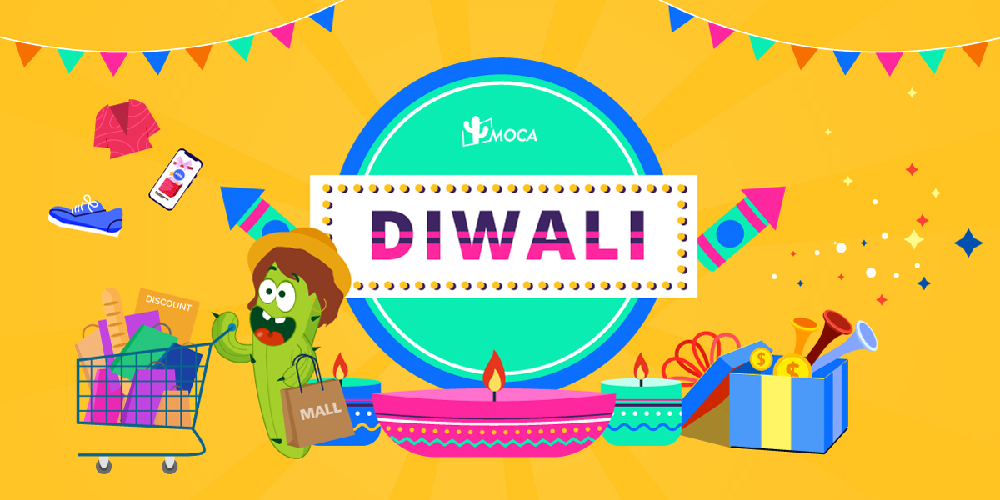

As the festive season approaches, Meta has shared insights from its September study on shopping trends conducted with the GWI consumer insights platform. The study reveals a growing optimism, with 50% of respondents planning to spend more than they did in 2023.

It reported that 96% of shoppers expect changes due to online shopping, e-commerce growth, and Quick Commerce. It also showed that **82% of internet users shop during Diwali**, 51% during New Year, and 45% during Dussehra and Durga Puja.

**Early Diwali Planning and Shopping Preferences**

A study by Amazon Ads with YouGov found that consumers are planning for Diwali months in advance, with 47% starting to think about the festival before July and 78% before September. Moreover, 64% consumers are eager to buy gifts for family and friends, while 58% of them are interested in shopping for themselves or their homes. Popular categories include fashion and accessories (62%), smartphones and tablets (58%), and personal care products (47%).

Ecommerce continues its upward trend, with Quick Commerce gaining traction in sectors such as electronics (1 in 4 buyers) and personal care (1 in 3 buyers). Over half of festive shoppers are expected to increase their use of e-commerce shopping this year.

**Hybrid Shopping and the Rise of Digital Influence**

Hybrid shopping is on the rise, with 57.45% of consumers choosing a mix of online and in-store shopping. Only 22.29% prefer physical stores, while 20.98% shop exclusively online, according to Rediffusion report.

Millennials and Gen Z are leading the online shopping trend, showing a shift in buying habits. Social media, especially Instagram and Facebook, influences 53.69% of shoppers, with 50.80% relying on online ads and 43.85% influenced by family and friends’ recommendations. While traditional ads like TV and print are still relevant (41.24%), digital sources now have a stronger impact, and only 26.34% of shoppers find in-store promotions as appealing as online options.

**Rise of Indian-Made Products**

Last year, the Confederation of All India Traders (CAIT) stated that retail markets in the country witnessed record business of Rs. 3.75 lakh crore ($ 45 billion) during the festive season. Prior to 2023, around 70% of the Diwali festival market was made entirely of Chinese goods. However, last year almost only Indian products“were sold and purchased in Diwali,” according to CAIT. This could be influenced by Government initiatives like “Make in India” and “Atmanirbhar Bharat” (self-reliant India).

**The Growing Power of Influencer Marketing**

Micro-influencers are proving to be as effective as macro-influencers in driving festive purchases. Among shoppers influenced by influencers, 40% follow micro-influencers, 39% macro-influencers, and 23% nano-influencers.

AI-powered discovery also plays a key role, with 80% of festive shoppers finding deals on Meta platforms, and 85% of consumers aware of at least one sales event through Meta.

Additionally, influencers play a pivotal role in promoting AI-powered products. Even though consumers may not fully grasp AI models like Google’s Gemini, they appreciate how AI-powered products, such as Samsung phones, enhance experiences like photo editing when promoted by influencers, further boosting influencer marketing. This has led to a growing demand for AI-powered influencer marketing platforms like [KOLPlanet](http://www.kolplanet.com), which brands are leveraging to reach a wider audience and increase sales during the Diwali season.

Want to learn more about how to levarage KOLPlanet to boost sales during Diwali? Contact MOCA at business@moca-tech.net.
