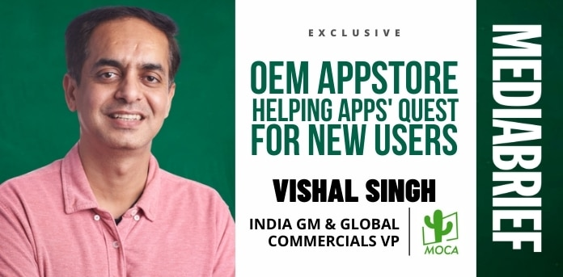
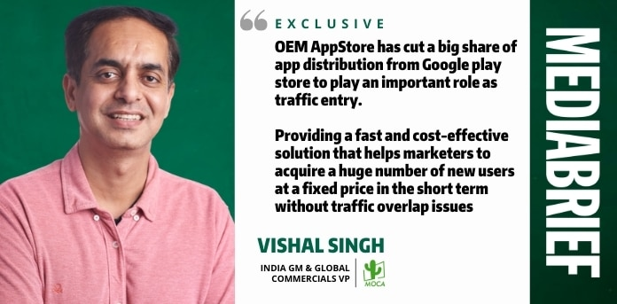
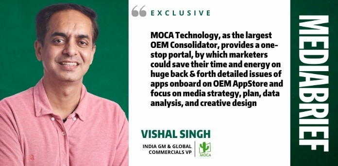
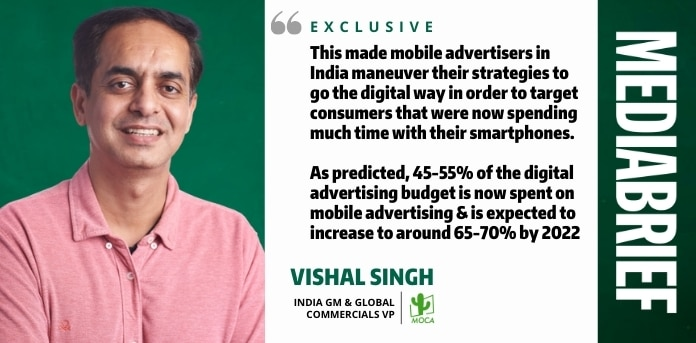
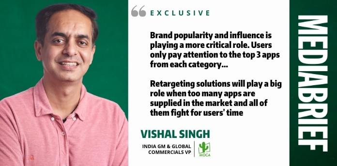
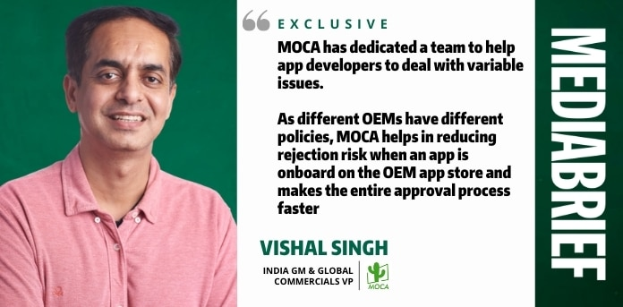

### *In an exclusive interaction, **Vishal Singh, India GM and Global Commercials VP, MOCA Technology**, speaks about the adoption of OEMs (Original Equipment Manufacturers) app stores in India, where the APP economy is headed, how MOCA helps in-mobile app advertising marketers and how advertisers can maximize their ROI with in-app ads.*

> Vishal is a marketing expert and business leader with more than 20 years of experience in Brand Management, Business Strategy, Digital Marketing, Media Sales, Media Strategy Development, and Business turn-around leadership. He has been instrumental in launching Telecom and Media brand portfolios across different markets of India. Prior to MOCA, he has worked with Idea Cellular, Big FM, Times Group, Spice Group, and GroupM.

#### **What solutions does MOCA Technology offer, and across which markets?**

MOCA is a global OEM aggregator and advertising innovator, established in 2012. Focusing on Asian market, Moca set local teams in China, India, Indonesia, Vietnam, Malaysia, collaborating with top global publishers for user acquisition, branding and re-engagement advertising solutions.

MOCA is one of the largest OEM consolidators across the globe and an advertising innovator to help advertisers to make innovative formats and combinations for contextualized promotion. MOCA is committed to provide a customized shortcut for advertisers to be the next unicorn.

MOCA is the acronym of Mobile Cactus. Cactus symbolizes vitality, bravery, and endurance. It survives in deserts with the extremely harsh conditions while providing the life-saving supplies to whom was passing by. As it stands for cactus, MOCA has the adaptability, perseverance, and great love to share and be shared. We seek common ground and partnership to turn a desert to a land of plenty.

MOCA is focused on providing a cost effective and customized solution for advertisers to maintain top of mind awareness within their target audience.

#### **What specific solutions does it offer?**

Our solutions range from OEM Consolidation to innovative brand solutions to Programmatic advertising and more. We provide a one-stop advertising solution including app uploading, air preinstall, user acquisition, re-engagement and brand awareness on OEM app stores. We’ve partnered with global top-ranking apps to help advertisers make innovative formats and combinations for contextualized promotion.

As for programmatic advertising, we have in-house DSP, DMP, ADX, SSP supporting both RTB and PMP. Multis-screen advertising solution are supported between mobile and TV.

#### **How does MOCA Technology help mobile OEMs?**

As more and more people are going digital, apps marketers also need to find different ways to keep a high exposure in all top entries to reach and acquire a huge number of new users.

OEM AppStore has cut a big share of app distribution from Google play store to play an important role as traffic entry. Providing a fast and cost-effective solution that helps marketers to acquire a huge number of new users at a fixed price in the short term without traffic overlap issues.

However, It is a challenge for marketers to deal with multiple OEMs with limited time and resources. MOCA Technology, as the largest OEM Consolidator, provides a one-stop portal, by which marketers could save their time and energy on huge back & forth detailed issues of apps onboard on OEM AppStore and focus on media strategy, plan, data analysis, and creative design.

#### **What is your proposition for the Indian mobile advertiser?**

India is well on its way to becoming one of the fastest-growing mobile app markets with more than a billion download users in 2021. The number is continuously surging especially since the global pandemic of Covid-19, which led to lockdowns, resulting in people spending more time at home.

This made mobile advertisers in India maneuver their strategies to go the digital way in order to target consumers that were now spending much time with their smartphones. As predicted, 45-55% of the digital advertising budget is now spent on mobile advertising and is expected to increase to around 65-70% by 2022.

This trend of advertisers shifting their strategies and budget to digital is also due to changed consumer behavior of searching and buying online a greater number of categories such as Food, FMCG, BFSI, and auto.

In the meantime, bonus time of mobile traffic could be gone soon as users would gradually lose the sense of freshness on mobile advertising. With more and more homogeneous advertisements on apps; how to retain user attention for 1-2 seconds and avoid being overwhelmed in the great wave of mobile advertising will be a challenge.

Therefore, the competition on advertising creativity, format, combination, display scenario will be more fierce. A single solution will not work.

#### **What is so different about Indian smartphone users via other global or Asian markets?**

First, over the past ten years, smartphone users in India are rapidly growing. As per Statista data, the Indian smartphone market attained 34 million users in 2010, and the number is continuously or rather exponentially growing each year and should reach 748 million users in 2021.

Currently, the country ranks the third highest smartphone users in the world after the US and China. Furthermore, as the second-most populous country in the world, it is also projected that smartphone users in the country will be able to reach 1,530 million by 2040.

Secondly, the need to always ‘go online’, the affordability of smartphones, cheap prices of mobile data, as well as the rise in disposable income, will further increase smartphone penetration in India.

It is also supported by the fact that the government and the private sector are boosting the availability of high-speed connectivity across the country as well as providing the hardware and services to put Indian consumers and businesses online. Compared to other Asian countries, McKinsey reported that India is digitizing faster than other 14 mature and emerging countries as well as others across the globe such as China, Russia, Germany, Japan, Italy, South Africa, France, South Korea, UK, Brazil, US, Sweden, Canada, Australia, and Singapore, in terms of digital foundation, which include the cost, speed, and reliability of internet connections; digital reach, or the number of mobile devices, app downloads, and data consumption; and digital value, in which consumers engage online by chatting, tweeting, shopping, or streaming.

Thirdly, although smartphone users are relatively high, the proportion of the population that did not own a phone yet is still higher. Giving it a further impetus to grow and swell, especially in tier 2 markets. So, with these facts in hand, the user’s latent demand to switch from a feature phone to a smartphone is notably higher.

#### **What exactly is the APP economy?**

APP economy is associated with the uprising of smartphone usage in which mobile applications are available for just about everything. As there are apps for everything, the other economic impacts around these are also happening.

People are now buying an ever-growing number of things through app stores; either to kill boredom, to work, to study, even to monitor their health. The growth of apps also opens up many new jobs. Tech-entrepreneurs are emerging, changing the way business is done as well as creating employment opportunities.

#### **How big is the in-mobile app advertising market and what are your growth projections?**

Mobile advertising has been rapidly growing over the years. Statista recorded that spending on mobile advertising worldwide amounts to 223 billion U.S. dollars and it is predicted to surpass 339 billion dollars by 2023.

#### **What are some of the emerging trends in mobile marketing / in-app advertising?**

Talking about trends in mobile/in-app advertising is inseparable, as COVID-19 has deeply impacted consumer’s content consumption and time spent habits. Moving more and more on their smartphone devices, they are using apps like never before. Apps are now used for everything from work meetings to playing games.

Simultaneously, spending on digital ads is also increasing. OEM AppStore is one of the critical channels to acquire new users. Influencer market is emerging, however not maturing. Advertisers are looking for an effective solution.

Brand popularity and influence is playing a more critical role. Users only pay attention to the top 3 apps from each category. How to build a market barrier in short term is a challenge. Otherwise, it is difficult to survive if the first seat chance is lost.

Retargeting solutions will play a big role when too many apps are supplied in the market and all of them fight for users’ time.

#### **Data breach in online apps is on a constant rise, how do you ensure data security**

There are few ways to collect user data. Via Telecom company, Publishers, who collect when a user registers, Third-party media monitoring platform, such as AppsFlyer, adjust, branch, MOAT, Kochava, Adjust, Mfilter, IAS, Sizmek, Double click. They hold huge data when using their SDK to collect user data for conversion attribution and fraud-checking. and all players through RTB via programmatic buy.

For all those are big companies, they have tight data protection policies. Major publishers on the other hand have a stringent data protection policy, but small publishers may not work diligently. As for RTB, there are too many players involved, all players can collect data from users in the process.

Also, we work only with OEM AppStore and global top app publishers for direct buy and PMP (private marketplace). All key data is kept at the publisher’s end, so there are no chances of user data leakage or breach.

#### **With the introduction of a new personal data protection bill in India, how things will change for the mobile advertiser or in-app advertising ecosystem?**

A new personal data protection bill in India will lead to increased demand for traffic from top publishers and Direct buy and PMP will be the new trend.

#### **How advertising on other OEM smartphone Appstore like Samsung, Huawei is different from advertising on Google play store?**

Xiaomi, Samsung, Huawai, etc are smartphone brands. Their AppStore is a free service given to users to improve user experience and that experience has an impact on the OEM brand image. Therefore, they put a tighter policy than Google play store whose policy is more friendly to app developers.

Mobile device sales contribute the most revenue to OEMs. OEM cares for user experience and favourability on their mobile phone brand.

But the revenue of the Google play store comes from the revenue share with the app developers. They care more if the app can bring money to them.

#### **Tech giants like Google, Youtube, and Tiktok are rolling out many changes to increase the security and privacy of minors, will this also have an impact on in-app advertising?**

Yes, they drive the entire market and all app developers to put resources into building processes for data protection to ensure security.

#### **Are there any quick tips or golden rules that you would like to share with mobile advertisers so they can maximize their ROI with in-app ads?**

Building a barrier with a big user base is critical, it will increase competitors’ costs on time and money. The product quality, online service for user feedback, app rating, and popularity are related to the cost of existing user retention and conversion rate for a new user.

How to increase the frequency of usage, reach, view, etc, decides if the user base you acquired and be retained. Performance campaigns can not work alone anymore; competition for Branding advertising will get fiercer. And vcreating more touchpoints with users will be critical.

#### **What is the difference between your service and other agencies that offer OEM AppStore solutions?**

MOCA has dedicated a team to help app developers to deal with variable issues. As different OEMs have different policies, MOCA helps in reducing rejection risk when an app is onboard on the OEM app store and makes the entire approval process faster.

We do not just provide install solutions on OEM AppStore but also have branding and retargeting solution. The combined solution helps marketers maximum their performance and influence the target audience.

We have rich experience and data. It helps advertisers to optimize and save money as we help them in deciding which OEMs are most suitable as per different categories and TGs.
