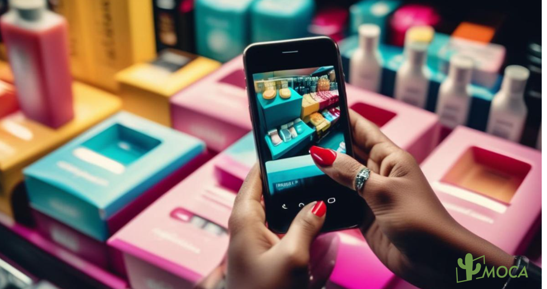

In 2024, e-commerce GMV in SEA market grew by 15% year-on-year according to the 2024 SEA economy report， co-conducted by Google, Temasek and Bain & Company, with video commerce playing a pivotal role. It accounted for 20% of this growth, a significant jump from less than 5% in 2022. Moreover, videos have become an integral part of the consumer shopping journey, influencing online shoppers at various stages, from discovery and research to the final purchase decision. In fact, 44% of online shoppers use videos at some point during their shopping process, with over 40% relying on them to help make purchasing decisions.

The surge of live shopping marks a significant turning point for video commerce in the region. Interactive livestreams, offering limited-time deals and combining urgency with seamless transactions, have become increasingly popular. Additionally, **creator-led video content with affiliate links and built-in transaction capabilities** is also on the rise.

Retail category creators, such as food, fashion, and beauty, are the most active, posting more than five videos weekly on average. However, **gaming creators experienced the fastest growth rate**, with a 9% increase from 2022 to 2024. This expansion is partially due to game developers incorporating language options and cultural nuances to cater to a diverse audience, enhancing the gaming experience and fueling growth.

The report also showed that consumers in the region are becoming more open to discovery and less dependent on offers. This trend is mirrored in the gaming industry, where SEA has emerged as a significant export hub. Developers in the region are capturing a significant share of the global mobile gaming market, driving 12% of downloads in 2024. In parallel, gaming content is booming, with more top creators and uploads than any other consumer category.

Smaller categories like home, tech, and pets are also experiencing  fast growth in the creator ecosystem, who are driving engagement and sales, often collaborating with brands outside their core categories to expand reach and enhance relevance.

Last but not the least, brands in SEA market are increasingly partnering with creators to tap into this growing trend. However, it’s worth noting that less than 20% of sponsored content by beauty brands involved creators whose primary focus was beauty, indicating **a shift towards cross-category influencer collaborations**.

About how to leverage influencer marketing to maximize business growth in SEA, contact MOCA at business@moca-tech.net
