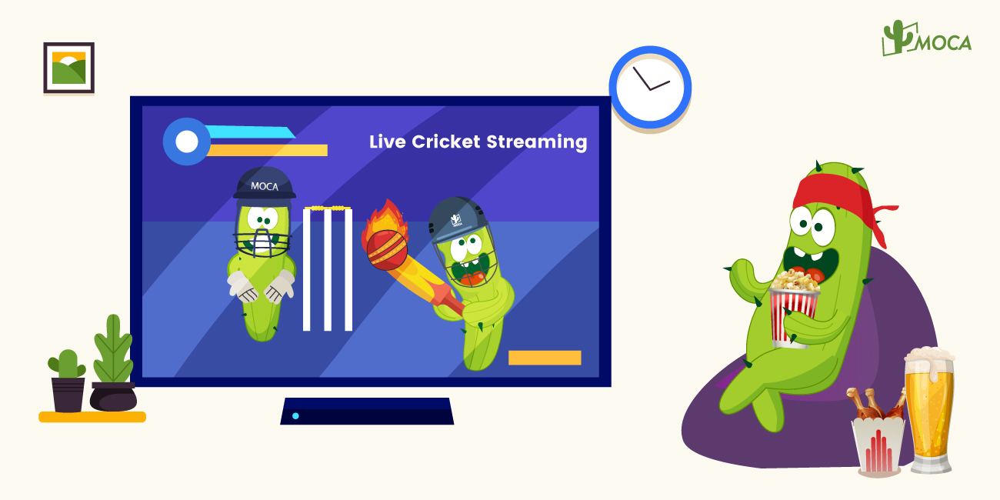

The Indian Sports Industry has grown to a revenue of INR 14209 crore in 2022. 85% of this value has come from cricket alone, with significant contributions from Team India matches as well as the Indian Premier League (IPL), according to GroupM ESP.

In terms of advertising spending, the total advertising spending on sports in 2023 is expected to reach Rs 10,000 crore across TV channels and digital platforms, with cricket accounting for 90% spending. In terms of channel, **TV is the largest medium to consume sports content** in India with the biggest share of the advertising revenue, contributing 40% share of the advertising market, and it is projected to grow at over 11% CAGR over the next 5 years. Media industry experts estimate sports advertising would contribute 12-13% of the total advertising spending this year.

Indian Sports viewership on television (TV) grew by 11% in 2022, with 758 million viewers watching sports on TV, as per Disney Star. Cricket for Indian televisions is no less than a Soap Opera where people find some drama, and this soap beats most of the others in terms of viewership. According to Indian Cricket Fandom Report 2023 of YouGov, among sports matches, 52% Urban Indians said they watch cricket match most.

In term of CTV impressions, India stood out as one of the fastest growing market globally, with 369% impressions increasing year over year, according to 2023 Global Insights Report of DoubleVerify.

The surge of OTT platforms, deeper smart TV penetration and access to a wide variety of content can potentially bring the market to a situation where the share of viewers who are willing to watch live sports on CTV, ushering in new opportunities for brands to acquire users cost effectively.

This year, with the first-ever hosting of the ICC Men’s Cricket World Cup 2023 in India, spanning an incredible 46 days and coinciding with festival season, there is no doubt that Indian will spend more time on cricket match watching with their family. This will create more opportunities for brands to build connection with audience.

In 2019 World Cup held in England, over 229 million viewers watched the India vs Pakistan match. With the convergence, the 2023 India-Pakistan match, often referred to as the jewel of the tournament, is expected to smash viewers’ record. Storyboard said 25%-30% increasing in sponsorship initiatives is expected during the ICC Men’s World Cup 2023 over the last tournament. While the cost for an India match of 2019 Cricket World Cup is Rs 20 lakh onwards for 10 seconds, and Over Rs 10 lakh is for all match packages. In 2019, 94% of the sports AdEx was from cricket, highlighting the popularity of the sport among advertisers. Indian advertisers alone were expected to spend more than 400 million World Cup 2023. Along with e-commerce, gaming, soft aerated drinks category and mobile phones that were on top of TV advertising.

These all position World Cup 2023 as the best time for advertisers to **battle for consumers’ mind** and create a brand’s presence. Advertisers can **leverage CTV plus secondary screen integrating advertising** strategies to engage with the audience during the match, enhancing brand awareness as well as acquiring users.

Want to know how to make CTV plus secondary screen integrating placement happen? Contact MOCA at business@moca-tech.net.
