Nearly 2 billion people around the world celebrate Ramadan, including 12% from Indonesia. The festival brings significant change in people’s daily routines, purchasing patterns, and content consumption, presenting unparalleled opportunities for user acquisition and revenue campaigns throughout the year.

**Ramadan Drives Indonesia Retail Growing**

Almost all people in Indonesia were fasting this Ramadan 2023, with 30% said they made Ramadan preparations 2-3 weeks earlier.

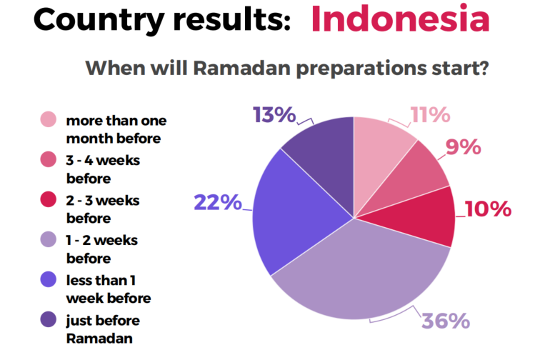

(source: TGM Global Ramadan Survey 2023, Indonesia)

70% respondents purchased items during Ramadan and Eid sale on week 3 and 4. Respondents are most active on their mobiles in the evening and night, with spikes in mobile activity seen before suhoor (sunrise meal) and after iftar (sunset meal).

All products under the fashion and beauty category are more likely to be bought online during Ramadan month, from week 1 to 4.

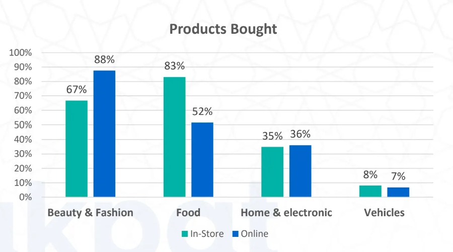

(shopping during Ramadan Month)

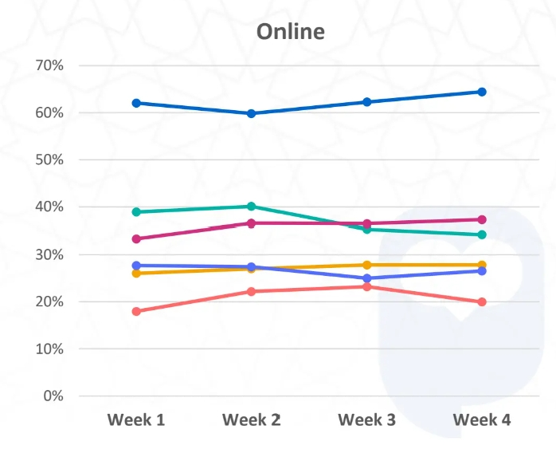

(source: Consumer Behavior of Ramadan 2023, Jakpat)

Food and Beverage was one of the most popular product categories during the first week (March 23-29) of Ramadan 2023, with three times takjil sales increase compared to the average weekly transaction throughout 2023 on Tokopedia as takjil hunting is an activity that is often carried out by the public, according to Tokopedia.

Price is often the most important factor to consider when buying essential needs, as consumers tend to look for cheaper places with many discounts to help reduce their expenses. However, the completeness of products is also an important consideration, as consumers may prefer to shop at stores that offer a wide variety of items to choose from.

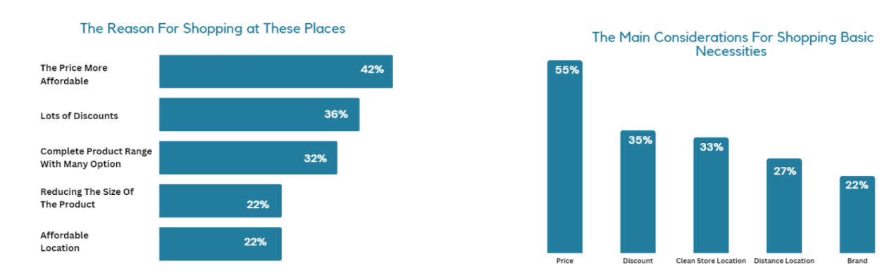

(source: Global Loyalty Indonesia)

Thanks to Ramadan and Eid al-Fitr. Indonesian retail sales surged by 12.2% in April, 5.2% up compared to March, driven by high demand for cultural and recreational goods, household goods, vehicle fuels, as well as vehicle spare parts and accessories, according to preliminary data released by the central bank of Indonesia (BI) on May 10th, 2023. This upward trend is particularly noteworthy as it follows 3.4% drop in February.

### **Time spend on TV is increasing**

Roughly 45% of respondents accessed digital entertainment through television (TV). More than 40% of respondents continued to rely on national TV channels to accompany their suhoor and iftar time, thanks to the government’s program to replace analogue TV with digital ones in late 2022. Smart TVs comprise a big part of digital TVs available in the market.

### **Ramadan-themed Ads on TV and at Video format are most favorite**

Ramadan-themed advertisements appears when the holy month is coming to the corner. 4 out of 5 respondents said they often saw the ads on TV. The most exposure to Ramadan ads was in the afternoon before iftar. 67% respondents feedback they saw ads 1-5 times per day.

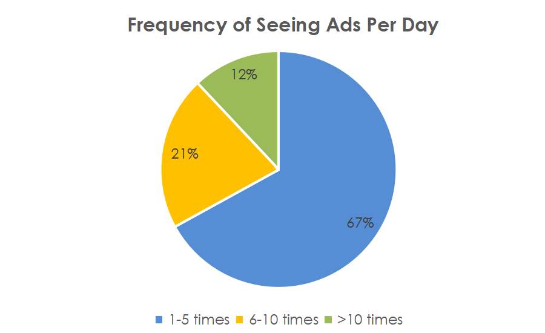

(source: Consumer Behavior of Ramadan 2023, Jakpat)

Half of the respondents remembered Ramadan ads owing to good cinematography or pictures, and interesting copywriting. 89% respondents said they loved to see Ramadan ads in video form. Half of them preferred picture ads. The types of ads that they see most often were food and beverages (89%), promotions (72%) such as discounts on e-commerce, and television programs (41%).

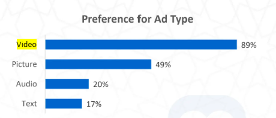

(source: Consumer Behavior of Ramadan 2023, Jakpat)

In this Ramadan, respondents spend around Rp100,000 more on online shopping than 2022.

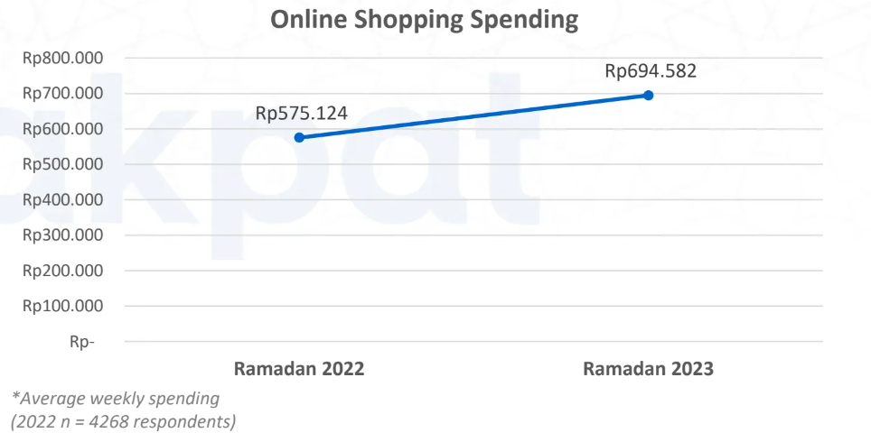

(source: Consumer Behavior of Ramadan 2023, Jakpat)

Shopee is the most popular e-commerce platform for Ramadan shopping, with 79% shopping from the platform, followed by Tokopedia and Lazada with 38% and 33% respectively.

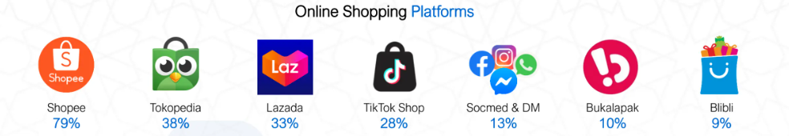

 (source: Consumer Behavior of Ramadan 2023, Jakpat)

### **App installs soar during Ramadan**

Global installs increased 7% during Ramadan in 2022, led by Fintech with 17%, followed by ecommerce with 13%.

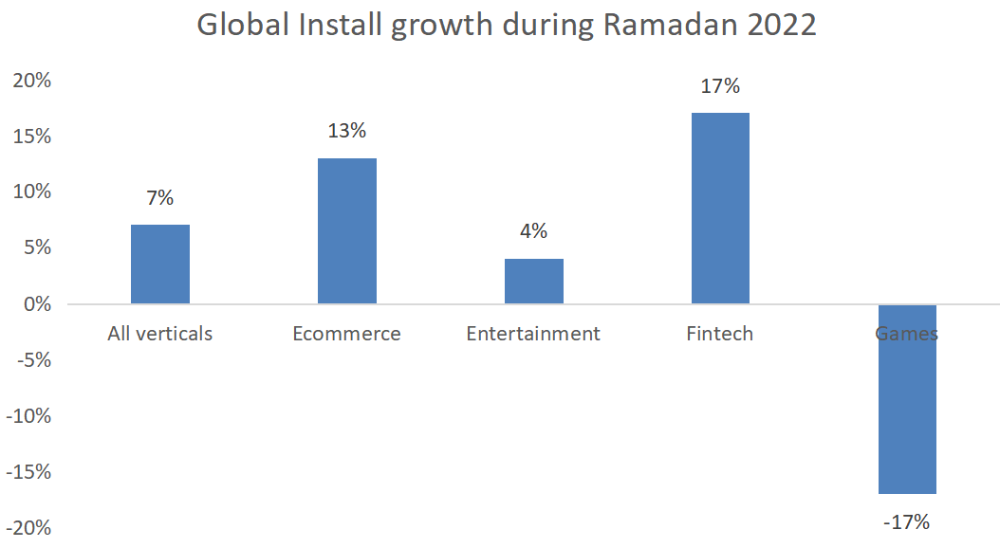

(source: Ramadan Insights 2023, Adjust)

In terms of user spending time, gaming apps and entertainment apps saw the longest in-app sessions during Ramadan 2022. The day after install, users spent an average of 50.4 minutes in gaming apps and 34.4 minutes in entertainment apps. When looking at verticals during this time, gaming had the highest Day 1 retention rate at 29%, followed by fintech at 21% and then entertainment and e-commerce apps both tied at 19%.

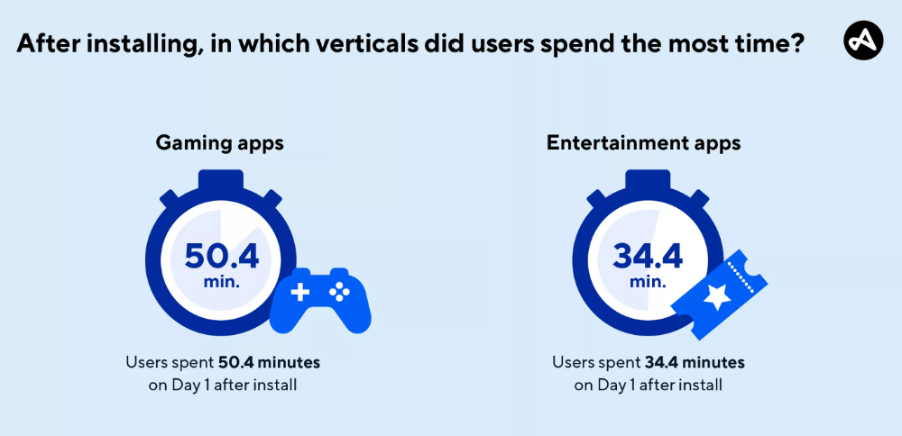

(source: Ramadan Insights 2023, Adjust)

#### **Finance remarketing gains momentum in the latter weeks of Ramadan, while gaming performance intensifies during Hari Raya.**

During the final weeks of Ramadan, Finance remarketing is highly impactful as users tend to make a significant number of Eid purchases through digital payment methods. Finance conversions then drop during Hari Raya itself, as banks are closed during that period.

Gaming marketers are encouraged to focus towards the Hari Raya holidays, when gamers enjoy much more free time at home. Gaming remarketing actually sees a nearly 4 times surge during the weeks of May 9 and May 16, compared with the start of the season on the week of February 28. There is also a final spike on the week of May 23, as advertisers try to remarket to new users they’ve acquired during Ramadan.

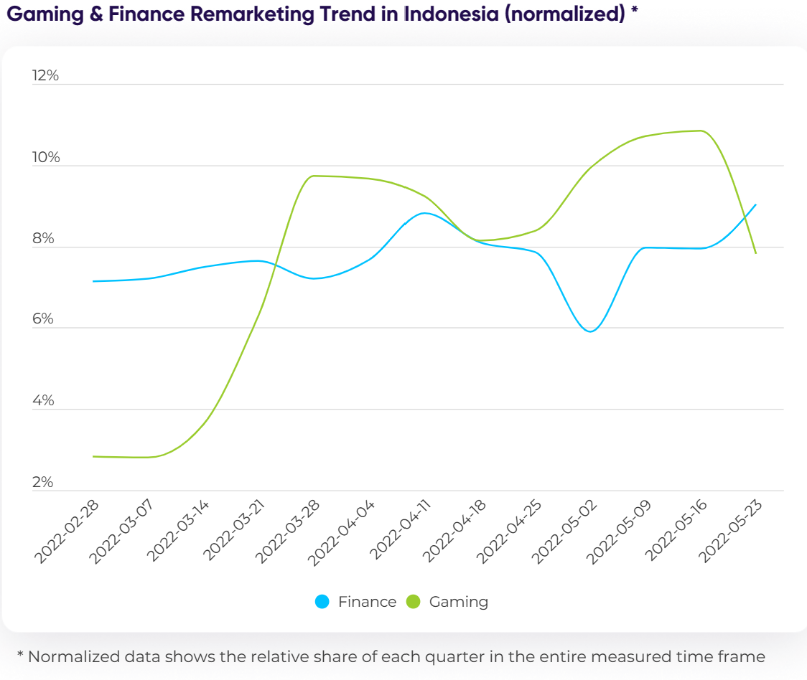

### **E-commerce and entertainment boost revenue during Ramadan**

Ramadan is a prime opportunity for gaming and ecommerce players as people with leisure time during this period. In terms of the revenue event of entertainment and e-commerce, Indonesia led global market and saw an incredible in-app increase, with 44% and 33% up respectively compared to the yearly average, indicating consumers are buying more in-app and signing up for more entertainment app subscriptions.

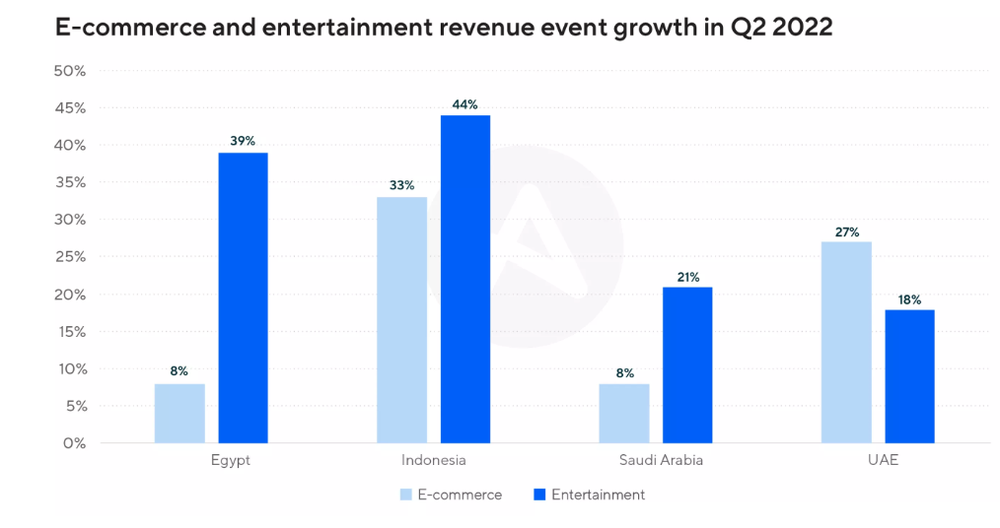

(source: Ramadan Insights 2023, Adjust)
