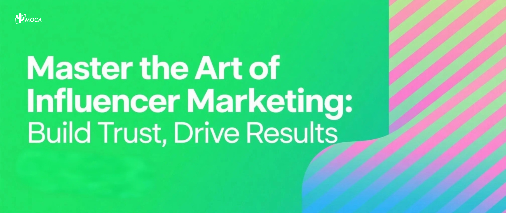

When 76% of Indonesian social media users make purchasing decisions based on influencer recommendations, brands can miss out on genuine growth by focusing solely on an influencer’s follower count. Navigating Indonesia’s complex landscape—a tapestry of diverse cultures and religious sensitivities—requires a nuanced approach to influencer marketing. Success hinges on a deep understanding of the local content ecosystem, from trending topics and cultural taboos to platform algorithms; missteps can significantly weaken campaign impact.

**Unlocking True Value: From “Vanity Metrics” to Authentic Engagement**

Indonesian consumers crave genuine interaction: 92% favor ads that tell a story, and 43% are more likely to buy again from a brand after engaging with an influencer they trust, as reported by McKinsey’s 2024 consumer behavior report. However, successful localization goes beyond simple translation. For example, marketing the same product in the cosmopolitan city of Jakarta versus the more conservative Aceh province demands distinct religious and cultural considerations in content strategy and review to avoid controversy and foster resonance.

Influencers who prioritize authenticity, relevance, and compelling storytelling build stronger connections. This approach fosters loyal and engaged communities built on trust. Influencers who actively interact with their audience through genuine responses, discussions, and incorporating feedback cultivate a sense of community, demonstrating they value their audience beyond mere numbers. This deeper engagement translates to tangible results: influencers drive impact throughout the entire customer journey, from awareness to loyalty.

-   **Awareness:** Engaging content expands a brand’s reach, with 63% of consumers discovering new products on social media through influencers, according to HubSpot’s 2024 report.
-   **Consideration:** Influencers who authentically showcase a product’s benefits encourage purchase consideration, with 56% of consumers considering a purchase after positive influencer mentions.
-   **Decision:** Testimonials and demonstrations that address consumer concerns directly influence buying decisions, with 68% of Indonesian social media users having purchased an item based on an influencer’s recommendation, as reported by We Are Social, 2025.
-   **Loyalty:** Consistent and valuable content fosters long-term customer loyalty, with 53% of consumers more likely to return to a brand after influencer engagement, according to Sprout Social’s 2024 survey.

**Choosing the Right influencers for Maximum Impact**

Choosing the right influencers is paramount. Brands should look beyond surface-level metrics and prioritize genuine engagement, audience relevance, and the ability to integrate brand messages authentically. Notably, nano-influencers in Indonesia (1,000-10,000 followers) offer 7x more engagement than macro-influencers, highlighting the power of highly engaged, niche communities, as per 2025 report from INSG.CO.

To truly capitalize on influencer marketing’s potential in Indonesia, brands need partners who understand these nuances. Companies like MOCA possess the expertise to navigate this complex terrain, ensuring campaigns resonate with local audiences, drive measurable results, and minimize risks.

To learn more about how to effectively leverage [influencer marketin](/news/cutting-through-the-clutter-a-strategic-blueprint-for-influencer-marketing-success-in-southeast-asia)g in Indonesia and for guidance on crafting impactful strategies, reach out to us at [business@moca-tech.net](mailto:business@moca-tech.net).
