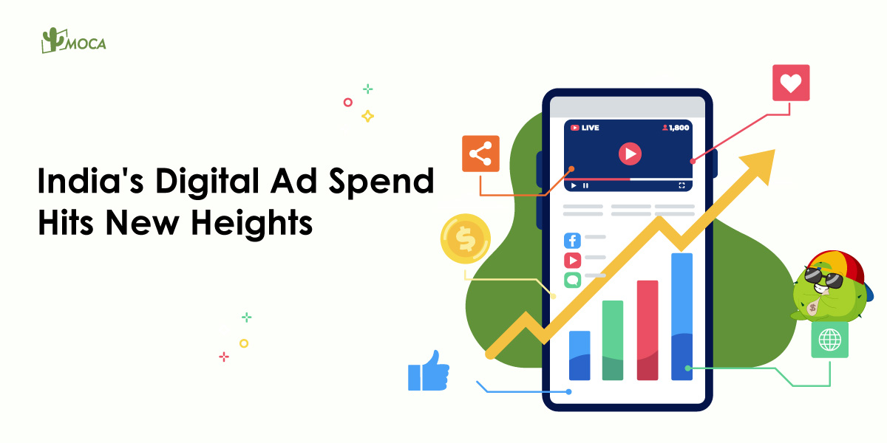

India, home to 1.4 billion people, is not only the fastest-growing economy globally but is also rapidly emerging as a leader in the digital advertising space. With internet penetration currently at 52.4% and projections indicating that the country will become the world’s third-largest economy by 2030, with a GDP of USD 5 trillion, India’s digital advertising industry is set to continue its rapid ascent.

### **Mobile Dominance Drives Growth**

Mobile platforms are the undisputed leaders in India’s digital media landscape, accounting for a staggering 78% of total digital media spend in FY24. This surge in mobile-driven advertising reflects broader trends across various sectors, especially in **fast-moving consumer goods (FMCG) and e-commerce**. As more businesses look to digital platforms to engage with an increasingly connected population, the significance of mobile advertising cannot be overstated.

### **FMCG & E-Commerce Lead the Charge**

FMCG and e-commerce are the cornerstone of the digital advertising boom in India, together contributing 67% of the overall digital ad spend. With both sectors witnessing phenomenal growth rates, FMCG saw a 37% increase in digital ad spending, while e-commerce outpaced the sector with a 52% surge in digital ad spend from FY23 to FY24.

The automotive sector, too, is not left behind, seeing a healthy 23% increase in digital ad investments. These growth patterns underscore the growing reliance on digital channels, with brands increasingly seeking direct engagement with their target audiences through highly personalized and dynamic content.

### **Social Media and Influencer Marketing: Key Drivers of Digital Spend**

India’s digital advertising ecosystem is becoming increasingly shaped by the influence of s**ocial media, search engines, and influencer marketing**. In fact, social media platforms have emerged as the largest format for digital ad spend, capturing 30% of the total digital advertising market. Platforms like Facebook, Instagram, and Twitter play a pivotal role in shaping the advertising landscape, particularly as social media penetration in early 2024 reached 32.2% of the population, equating to around 462 million active users.

Influencer marketing has gained significant traction as well, with brands increasingly partnering with content creators to engage India’s diverse and digitally savvy audience. This shift towards personalized, real-time content aligns with consumer demands for relevance and authenticity in brand messaging.

### **Video and Content Marketing on the Rise**

Video and content marketing continue to play a central role in India’s digital advertising sector. With an ever-increasing demand for video content—fueled by platforms like YouTube, Instagram, and short-form video apps like TikTok and Reels—marketers are finding innovative ways to engage with their target audiences, telling compelling stories that resonate with consumers at every stage of their buying journey.

### **The Digital Media Spend Explosion**

India’s total digital media spend has exploded, growing 29% to an impressive INR 40,800 crore in FY2024-2025. As digital media surpasses television to become the largest media segment in India, it now commands 41% of the total advertising market share, according to Ipsos estimates. This marks a historic shift in India’s media landscape, with digital media becoming the primary touchpoint for marketers to connect with consumers.

### **The Role of Major Events and Gen-Z Consumption**

Key events such as cricket tournaments and national elections have played a significant role in driving digital ad spending. However, the country’s largest emerging audience—Gen-Z—is also a powerful force in this evolution. Gen-Z’s affinity for technology, personalization, and interactive experiences fuels digital growth, pushing brands to adopt more immersive strategies such as augmented reality (AR) filters, AI-driven recommendations, and gamification.

Additionally, government initiatives supporting the digitalization of startups and the surge in connected TV (CTV) usage have provided an added boost to the digital advertising ecosystem. With over 20 million CTV users in 2023, expected to reach 40 million by 2026, platforms like YouTube, Disney Hotstar, and Netflix are opening up new opportunities for marketers to reach high-income, urban audiences who prefer ad-supported streaming services.

### **The Future of Digital Advertising in India**

The future of digital advertising in India looks brighter than ever. As India’s internet user base continues to expand, mobile penetration grows, and sectors like e-commerce, FMCG, and automotive push the boundaries of digital engagement, India is primed to lead the world in innovative, targeted, and meaningful digital advertising. For brands and marketers, India is not just a market to watch—it’s the market to invest in.

By 2030, as the world’s third-largest economy, India’s digital advertising industry will be central to the global marketing ecosystem, offering brands unprecedented opportunities to connect with the world’s most diverse and tech-savvy audience.
