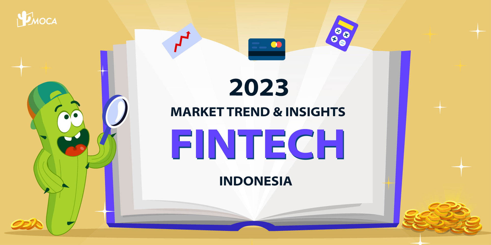
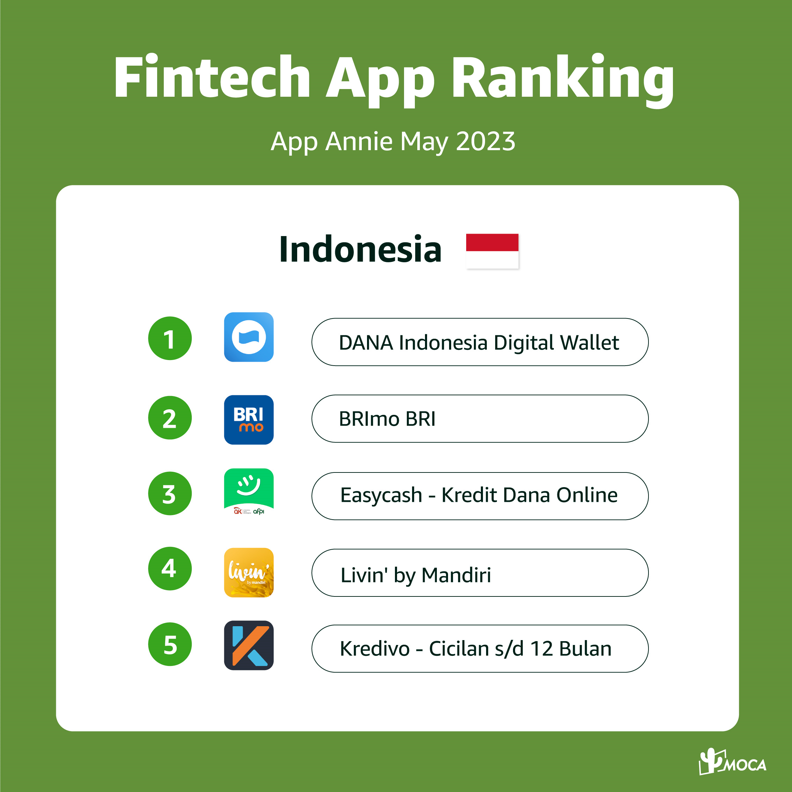
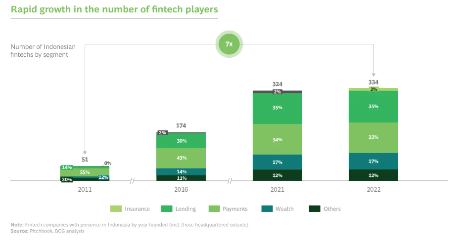
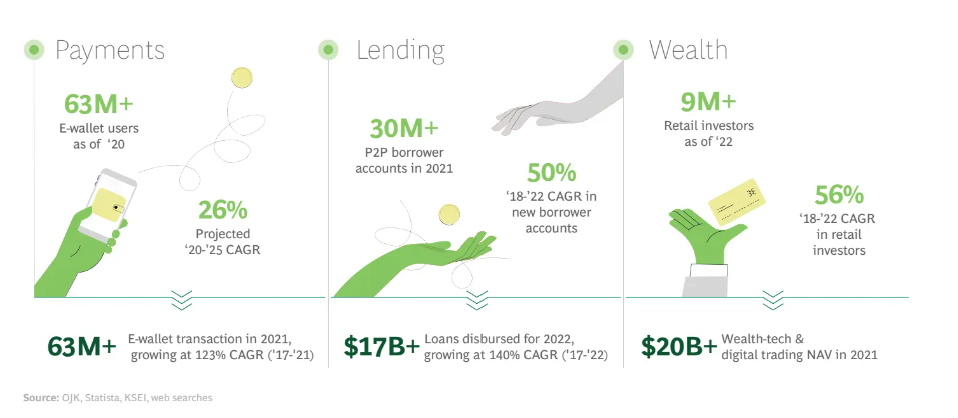
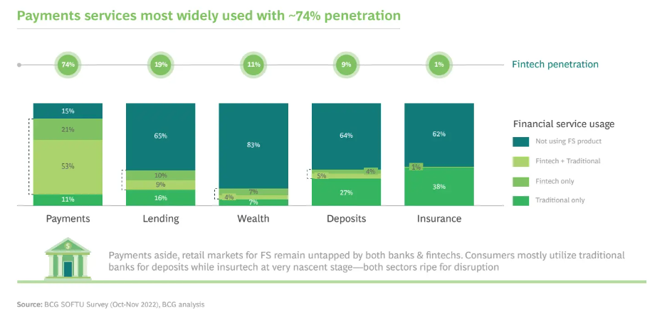

The transaction values of Indonesia in fintech grew by 39% year-on-year, the second highest growth rate among G20 countries during the COVID-19 pandemic, driven by rising consumer adoption, demand for innovative digital financial products and a dynamic venture capital landscape, released by the Minister of Communications and Informatics of Indonesia in December 2022.

According to Indonesia Fintech ranking of App Annie, in terms of downloads in May, 2023, the Top5 Fintech players includes DANA, Brimo, Easycash-Kredit, Livin’ by Mandiri and Kredivo.

There are 167 Fintech companies that offer payment, lending, personal finance, crypto and blockchain, crowdfunding, Insurtech, and PoS services in Indonesia. The Fintech industry in the country is regulated by two entities – Bank Indonesia and Otoritas Jasa Keuangan (OJK). While Bank Indonesia oversees the monetary policies, OJK takes care of P2P Lending, Crowdfunding, digital bank, data security, Insurtech, and consumer protection. According to Indonesia-fintech-report released by BCG, the number of fintech players in Indonesia increased six-fold over the last decade, rising from just 51 active players in 2011 to 334 in 2022, mainly contributed by payment segment.

FinTech apps downloads in Indonesia have seen consistent growth from Q3 2021 – Q3 2022, the top5 Finech apps grew at a combined CAGR of 14.4%. In terms of sessions, fintech apps experienced 63% increase in sessions during Q1 2022 compared to the Q4 2022 average, and with 21% increase in sessions YoY.

**The growth of Fintech business by segment**

Customer engagement with fintech offerings continues to surge. The payment segment boasts over 60 million active users and is expected to grow at 26% annually between 2020 and 2025. Meanwhile, in the lending space, there are more than 30 million active peer-to-peer (P2P) borrower accounts. Additionally, the wealth segment is thriving with over 9 million retail investors. Fintech SaaS is also experiencing a surge in adoption, with six million SMEs now using SaaS platforms. This marks a remarkable 26-fold expansion over the previous three years. Transaction values also continue to grow, with more than US$20 billion of e-wallet transactions in the period 2017–2021, a remarkable 123% CAGR.

Statista reported the average transaction value per user in the Digital Investment market is projected to amount to US$124.90 in 2023, and the Digital Assets market is expected to show a revenue growth of 39.7% in 2024. Transaction values will continue to grow, with more than US$20 billion of e-wallet transactions in the period 2017–2021, a remarkable 123% CAGR.

**Big potentials on finance service retail market**

In terms of customer penetration, digital payments lead the market with almost three quarters of respondents utilizing a fintech product. However, the broader retail market for financial services remains largely untapped for both fintech and traditional financial institutions, with over 60% of respondents not using any lending, wealth, deposits, or insurance products. Despite significant growth in the usage of fintech products, especially in the post-COVID landscape, there is still a significant opportunity to increase overall consumer awareness and adoption.

**How to survive and get positive ROI**

In Fintech category, it is very difficult to stay ahead, as the user base will be the first challenge to be survived. As per MOCA, the top digital advertising agency in Asia, based on its hundreds of fintech campaign data, 10M user base is the survival line. If the user base is less than 10M, user acquisition cost will be very high due to lower CVR. At this stage, user trust is not built yet, user retention is low, ROI is difficult to get positive. Once user base gets cross over 50M, UA cost will be dropped and under control. User retention and engagement will have obvious improvement. It is possible to turn ROI to be positive.

In other words, how to control user acquisition cost and find a cost-effective UA solution is crucial. According to 2022 Fintech report shared by Adjust, in terms of traffic source, OEM is the most efficient channel, contributing 60-70% traffic, followed by programmatic & ad networks bring 30-40% traffic. MOCA covers all OEM solutions including OEM Appstore, OEM app traffic, PAI, Air-preinstall, etc.  With rich experience on campaign optimization, MOCA team offers accurate advice on traffic selection and optimization, to help advertiser in acquiring high quality users while maintaining budget control.
