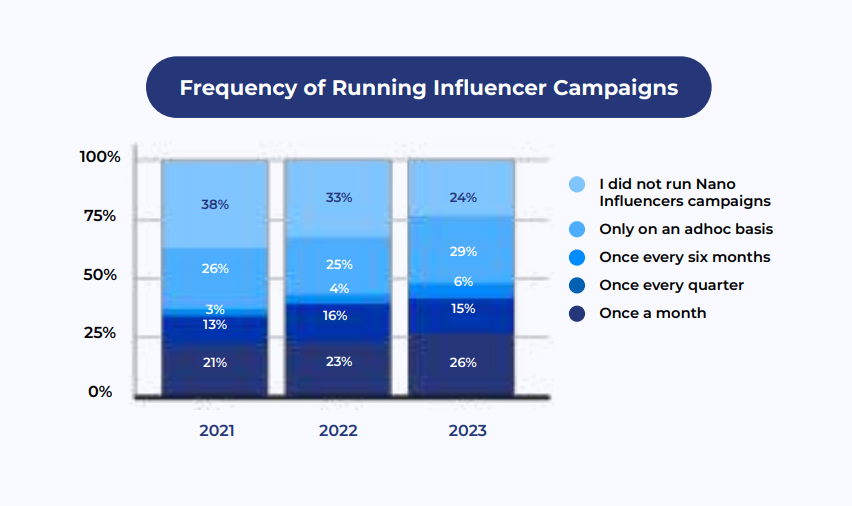

Influencer Marketing in Asia will cross $19 billion in 2023 and projected to hit $30 billion in 2027, presenting a unique opportunity to tap into niche audiences, boost awareness and drive conversions.

In Indonesia, 77% or 212.9 million of the total population are internet users, and 167 million of them use social media. This makes influencer collaborations emerging as a pivotal force in the market, steering a significant shift in how brands allocate and consumer engagement strategies.

Notably, **57.5% of Indonesian brands are allocating marketing budgets exceeding IDR 100 million in 2023**, marking a substantial increase from 42.5% in 2021. This surge in financial commitment coincides with a significant uptick in brands venturing into influencer marketing, with 86.3% actively participating in such campaigns in 2023, up from 73.8% in 2021. Furthermore, a noteworthy trend is the inclination of brands to allocate a substantial portion, ranging from 10% to 50%, of their overall marketing budget to influencer collaborations, revealing a strategic recognition of the impact these partnerships yield.

In the realm of media spending, influencers have claimed a prominent position, **ranking third in the hierarchy of media spending in Indonesia** from 2021 to 2023, capturing a significant share of 38.8%.  This trend is emphasized by the fact that an astounding 90% of Indonesian users invest more than two hours of their time on social media platforms in 2023, reinforcing the pivotal role these channels play in brands’ outreach strategies. In 2023, a considerable 71.3% of brands said they intensify influencer collaborations this year, with 26% running influencer campaigns once a month. Additionally, 47.5% of brands are working with 11 to 100 influencers and 8.8% of brands are engaging more than 100 influencers, a sharp increase from 2.5% in 2021.

In terms of content type, **short-form videos**, particularly on platforms such as TikTok, Instagram Reels and SnackVideo (Kwai), have emerged as the favored content type among Indonesian users. This aligns seamlessly with influencer content strategies, as almost **80% of users express a preference for influencer accounts over brand accounts**, seeking relatable and informative content. The integration of various content types, including comedy, memes, tutorials, and live streams, has played a crucial role in enhancing the performance and effectiveness of campaigns.

Nearly 94% of Indonesians replied that they would like to see a product or service being promoted by an influencer at least 2 times before making a purchase. They are also more impacted by a product recommended by many influencers within a period of time, bringing abundant opportunities for brands to build connection with potential consumers.

All these will continue to drive the development of influencer marketing in Indonesia and make it a crucial strategy for brands to boost brand awareness in the dynamic digital market.

Want to know more about **how to explore right influencers to your brand and track the campaign performance effect****ively**? Contact MOCA at [business@moca-tech.net](mailto:business@moca-tech.net?subject=MOCA-influencer%20marketing%20solution).
