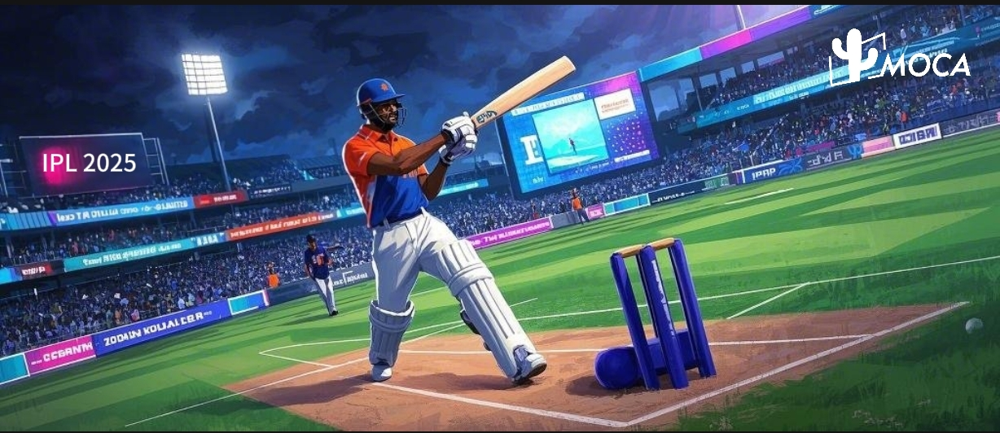

When Rishabh Pant’s ₹27 Crore LSG deal makes headlines, when India’s [CTV](/news/ctv-the-dominant-force-in-advertising-ef-bf-bc) households cross 50 million –The Indian Premier League (IPL) 2025 ceases to be just cricket. It’s now a battleground for brands to conquer 150 million digitally obsessed fans. With traditional TV’s share crashing to 32%, the message is clear: Either deploy surgical CTV + influencer combos powered by data, or watch competitors hit your market share for a six!

**IPL 2025 Auction Highlights & Viewer Behavior Trends**

The IPL 2025 auction saw teams spend a staggering ₹639.15 crore on 182 players, with marquee buys such as Rishabh Pant (₹27 crore, LSG) and Shreyas Iyer (₹26.75 crore, PBKS). While traditional TV grew by just 5% and its share dipped to 32%, digital consumption is exploding. CTV platforms like JioCinema, Disney+ Hotstar, and YouTube experienced nearly **35% ad growth** in 2024, signaling a major shift in viewer behavior**. Digital advertising in India surged by 14% in 2024, with digital video and social media ads driving much of that growth**.

**CTV & Influencer Marketing: The Future of IPL Engagement**
With CTV adoption expected to reach 50–60 million households by the end of 2025, programmatic advertising on CTV offers brands a golden opportunity to deliver hyper-personalized, real-time content. Simultaneously, influencer marketing—bolstered by IPL-themed collaborations on platforms like Instagram Reels and YouTube Shorts—empowers brands to tap into authentic, organic audience engagement. These dual strategies not only amplify reach but also deliver superior ROI compared to traditional advertising methods.

### Action Plays to Win IPL 2025

-   **Leverage Multi-Screen Engagement**: Seamlessly integrate campaigns across CTV, mobile, and social channels for maximum impact.
-   **Data-Driven Precision**: Utilize programmatic and AI-powered advertising to target premium audiences in real time.
-   **Influencer Collaborations:** Leverage IPL-themed influencer partnerships to boost organic reach and engagement.
-   **E-Commerce Synergy**: Optimize your search and e-commerce strategies to capture the surge in online consumer activity during the tournament.

IPL 2025 is set to redefine the advertising landscape—brands that embrace these innovative, data-driven strategies will lead the pack.

**Ready to Transform Your IPL 2025 Campaign?**  Contact us at business@moca-tech.net to learn how MOCA’s expertise in CTV and [influencer marketing](/news/from-followers-to-buyers-influencers-fuel-e-commerces-dynamic-shift) can unlock unprecedented growth for your brand.
