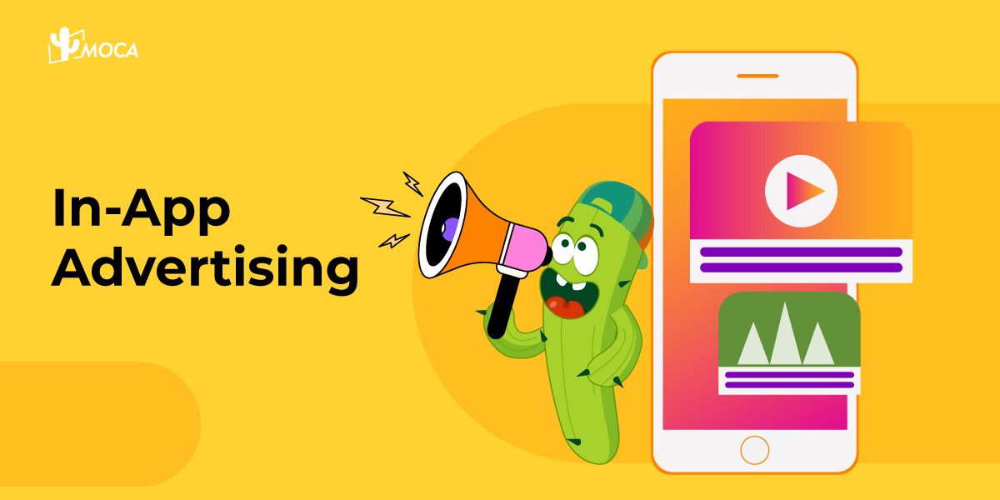

In-app advertising stands as a pivotal method for app monetization and a potent tool in the hands of mobile marketers. With the global mobile user base exceeding 7 billion and users spending more time on their mobile devices, in-app advertising has become a crucial element for the success of any mobile app.

The mobile advertising spend has witnessed exponential growth over the past decade and is anticipated to reach nearly 400 billion by the end of 2024. Specifically, in India, the in−app market is projected to reach 2,685 million in 2024, growing at a CAGR of 10.42% during 2024-2029, leading to a projected market volume of $4,407 million by 2029, according to Statista.

To maximize the effectiveness of in-app advertising, it’s crucial to understand the four primary types of in-app ads:

-   **Banner Ads**: Exceptional at increasing brand awareness.
-   **Video Ads**: Longer in duration, suitable for enhancing engagement through narratives/stories.
-   **Rich Media Ads**: Similar to banner ads but with better visual effects and sometimes interactivity.
-   **Native Ad**s: Seamlessly integrated into the app’s native environment, cleverly earning users’ trust.

Navigating the choice of the right in-app advertising type can be challenging, as different apps have varying demands. What works for one app may not necessarily yield the same results for another. Therefore, it’s advisable to test different types before launching to determine which works best. The success of an in-app advertising campaign hinges on understanding where and how to find the audience most receptive to advertising. In this context, let’s delve into the four main types of mobile app advertising.

-   **Choose the right ad format:** Finding the ad format that best suits your audience and app workflow is crucial. When selecting an ad format, prioritize the in-app user experience. For example, **avoid pop-up ads during critical moments in a [gaming](/news/navigating-opportunities-and-challenges-in-india-gaming-industry) app**, as they can disrupt the user experience and have a negative impact. If you are advertising through social media, consider how ads are displayed on different platforms and develop corresponding strategies.
-   **Invest time in creating high-quality creatives:** While crafting a marketing strategy undoubtedly requires time and effort, don’t overlook the importance of creatives. Well-crafted visuals, copywriting, and other materials can sometimes determine the success or failure of a campaign and should therefore be a priority for marketers.
-   **Conduct comprehensive testing:** To identify the most effective ads and understand the factors influencing campaign performance, conduct tests, including pricing model tests, A/B testing of creatives, etc. Use the test results to find the best ways to optimize future campaigns.

When leveraging A/B testing, focus on the following aspects:

-   **Identifying the Target Audience:** The key to the success of a promotional campaign lies in finding the ideal audience and delivering effective advertisements to them. App publishers must ensure that their user acquisition (UA) activities attract the right users, while advertisers need to select high-performing ads. The higher the relevance of the promotional activities, the higher the conversion rate. Today’s mobile marketers can leverage powerful tools such as artificial intelligence (AI) and machine learning (ML) to create quality target audiences.
-   **Balancing Advertising for Optimal User Experience****:** Finding a balance is crucial in advertising and marketing. Even if an advertisement is excellent, if it is displayed too frequently or disrupts the user’s in-app experience, it can backfire. To avoid this, you can segment your audience and deliver more relevant ads to different user groups at appropriate times. Additionally, when designing in-app ads, the goal should always be to improve the user experience and avoid ads that interfere with app usage.
-   **Choosing a Reasonable Pricing Model:** There are various pricing models available in the market, such as cost per mille (CPM) and cost per click (CPC). Make sure the most suitable model is chosen based on the goals and needs of your promotional campaign.
-   **Staying Informed about Privacy-Related Regulations:** In recent years, global regulation of data privacy has been tightening, with various laws, regulations, and standards emerging continuously. Make sure your advertising remains compliant.
-   **Understanding the Full Picture of the User Journey:** Another significant advantage of MMPs is their ability to map the entire user journey, showing how users interact with the app after initially clicking on an ad. By monitoring in-app events and user behavior, you can identify the most valuable user types for monetization and target potential high-value users in future promotional campaigns.
-   **Implementing Remarketing:** The segment of users who convert but then churn is also worth paying attention to. These users have already shown interest in the brand and have the intention to use the app. Remarketing to them can effectively stimulate re-engagement, increasing ROAS (Return on Advertising Spend) and lifetime value (LTV).

For more how to maximize in-app marketing effectiveness, contact MOCA at business@moca-tech.net.
