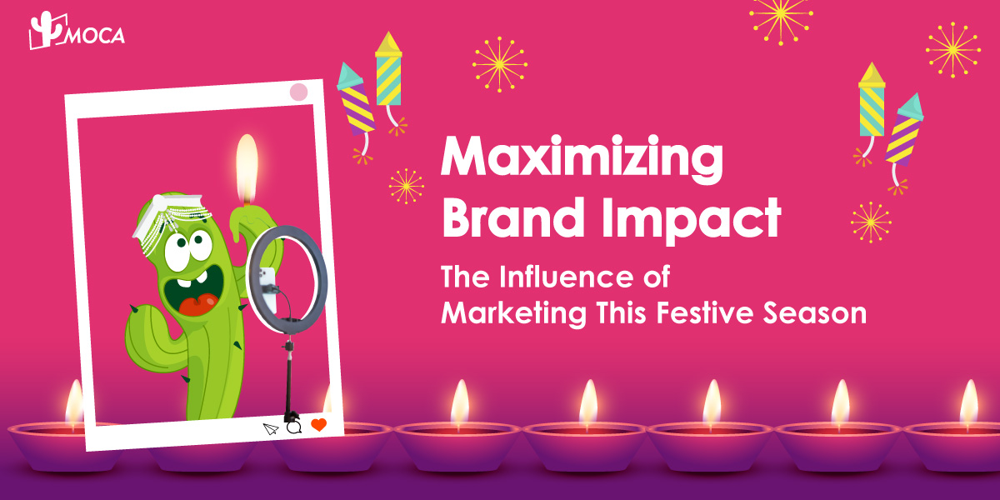

The Indian festive advertising spend is expected 15% to 20% year-on-year increase and the ad spend during festive seasons accounts for approximately 45% to 50% of annual ad expenditures.

This year, more brands are allocating larger budgets to influencer marketing, leveraging influencers’ influence on followers to increase brand voice in the market and drive sales.

Ipsos Research reveals that about 90% of respondents in India are eager to shop this festive season. Nearly half of those planning festive shopping intend to spend more, with 55% of metro shoppers and 43% from tier-two cities (populations between 1 and 4 million) increasing their budgets. According to Think with Google, around 65% of Indian shoppers have shifted to purchase products online that they previously bought in-store, with over 50% trying new brands.

The “Short Form Big Impact: Festive Blueprint” report indicates that 45% of users trust regional creators, and 86% prefer content in their native languages. Short-form videos, which dominate the format landscape, are significantly influencing consumer decisions. Notably, beauty emerged as the top category for influencer ads during Diwali 2023, with 62% of the leading makeup ads on Instagram produced by Gen Z creators. This shift suggests that millennials are no longer the primary focus of attention in this space.

In terms of platform, Instagram remains the dominant platform for influencer marketing, while YouTube is gaining traction. As Gen Z and millennials increasingly shift away from traditional media in favor of social platforms and OTT, the demand for authentic and engaging influencer content continues to grow, solidifying influencer marketing’s role as a crucial component of brand strategies.

By incorporating cultural nuances and regional languages into their strategies, brands are crafting campaigns that resonate deeply with consumers, enhancing their connection and engagement during the festive season. Influencer markting platform like KOLPlanet plays a positive role in this landscape, providing valuable insights and connections to the right influencers, enabling brands to maximize their campaign effectiveness and output.

For more insights on leveraging [influencer market](/news/the-evolution-of-influencer-marketing-in-the-creator-economy)ing during the festive season to boost business growth, contact MOCA at business@moca-tech.net.
