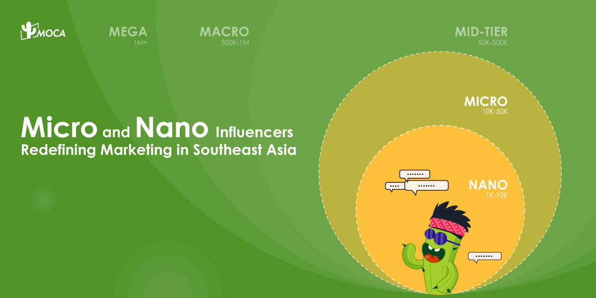

Southeast Asia is experiencing rapid expansion in influencer marketing. Over the past two years, there has been a noticeable shift towards **micro and nano-influencers** as consumers demand greater trust and authenticity. To meet this demand, campaigns are increasingly prioritizing transparency and “deinfluencing,” focusing on genuine connections with a more discerning audience.

The market’s expansion is further supported by the growing reliance on influencers for **product recommendations and lifestyle insights**. The rise of niche influencers across various industries, along with the high demand for micro and nano influencers, underscores the need for brands and agencies to build deeper connections with consumers, driving market growth.

Among influencer categories, the fashion and lifestyle sectors dominate the market. This dominance is driven by the expanding fashion industry and the imperative for luxury brands to forge closer connections with their audiences, particularly in making high-end fashion and lifestyle brands more accessible. The integration of e-commerce features has become a standard component of influencer marketing, further enhancing its impact. Since 2020, the convergence of social commerce and influencer marketing has been revolutionizing how consumers discover, engage with, and purchase products. Projections indicate that this trend, which reached $1 trillion in 2023, could grow to $2.9 trillion globally by 2026, according to PwC.

Worldwide, there are 58.2 million Nano influencers and 5.1 million micro influencers, with 2.3 million of them in India and 1.1 million in Indonesia, according to trendHero 2023. Traditionally, reviewing influencer data is often time-consuming and prone to errors，making it difficult to achieve accurate insights and timely decision-making. This inefficiency can lead to misaligned campaigns and wasted resources. The popular AI-powered influencer marketing tools, like KOLPlanet, Kofluence, Klug, are essential for overcoming these challenges. These tools provide features such as algorithm-driven analytics, real-time campaign management, and advanced data processing to boost campaign efficiency.

-   **Automated Data Analytics:** Streamlines influencer reviews, making the process faster and more accurate.
-   **Unique Reach Metrics:** Reduces wasted spend by evaluating the distinct reach of followers.
-   **Enhanced Performance Monitoring:** Improves authenticity checks and fraud detection.
-   **Accelerated Campaign Development:** Cuts planning time from 30-40 days to just 5-7 days.

MOCA is a leading digital advertising agency with a strong focus on the dynamic Asian market. With data-driven insights and end-to-end management, 12 years digital marketing experience， as well as local experts on [influencer marketing](/news/sea-influencer-marketing-a-game-changer-for-e-commerce), MOCA can amplify your brand’s presence, precisely acquire users in scale, and eventually drive business growth.

For more about influencer marketing, contact MOCA at business@moca-tech.net.
