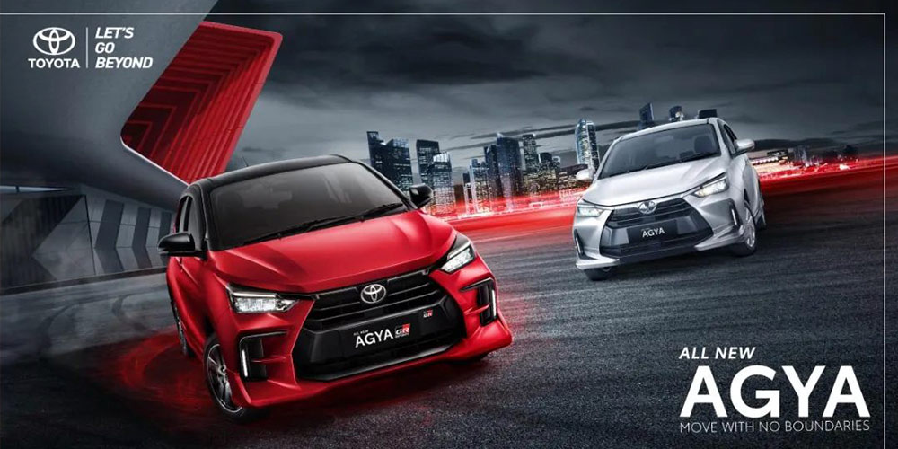

Toyota, the global leader in auto sales for three consecutive years, launched the All New Agya for the Southeast Asian market in Indonesia on March 10th, 2023.

The new model is mainly targeted towards young middle-class consumers, featuring a 1.2T three-cylinder engine that delivers a maximum power of 88 horsepower and a maximum torque of 113 N·m, paired with a 5MT/CVT gearbox. The chassis and steering system have been re-tuned to greatly enhance driving pleasure. Additionally, the All New Agya is equipped with a large-sized smoked black grille and a GR-style bumper, sleek-shaped air ducts on both sides, and red stitching accents on the steering wheel and other parts to further enhance the sporty atmosphere.

As a long-term partner of Toyota Indonesia for mobile marketing and digital media advertising, MOCA participated in the launch of the new model. Due to the strict confidentiality requirements of the launch plan, media partners were only informed of the plan before the launch. To ensure sufficient brand exposure and user coverage in a short period of time, MOCA adopted a high-intensity media linkage placement strategy across mobile and television platforms. With rich experience in brand planning and media placement, as well as strong support from various media partners, MOCA successfully completed the launch task.

We would like to express our gratitude to our partners for their trust and efficient cooperation, and wish Toyota’s All New Agya great success.
