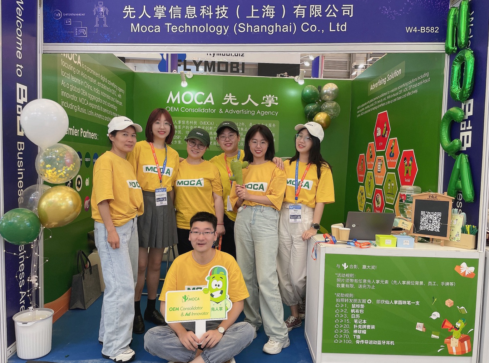
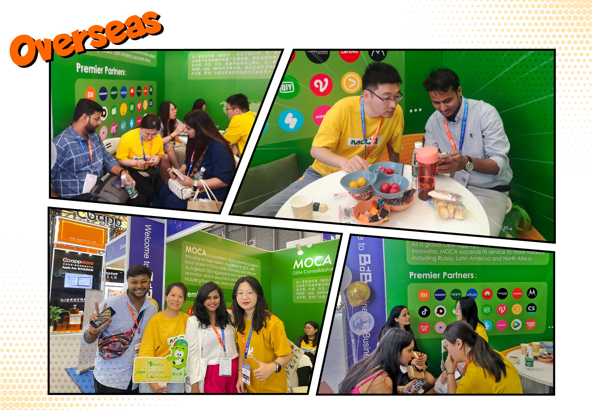

The 20th ChinaJoy (China Digital Entertainment Expo & Conference), has come to a successful conclusion. Thank you all visiting MOCA booth.

As one of the most influential global digital entertainment events in Shanghai, China since the pandemic, 2023 ChinaJoy garnered overwhelming attendance despite strong Typhoon Doksuri approaching and continuous heavy rain in Shanghai. ChinaJoy officials estimated that more than 300 exhibitors participated, attracting about 75,000 visitors daily on average from 22 countries and regions worldwide.

At MOCA booth, we warmly welcomed numerous domestic and international visitors from China, India, Indonesia, Vietnam, Russia, the Arab United Nations, Germany, and beyond, engaging in deep and insightful communication to explore diverse cooperation opportunities focusing on CTV advertising, local branding, user acquisition, and DSP advertising services.

With over a decade experience in localized digital advertising services, especially in gaming industry focusing on Asia market, by local teams in China, India, Indonesia and Vietnam as well as long-term partnerships with numerous leading media and global DSPs, MOCA offers gaming developers worldwide and brands the cost effective local solutions below:

-   CTV advertising: TV version App pre-installation on TV set, remote control shortcuts, outstream and instream video ads and so on.

-   Local branding: customized digital advertising solutions for global brands entering Indian and Southeast Asian markets, by leveraging leading media resources in the category of social, OTT, e-commerce, beauty, office, and precise targeting based on first-tier DSP platforms.

-   User acquisition: one-stop service across all global OEM appstores (Xiaomi, Samsung, vivo, OPPO/Realme, Huawei, Transsion, Lenovo/MOTO) , including app uploading, PAI/air pre-install, user acquisition, brand advertising, and more. Meanwhile, we collaborate with numerous high-quality app developers to ensure clean and high-quality traffic.

-   Programmatic advertising: based on self-developed DSP, ADX, SSP platforms (supporting RTB and PMP), and The Trade Desk (TTD) with precise user targeting capability, MOCA helps advertisers precisely target their audience.

MOCA is Looking forward to seeing you at the next ChinaJoy.
