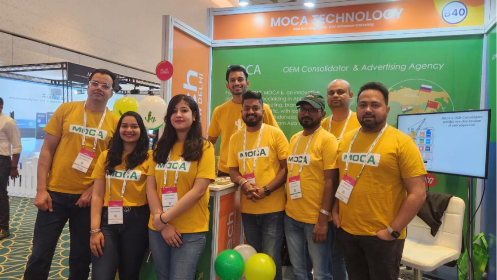
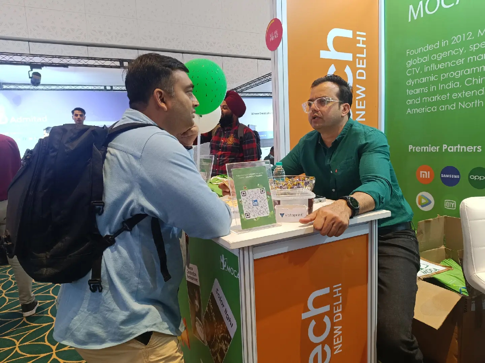
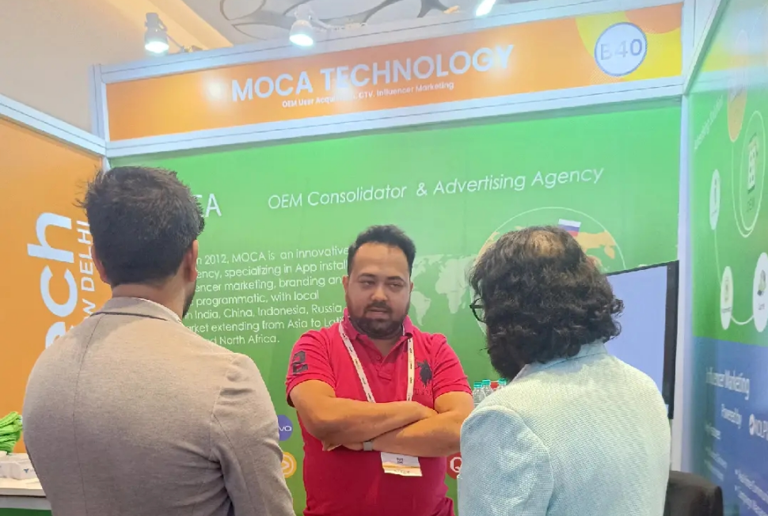
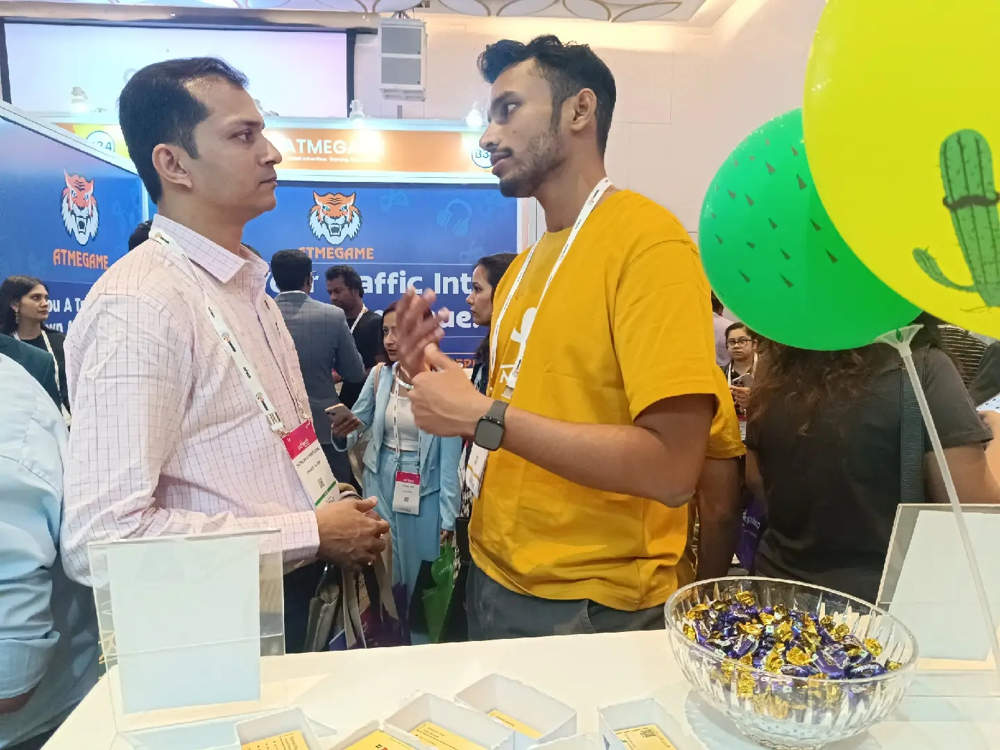
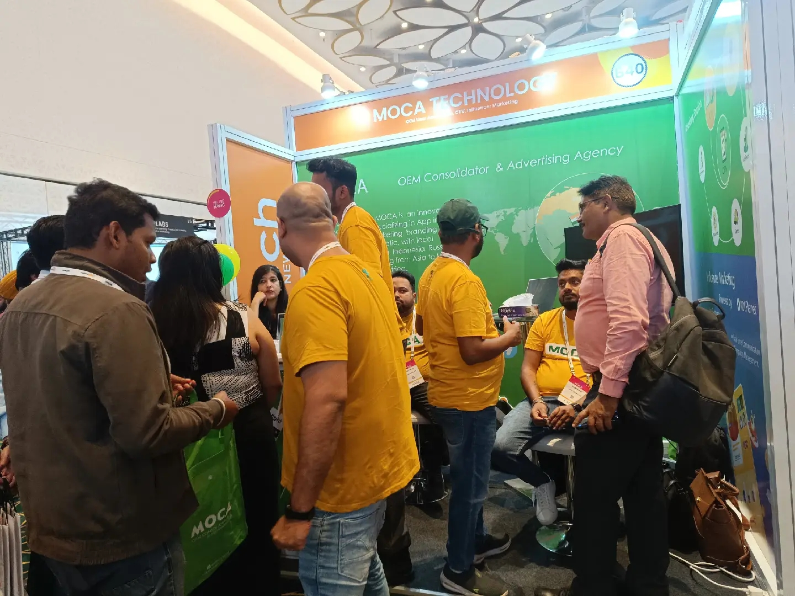

Amidst an overwhelming turnout at ad:tech India, we would like to extend our sincere appreciation to the clients,  partners, publishers and other visitors, who took the time to visit MOCA booth over the past two days.

During March 13-14, 2024, in the vibrant city of New Delhi, at Booth #B40, Ad:Tech, India, MOCA, as an OEM consolidator and innovative ad agency, demonstrated its services and the latest self-developed influencer marketing tool with decision marketers from over 25 countries. In the two-day exhibition, MOCA team had exciting conversations with guests, engaging in deep discussions on performance driving in [influencer marketing](/news/acquire-high-quality-consumers-through-influencer-marketing), CTV, ecommerce, as well as user acquisition.

Ram Thakur, the business VP of India of MOCA, emphasized that social media influencers play an increasing important role in consumer purchasing decisions. Based on MOCA’s survey about “what’s the most challenging of **user acquisition**?” in [MOCA linkedin](https://www.linkedin.com/company/moca-tech/posts/?feedView=all), about 55% participants mentioned “Fraud” and 32% responded “quality”.

He added it’s crucial to unearth tactics to enhance performance in this constantly evolving digital marketing landscape, shedding light on how we are reshaping the approach brands employ to influence and sell, particularly addressing the prevalent concerns of fake followers. As an innovative ad agency, MOCA, keeping up with the market, developed AI-powered **influencer marketing** tool. Besides facilitating seamless communication between advertisers and influencers as well as full-suite CRM integration , it can accurately identify fake followers and filter out authentic audiences for advertisers, assisting them to find the most match influencers and acquire users cost effectively.

During the discussion, one of the biggest challenges of [CTV advertising](/news/harness-ctv-ott-to-peak-performance) advertiser mentioned the most frequently was that the current CTV solution in the market is primarily billed on CPM for pre-roll and Mid-roll ads and does not support redirection, unfriendly to downloads-based on performance and cost controlling.  Regarding this concern, Somrup Nag, the account director of MOCA, showcased its CPI-based user acquisition CTV solution, and elaborated how the **CPI-CTV solution** amplify performance for advertisers in case study. “As the frequency of consumer shopping online is growing across all platforms, and the trend is also being observed in the realm of Connected TV (CTV),  CTV advertising would increasingly feature shoppable ads”, he added.

Kunal Naik, the senior manager of MOCA, with rich experience in **gaming advertising**, had deep discussions with developers and advertisers regarding gaming development and cost-effective user acquisition strategies. He mentioned, “There are currently 180 million registered fantasy sports users in India, projected to reach 500 million by 2027. The fantasy sports market in India is anticipated to grow at a rate of 40.14% during the period 2024-2032. It stands as the biggest gaming market globally, and we believe it still holds significant growth potential.”

As an OEM Consolidator & Innovative Ads agency in global market , MOCA collaborates with premium media partners. We are committed to helping advertisers explore new business growth opportunities in the dynamic digital market, enabling them to capitalize on traffic bonuses and reach potential audiences cost-effectively in the most opportune scenarios.

If you want to know more about how MOCA can help you drive business performance? Contact us at business@moca-tech.net.
