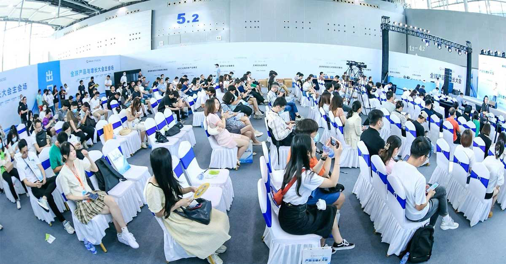
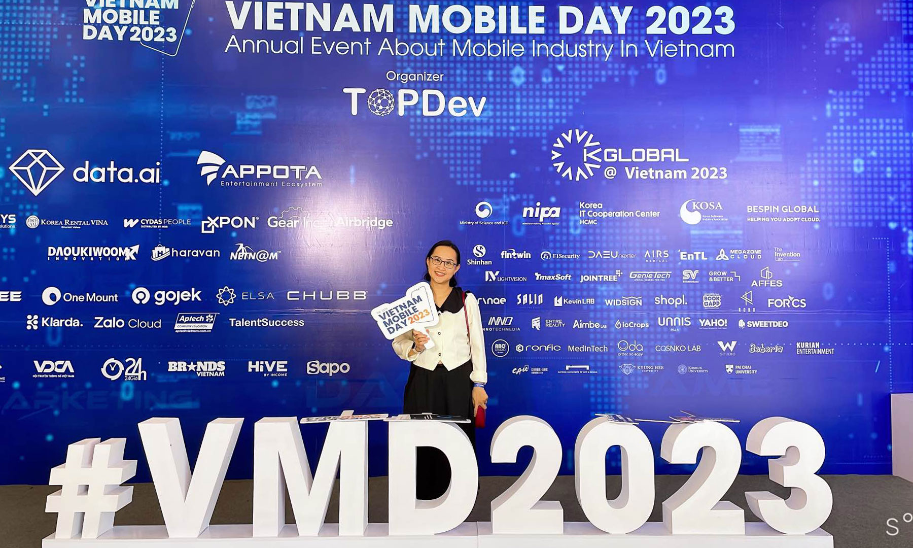
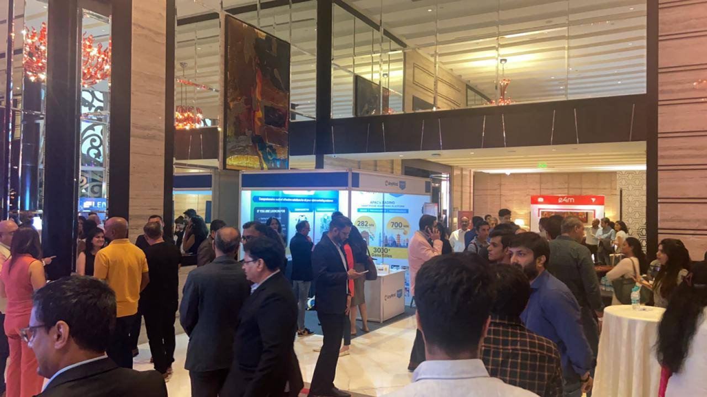
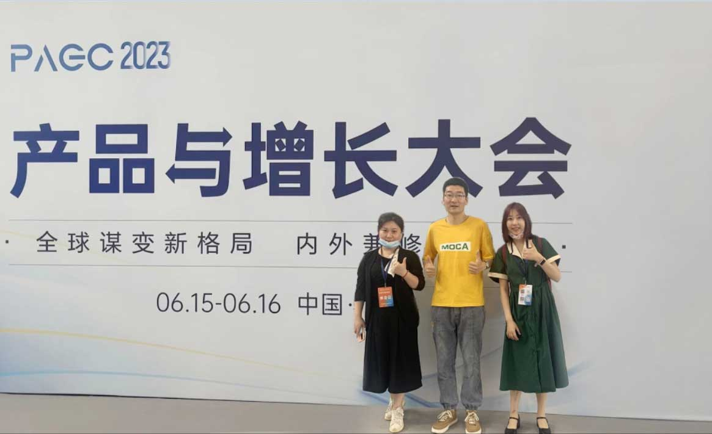

Digital marketing has expanded its wings more than ever in the past few years with the emergence of new technologies. In a dynamic market, staying ahead of the curve is imperative for digital marketers. The ability to remain up-to-date with the latest market trends and innovations is crucial for effectively navigating the digital landscape. Digital marketing events provide a golden opportunity for marketers like MOCA to resonate with clients, better understand their demand, and eventually provide cost effective and customized solutions.

## **In June 2023, MOCA Team Attended Three Events Cross Regions**

MOCA has attended three influential digital marketing events, covering gaming, the mobile economy, and overseas marketing.

### **1\. Multiverse Mobile Economy; Vietnam Mobile Day 2023:** On 9th June 2023, in Ho Chi Minh City, Vietnam

The 13th Edition of Vietnam Mobile Day is the largest mobile event for all Mobile-related businesses & individuals, attended by more than 7000 professionals, 60+ speakers, and 50+ sponsors from around the world. This renowned gathering unites esteemed experts in mobile advertising and OEMs to engage in discussions surrounding the most recent advancements and emerging trends in the mobile industry.

During the event, MOCA Vietnam team engaged with industry leaders, shared profound business insights, and uncovered opportunities of future prospects for mobile apps, branding, and promotions through esteemed OEM channels.

### **2\. GameON: Online Gaming Summit:** On 9th June 2023, in Mumbai, India

The Gaming event hosted by exchange4media brought together 500+ professionals from the gaming industry. All the prominent leaders of the industry joined the professional network to tap into the vast potential and future prospects of the gaming ecosystem.

In a vibrant atmosphere filled with gaming energy, MOCA team had a deep discussion with gaming app experts about the driving forces behind gaming growth and delved into groundbreaking strategies within the ever-evolving realm of advertising for gaming apps. Fireside chats and panel discussions offered tremendous knowledge about the future of online gaming and gaming apps.

### **3\. PAGC2023:** On 15th June 2023 at Guangzhou, China

The 3rd Global Product and Growth Conference 2023, organized by Yangfan, was a 2-day conference with special guests to collectively delve into future trends, opportunities, and growth potential in overseas markets focusing on gaming and pan-entertainment.

At the event, MOCA China Team actively engaged with gaming professionals, product managers, growth hackers, and industry leaders and shared the latest market trends and insights on the future of oversea marketing in an era of intense competition.

In the coming months, MOCA will continue to be active in global events, which will be announced in LinkedIn @ [Moca-Tech](https://www.linkedin.com/company/moca-tech/). If you were also there, Let’s meet and explore solutions on how to battle in audiences’ minds through OEM and innovative advertising solutions!
