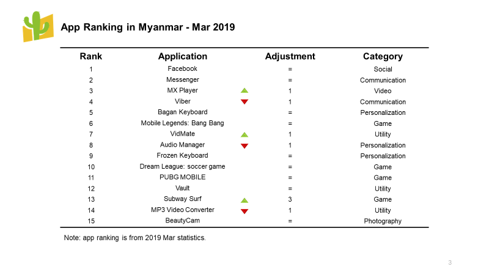
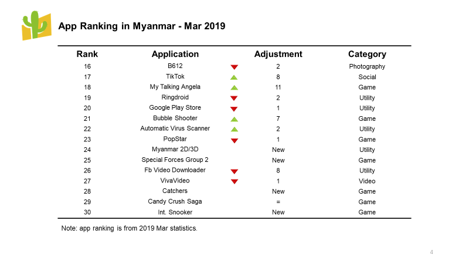

**Myanmar** is unique, compared with other countries’ mobile application markets. There hasn’t been an app store that dominates the market yet. Some of the users may choose **Google Play**. However, many users still don’t use it because people usually buy smartphones through unofficial channels. These phones are installed Chinese system by default instead of Google Service. Also, online registration for a Google account is difficult while using these phones. Under this special situation, **Zapya**’s strong offline peer-to-peer sharing function becomes important locally. Users prefer to share applications, files, music, photos, etc. through Zapya. Zapya’s users cover across the country and remain in the top metropolis like Yangon. **The 2019 first-quarter rank** is based on the application transferring times on Zapya to reflect the popularity of the applications in Myanmar, and the rank doesn’t include Zapya.

Compared with the last season, **Facebook** is still on the top of the social application category, following by **TikTok**. TikTok moved up from No. 25 to No. 17, from Dec 2018 to Mar 2019. Even the application market’s activity decreasing during the first quarter, its growth doubled from February to March, showing strong demand.

**Viber** slid a little in the general rank, but it still closely followed **Messenger** at second place in the communication application category.

In the utility category, **Fb Video Downloader** moved down from No. 18 to No. 26 generally. **Google Play Store** had a little slide as well.

**BeautyCam** is still at the first place in the photography category. **B612** moved down two places generally.

In the game category, **Special Forces Group 2**, **Catchers** and **Int. Snooker** are new on the rank. They are a first-person shooting game, an action adventure game, and a mobile billiard game. **My Talking Angela** has raised eleven places. Meanwhile, **Bubble Shooter** has raised seven places. Although casual games are generally behind competitive games, their popularity has significantly increased.

**Mobile Legends** is still on the top of the game category. As a mobile multi-player online battle area (MOBA) game, Mobile Legends dominates Southeast Asia’s game market. It is developed by Shanghai Moonton Technology company. However, the company faced a lawsuit from League of Legends last year, the popularity of the game didn’t have any effects. In the **2019 30th Southeast Asia Game**, Mobile Legends will be one of the medal events as an e-sport game.

As one of the new applications in the rank, **Myanmar 2D/3D** displays statistics of Thailand exchange stock daily and Thailand government monthly lottery. Unlike the other countries, Myanmar didn’t have stock exchange until 2012. Due to the imperfect facilities, understanding how to deal with it is difficult for local people. Myanmar 2D/3D creates a shortcut for Myanmar investors to learn stock exchange trading, by providing Thailand stock exchange data to them. It also has a live-chat function allowing users to share news with friends. The application’s growth doubled from February to March. The more economics grows, the more stocks exchange investors appear. Maybe Myanmar 2D/3D coming on the rank indicates, after the economic downturn in 2018, there will be a power drive Myanmar economics growth in 2019.

The mobile market changes not only influence application development’s trend but also affects the mobile app’s value in advertising. As the top Chinese digital media agency that focuses on Asia market specializing in mobile advertising for branding, **MOCA** will keep updating high-quality news and reports.

**About Zapya**

*As the choice of over 600 million users from 200 countries, Zapya is one of the world’s fastest cross-platform file sharing tool who dominates the Myanmar market. It allows the user to transfer files via Androids, iPhones, iPads, Window Phones, PCs, and MacBooks immediately. With Zapya, users can share photos, videos, music, installed apps and any other formats of files anytime, anywhere, and without network restriction!*
