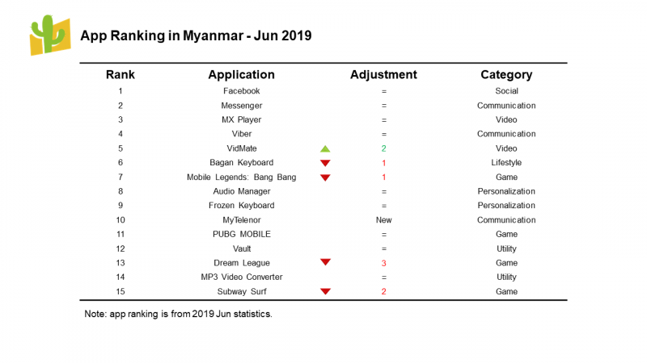
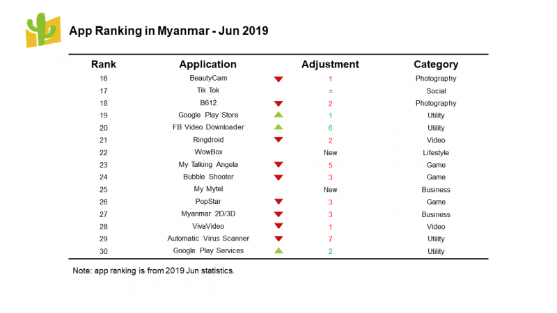

In the past 6 months of 2019, the global mobile application market has many changes beneath the surface. How does the Myanmar mobile application market perform in this period? MOCA & Zapya co-published 2019 2nd quarter Myanmar mobile application rank report, providing the primary information for marketers.

**Myanmar Mobile Application Market**

In the global mobile application market, Myanmar is a special region. There hasn’t been a dominated application store there. A small portion of the users who speak English would like to choose the Google Play Store. Many people purchase phones in unofficial ways. These phones didn’t come with Google Service. Therefore, it is difficult to register a google account. Under this situation, Zapya’s powerful offline file transferring function becomes extremely important. Users like to use Zapya to download applications, transfer files, share photos, and music. In Myanmar, the high usage keeps Zapya staying in the first place in the utility category. Therefore, the 2019 2nd quarter Myanmar application rank is based on the application transferring times on Zapya to reflect the popularity of the applications in Myanmar, and the rank doesn’t include Zapya.

**Rank Analysis**

The application rank didn’t have many changes this time.

Besides My Telenor is new on the rank, Social’s and Communication’s categories haven’t changed at all. The ranks showed stable in the last season.

In the Video category, Ringdroid and VivaVideo had a tiny slide down. VidMate went up 2 places. MX Player didn’t have any change.

All the Photography applications had a little decline. However, the BeautyCam still be the first place in this category, B612 followed behind it closely.

In the Personalized & Lifestyle category, Wowbox is new on the rank. Other apps didn’t change except Bagan Keyboard declined 1 place.

One of the categories that have a big change was Game. Only PUBG MOBILE hasn’t changed, other games all have declined. My Talking Angela had a significant dropped, which are 5 places.

In the Utility & Business category, only 3 apps went up. Other apps all have declined. Automatic Virus Scanner had a significant dropped, which are 7 places.

**My Telenor、WowBox & My Mytel**

The three new apps on the table all belong to telecom. My Telenor and WowBox are from Telenor. My Mytel is from Mytel. Meanwhile, My Telenor and My Mytel are functioned as clients service applications. Mytel is a Southeast Asian telecom with 4G technology. They have been promoting their 4G services recently. Therefore, the application has a boost as well.

As one of the successful telecoms, Telenor started the business in the Scandinavian Peninsula. In 2004, they launched their operation in Pakistan to expand in the Asia-Pacific region. Later, they opened their branch in Myanmar in 2014. According to the report, Telenor added 1.4 million subscriptions in last season, and the total subscriptions reached the highest number-19.8 million. Therefore, as they were promoting the 4G service, their lifestyle application-WowBox’s had a better condition to spread in the market.

Most mobile applications rely on high-speed internet condition to maximize their app functions and monetization. The rank just showed the fierce competition of telecoms and their 4G service, which might indicate a new trend of application developing there.

The mobile market changes not only influence application development’s trend but also affects the mobile app’s value in advertising. As the top Chinese digital media agency that focuses on Asia market specializing in mobile advertising for branding, MOCA will keep updating high-quality news and reports.
