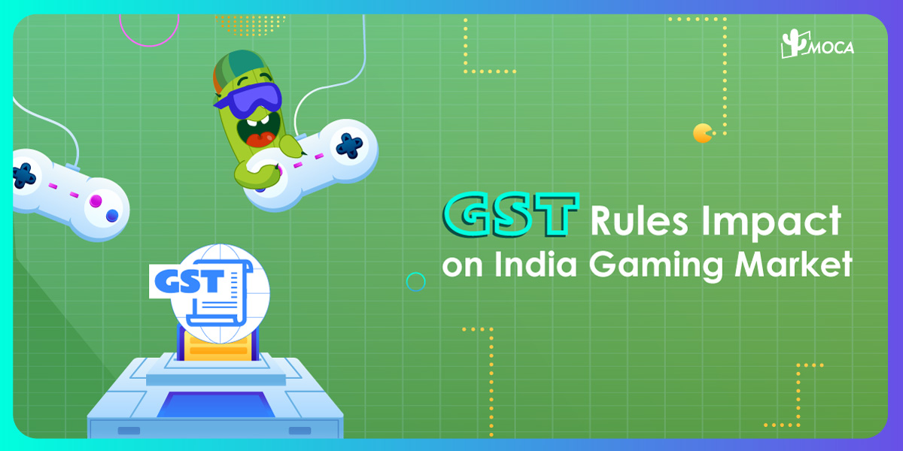
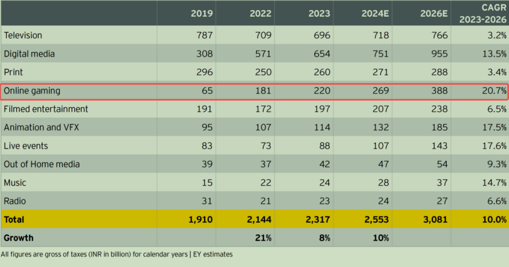

The growth of the Media & Entertainment (M&E) sector in India is being propelled by increased internet accessibility and affordability. As per EY estimates，in 2024, the Indian M&E sector is projected to grow by 10.2%, reaching INR 2.55 trillion. It is expected to continue expanding at a CAGR of 10%, hitting INR 3.08 trillion by 2026. While TV remains the largest segment, digital media is anticipated to overtake it in 2024. **[Online gaming](/news/rmg-driving-india-online-gaming-market) will be the fastest-growing segmen**t, with a 20.7% CAGR from 2023 to 2026.

India is the world’s biggest market by mobile game downloads, with over 455 million online gamers in 2023, expected to reach 491 million in 2024. Of these, 100 million play daily, including 90 million gamers pay to play, with real money gaming comprising 83% of segment revenues.

As per EY-LOCO gamer survey, 58% of respondents were willing to spend money to play real money games while 52% of respondents had paid to play fantasy sport in 2023. Game streamers also saw an increase in viewership of 20% to 25%, particularly in Tier-II cities.

**Online Gaming, Driven by In-app Purchases and Fancy Sports**

By 2026, online gaming revenue is expected to reach INR 388 billion. The fastest growing segment would be in-app purchases with a CAGR of 27%, followed by fantasy sport at 23% and rummy and poker at 19%. In-app revenues around casual games are estimated to double to INR 28 billion by 2026.

The survey showed that transaction-based game revenues increased by 21% to reach INR 182 billion in 2023, expected to reach INR 222 billion in 2024, led by fantasy sports with INR 120 billion, thanks to the IPL and the CWC, where India’s performance drove both viewership and game play, followed by rummy and poker with INR 82 billion.

**GST Rules Impact on Gaming Market**

 The shift in the GST rate from 18% on the platform fee or Gross Gaming Revenue (GGR) to 28% on the full face value has indeed posed significant challenges for online skill gaming companies. Larger companies have been compelled to rework their business models to mitigate the impact on players and sustain growth. However, this adjustment has strained profit margins, leading to layoffs and shutdowns, particularly among smaller companies.

In the short term, we can expect several developments:

1.  Business Model Innovations: Companies will likely introduce new features, game modes, and monetization strategies to attract and retain players while minimizing the tax burden’s impact.
2.  Incentives for Players: To maintain player engagement, companies may offer more promotions, bonuses, and loyalty programs.
3.  Consolidation in the Industry: Larger companies may acquire smaller ones struggling to adapt, leading to fewer but more robust players in the market.

Overall, the industry is likely to see significant changes as companies navigate this new tax landscape, balancing player engagement and financial sustainability.
