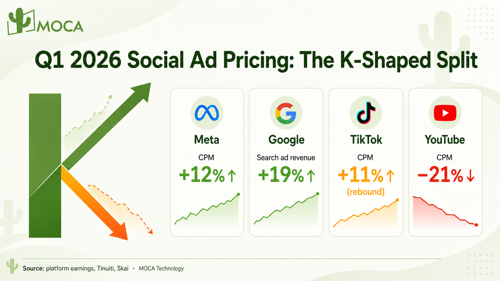

Cross-border marketers have spent the last six months complaining about the same thing: ads keep getting more expensive. But read the platform earnings and the benchmark reports, and the real story is not “everything went up.” It is a K-shaped split. In Q1 2026, Meta CPM rose 12%, Google search revenue grew 19%, TikTok rebounded 11%, and YouTube CPM fell 21%.

Treating those four platforms as one ad market is now the most expensive assumption a brand can make.

*Q1 2026 ad pricing at a glance. Sources: platform earnings, Tinuiti, Skai.*

| Platform | Q1 2026 price move | Volume signal | Main driver (source) |
| --- | --- | --- | --- |
| Meta | CPM +12% | Impressions +19% | Advertiser demand + AI capex pass-through (WSJ) |
| Google | Search revenue +19% | $60.4B Q1 | Core search holds; long-tail returns (Alphabet Q1 2026) |
| TikTok | CPM +11% (rebound) | Spend +14%, 18% budget share | Budget migration (Skai 4/28; Tinuiti Q1) |
| YouTube | CPM -21% | CTV spend +39% YoY | 72% of spend on TV screens (Tinuiti Q1 2026) |

## Why Are Some Prices Climbing Faster?

### Meta keeps climbing

Meta CPM moved from a 6% rise in Q4 2025 to a 12% rise in Q1 2026. Over the same window, Meta raised its 2026 AI capital-expenditure guidance twice in four months. [According to The Wall Street Journal](https://www.wsj.com/business/earnings/meta-meta-q1-2026-earnings-report-ae021875), the price increase came from two forces: accelerating advertiser demand, and Meta passing its AI investment bill on to advertisers.

Prices rose 12%, but total impressions rose 19%. Each dollar buys more reach than before. The catch is that pricing power has quietly shifted to the algorithm, not the buyer.

### Google’s search pie is still intact

[Alphabet’s Q1 2026 earnings](https://abc.xyz/investor/) reported search ad revenue of $60.4 billion, up 19% year over year. AI search tools such as Perplexity and ChatGPT are absorbing a large share of general web traffic, yet Google’s core search advertising held firm.

Head terms that everyone bids on, like “running shoes” or “rackets,” climbed alongside Meta. But once AI search took over knowledge-style queries such as “how to choose running shoes for your foot type,” it pushed the specific long-tail terms back to Google, where competition is lighter and clicks are cheaper. That long tail is now the better-value inventory.

> **Key finding:** Meta CPM rose 12% in Q1 2026 while impressions rose 19%, and Alphabet search ad revenue grew 19% to $60.4 billion. Demand-side pressure, not scarcity, is driving the climb on both platforms.

## TikTok Rebounds, YouTube Opens a Pricing Window

### TikTok is the most underrated platform this quarter

[According to Skai’s Q1 report](https://skai.io/newsroom) (April 28), advertisers pushed TikTok’s budget share to an 18% five-quarter high. [Tinuiti’s Q1 data](https://tinuiti.com/research-insights/research/digital-ads-benchmark-report/) confirmed the turn: TikTok CPM rebounded 11% after four straight quarters of decline, while ad spend rose 14%.

[Business Insider](https://www.businessinsider.com/) documented a finer split inside the platform. TikTok micro-influencers, with 15,000 to 50,000 followers, saw prices rise roughly 125% in Q1 2026, while mid-tier creators fell 29% and top-tier creators dropped 18%.

The same split runs inside the creator market, tier by tier, not just across platforms. It also tracks the wider shift toward search-led discovery we covered in [TikTok’s search-first shift](/news/tiktok-search-first-shift-sea-2026).

| TikTok creator tier | Follower range | Q1 2026 rate move |
| --- | --- | --- |
| Micro | 15,000-50,000 | +125% |
| Mid-tier | mid-range | \-29% |
| Top-tier | large | \-18% |

### YouTube cuts price to hold volume

YouTube CPM fell 21% in Q1 2026, but spend on television screens rose 39% year over year, and 72% of Q1 video-ad spend went to connected-TV screens, [according to Tinuiti’s Q1 2026 Digital Ads Benchmark Report](https://tinuiti.com/research-insights/research/digital-ads-benchmark-report/). More viewers are watching YouTube on the living-room big screen, yet the unit price has not kept pace. Brands running awareness and CTV campaigns are sitting in a short-lived pricing window, the same big-screen shift we mapped in our [World Cup 2026 second-screen strategy](/news/world-cup-2026-second-screen-strategy-sea-india).

> **Key finding:** TikTok CPM rebounded 11% to an 18% five-quarter budget-share high, with micro-influencer rates up 125%, while YouTube CPM fell 21% even as connected-TV spend rose 39%. The cheapest inventory and the fastest-rising inventory now sit on different platforms.

## MOCA Technology’s View

### A K-shaped split is the normal state

Q1 2026 social ad pricing tells four stories at once. Treating Meta, Google, TikTok, and YouTube as one platform category is the most expensive cognitive error in cross-border media buying. After each quarterly earnings cycle, reweight every platform on current data. Do not carry last quarter’s budget split forward out of habit.

### The early rebound window beats the rising window

TikTok’s budget share jumped to 18% in a single quarter because of budget migration. Today’s price is probably below where it will sit two or three quarters from now. The early stage of a rebound is worth more than the late stage of a climb.

### Reading scheduling signals decides profit and loss

In 2026, the ad-budget question has shifted from whether to spend to which side to spend on. MOCA Technology, which has run cross-border media across Asia-Pacific since 2012, treats each quarter’s platform earnings as a scheduling signal rather than background noise. That is where ROI and long-term growth become predictable instead of accidental.

> **Key finding:** MOCA Technology, operating cross-border media in Asia-Pacific since 2012, recommends reweighting Meta, Google, TikTok, and YouTube after every quarterly earnings cycle and buying rebound platforms early rather than carrying last quarter’s split forward.

## Frequently Asked Questions

### What is a K-shaped split in social ad pricing?

A K-shaped split means platform prices move in opposite directions at the same time instead of rising or falling together. In Q1 2026, Meta (+12%) and Google (+19%) climbed while YouTube CPM fell 21% and TikTok rebounded 11% from a low base.

### Why did Meta CPM rise 12% in Q1 2026?

The Wall Street Journal attributed Meta’s Q1 2026 increase to accelerating advertiser demand and Meta passing its rising AI capital-expenditure costs on to advertisers. Impressions rose 19% over the same period.

### Is Google search advertising still worth it after AI search?

Yes. Alphabet reported Q1 2026 search ad revenue of $60.4 billion, up 19%. AI search shifted knowledge-style queries away from Google, but pushed cheaper, lower-competition long-tail terms back into search inventory.

### Why is TikTok ad pricing rebounding?

Tinuiti’s Q1 data shows TikTok CPM rose 11% after four quarters of decline, with ad spend up 14%, as advertisers moved budget share to an 18% five-quarter high (Skai, April 28). Micro-influencer rates rose 125% while mid- and top-tier creator rates fell.

### Why is YouTube cheaper in Q1 2026?

YouTube CPM fell 21% even as connected-TV spend rose 39% year over year and 72% of video-ad spend went to TV screens (Tinuiti Q1 2026 Digital Ads Benchmark Report). Unit pricing has not kept pace with the shift to the living-room screen, opening a short-term window for awareness and CTV buyers.

## About MOCA Technology

Founded in 2012, MOCA Technology is an influencer marketing and programmatic advertising platform serving brands across Asia-Pacific. MOCA operates [KOLPlanet](https://www.kolplanet.com), a creator marketplace connecting brands with influencers across Indonesia, Thailand, Vietnam, the Philippines, Malaysia, Japan, South Korea, Taiwan, and India.

MOCA Technology’s core services include influencer marketing strategy and execution, creator-brand matchmaking through KOLPlanet, innovative branding solutions, and cross-platform programmatic advertising. The company is headquartered in Shanghai with local teams in Jakarta, Bangkok, Manila, Taipei, and Mumbai, anchored by 14 years of operating experience across Southeast Asia and India.

**Rebalancing your 2026 ad budget across Meta, Google, TikTok, and YouTube?** Talk to our Asia-Pacific team about quarterly platform reweighting, creator-tier selection, and cross-platform media planning.

Contact: [business@moca-tech.net](mailto:business@moca-tech.net?subject=Q1%202026%20Ad%20Pricing%20Strategy) | [www.moca-tech.net](https://www.moca-tech.net)
