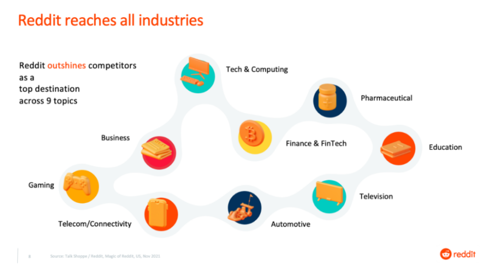
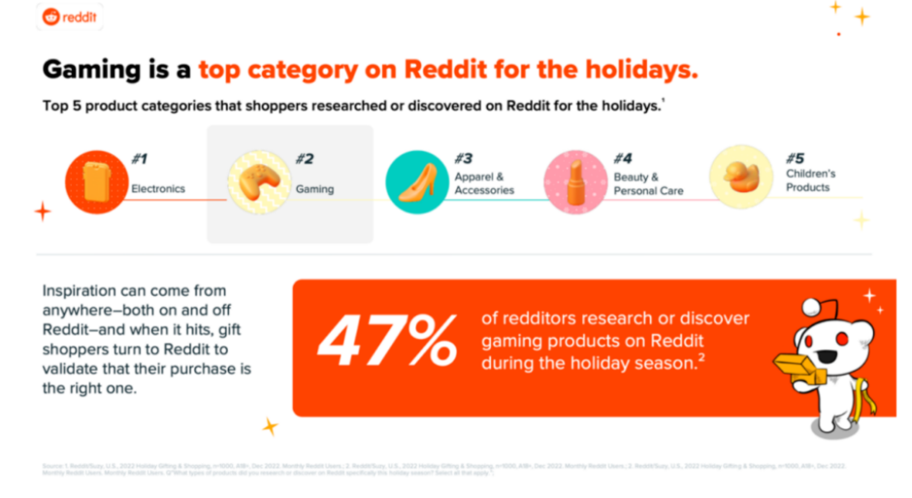
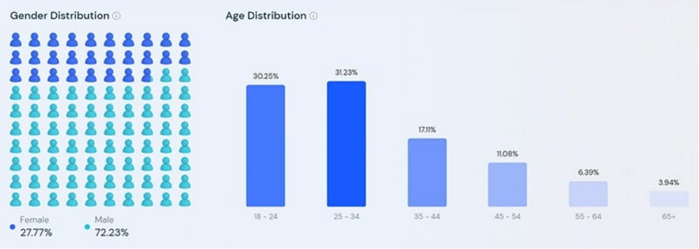
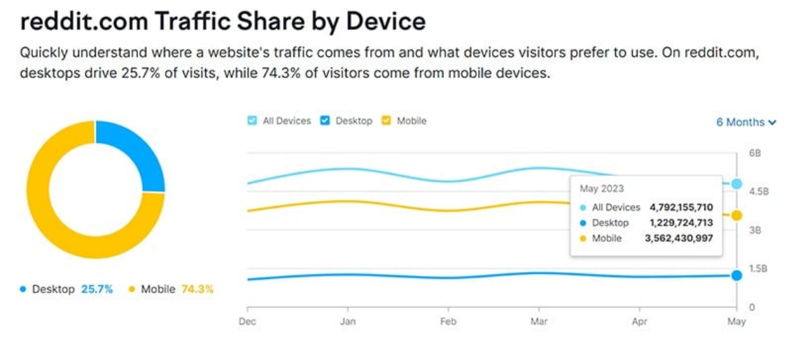

We are thrilled to announce that MOCA and Reddit, the most popular social media worldwide, have built strategic partnership, to help advertisers to scale up user base and acquire users more cost effectively with content driven ads.

Reddit ranks at No.7 as the most visited site. It is estimated with an 55.79 million daily active users and 1.660 billion monthly active users in 2023, according to Reddit User Base & Growth Statistics.

**The Advantage of Reddit Platform**

Reddit users exhibit a lower overlap with mainstream and emerging social platforms, with 70% overlap with Facebook users and only 42% overlap with TikTok users. Reddit users demonstrate high interactivity, with 94% engaging with recommended content. These users span various industries, mainly from the categories such as technology, healthcare, business, finance, education, gaming, telecommunications, television, automotive, and more.

Unlike many social media platforms, Reddit’s “subreddit” structure gathers users with shared interests into communities devoted to specific interests. This structure facilitates the delivery of ads that are more relevant to the users’ interests.

With machine learning based AI research tool, Reddit can analyze the original context of each keyword among posts and conversations that align best with each advertiser’s requirements, to display the most fitting ads to the relevant Reddit users for advertisers.

**Strong Gaming Content Demand**

Reddit official reveals that gaming content ranks first in terms of recommendations, comments, and searches related to in-app purchases. 95% of gamers express high trust in games recommended by the platform. During holidays, the [gaming category](/news/the-impact-of-ipl-on-india-advertising-and-gaming) stands out, with 47% of Reddit users indicating their intention to try new games.

*Reddit User Profile As per Reddit statistics report, the largest age group of visitors is 25-34 years old, with 31.70% of the Reddit traffic, followed by 18-24 years old, accounting for 30.78% and 35-44 years old (17.15%), 45-55 (10.77%), 55-65 (6.11%), and 65+ (3.50%). 80% of Reddit users followsReddit guidence to watch a new show or movie, and 51% rely on Reddit to discover new entertainment content. Reddit user spend more than 15 minutes a day on the site.*

*In terms of traffic contributed by country, The United States contributed 47.13%, followed by The United Kingdom with 7.48%, Canada with 7.36%, Australia with 4.15%, and Germany with 3.40%.Mobile devices account for the majority of Reddit’s traffic, with 75.5% of users accessing the site via smartphones. Desktop traffic accounts only for 24.5% of total visits, according to SEMrush.*

*Ads FormatReddit advertising platform support various marketing objectives, including brand impressions, website traffic, conversions, video ads, app downloads, and so on. There are primarily two forms of advertising: bidding ads and day-package branding ads. The former is more focused on performance, while the latter emphasizes branding. Leveraging robust content and community categorizations, Reddit enables highly precise targeting based on user interest and community demographics.As a global partner of Reddit, with data-driven insights, MOCA will provide one-stop advertising solution for brands to effectively engage Reddit’s diverse user base, driving action and influences users’ purchasing decisions.*
