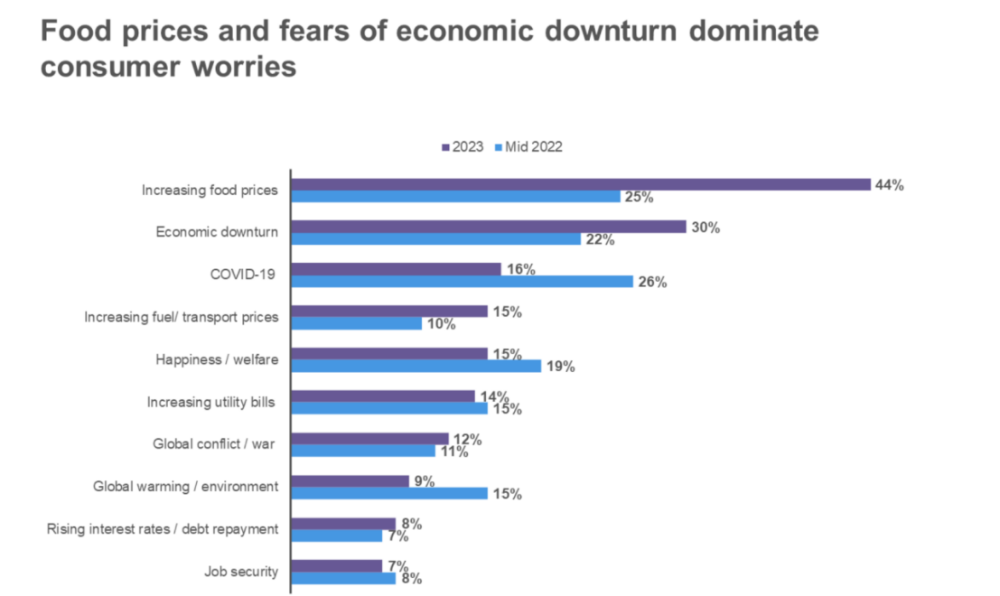
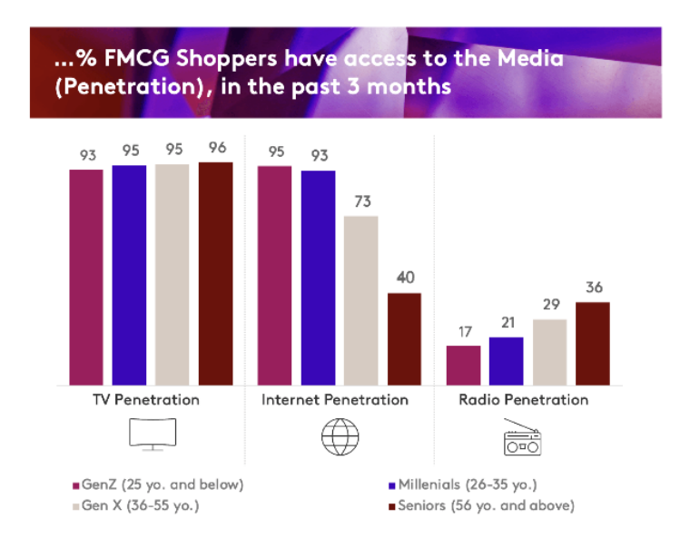

The FMCG industry is the 4th largest sector in Indonesian economy, with 50% of its market in home, cosmetic and personal care segments, and 31% and 19% in the food and drink market, with a positive overall year-on-year market value of 5.9% up in 2022 Q3 in Indonesia, said Statista. On average, Indonesian families spend about 20% of their entire household spending on FMCG items, with the food segment making a major contribution. However, around 1/3 of FMCG categories have had significant price increases above total FMCG inflation of 7%, especially in food category, according to FMCG Outlook Indonesia 2023 of Kantar.

### Source: NielsenIQ 2023 Consumer Outlook Survey vs. Mid-year Outlook July 2022

74% of Indonesian consumers are concerned about their personal financial situation, leading to the overall spending cautiously. 62% said they buy certain products only when they are on promotion/special offer. 54% said they use comparison sites to find cheaper alternatives. Additionally, quite a lot of consumers choose in-store instead of online store is that it takes longer time to be delivered than they were told at time of purchase, according to PwC’s 2023 consumer insights survey.

Even though, expanding online presence still looks to be a valuable opportunity as it is the only channel experiencing consistent growth in buyer growth. FMCG e-commerce continues to grow across socioeconomic status, driven by higher purchase frequency and an increase in the number of categories being purchased online. The contribution of top FMCG e-commerce categories, including skincare, cosmetics, cologne, face powder, and foundation maintain, are over 10%.

**Source: Kantar**

In the market, in terms of media landscape**, TV remains a popular and important touch point for building awareness and mass communication**, with 95% user penetration among age group 26-55. Interestingly, across regions, secondary cities and rural areas exhibit a potential to drive FMCG spending, demonstrating an 8% upswing compared to just 5% growth observed in major cities, as per Kantar.

These constantly shifting purchasing behavior make it essential for FMCG brands to keep up to date with the trends in the market and response with a seamless strategy for online and offline channels, optimizing the different price-points and touch points to engage with different shopper segments.  Product innovation will be the main differentiation in recruiting new shoppers, with new flavours, occasions, pack sizes and functionality.

Unquestionably, advertising innovation assumes a pivotal role in not only driving user engagement but also in acquiring new users. This is particularly crucial as users routinely switch between different applications in diverse scenarios.

In partnership with global top-ranking apps in Asia market such as SnackVideo, WeTV, iQiyi, WPS, BeautyPlus, Camera 360, CamScanner, etc , MOCA explores **scenario-based advertising** to help advertisers battle for consumers’ mind with innovative branding solutions, covering social, pre-roll video, music, beauty, weather, SMS, etc.
