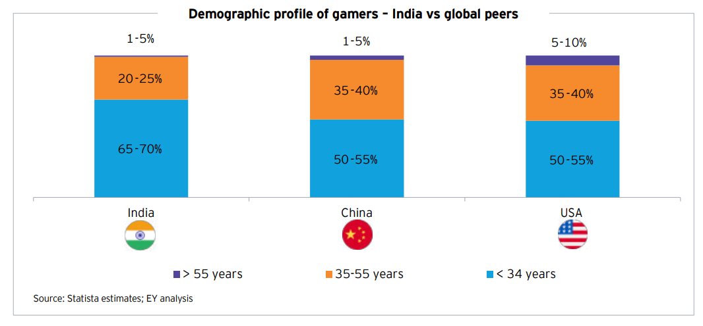

India online gaming is the second-largest gaming market globally. Although extensive deliberations within the GST council over the past 18 months brought about changes on the online gaming segment, with increasing GST from 18% to 28%, the market is still experiencing rapidly growth, expected to reach INR33,243 crore by 2028, with a projected CAGR of 14% over the next five years, according to New Frontier Online Gaming report by EY.

The online gamers reached 42.5 crore in 2023, expected to see 5% CAGR gamer growth, to reach 53.8 crore by 2028. The market skews a youthful demographic, with 65-70% of gamers under 34. In 2023, the number of paying gamers reached 140 million, growing by 17%, and contributing 25% share of total gamer base. The average revenue per paying user has increased almost 10 times of 2019, reaching $19.2, driven by factors including increasing interest in RMG among tier 2 and tier 3 audiences, a surge in in-app purchases, and gaming’s shift towards a lifestyle choice. On average, each active user spend 10-12 hours on gaming in a week. 94% of gamers preferring mobile gaming, accentuating the ‘mobile-first’ approach fueling the market’s expansion.

In terms of App downloads, India ranks No.1 globally. According to January 2024 data released by Sensor Tower, the global downloads in AppStore and GooglePlay reached 45,200 million, including 718 million contributed by India with 15.9% share.

Although India online gaming market is soaring, the current gamer penetration is only around 30%, far behind of the 53% of China and the 56% of U.S. With a strong focus on youth and increasing gamer penetration, coupled with innovative in-game ad formats driving user engagement, India gaming market is on a path towards exponential growth, presenting a lucrative opportunity for gaming apps, particularly in RMG.

Advertisement-led monitization holds significance of India online gaming sector, as the paid user base in concentrated within the RMG segment. [Mobile gaming](/news/2023-global-gaming-apps-growth-overview) advertising revenue is forecasted to increase at a 25% CAGR from 2023 to 2028, and the real money gaming (RMG) sub-segment holds a significant stake, comprising 82.8% of the market share in 2023, featuring over 400 RMG start-ups, expected to witness a 13% CAGR. The sector is seeing a 90% ads completion rate. In-game ad formats like opt-in reward ads, playable ads, and personalized video ads have transformed gaming ads into an engaging feature for gamers.

Want to know more how to acquire users cost effectively for your apps? Contact MOCA at business@moca-tech.net.
