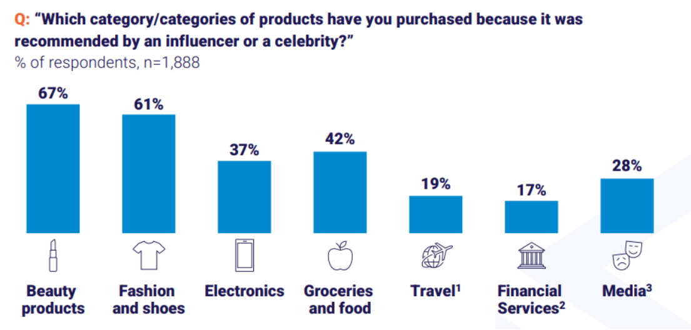

The ecommerce market is in Southeast Asia forecasted to reach $235 billion by 2028, with Indonesia accounting for the largest share at 44%, followed by contributions from Thailand at 17% and the Philippines at 12%. In terms of ecommerce categories in the region, electronic & appliances, fashion & shoes, and beauty & personal care categories lead in terms of NMV, representing 30%, 20%, and 15% respectively.

Influencer marketing is a significant sales driver of e-commerce sales in Southeast Asia, directly contribute around $11 billion of NMV in 2023. By 2028, influencer marketing sales contribution will increase by 13% to 17%.

As consumers increasingly tune out traditional digital ads, native advertising methods like influencer marketing are becoming essential to engage with younger demographics. This shift necessitates a strategic focus on influencer-led marketing campaigns to effectively target and resonate with audiences who seek authenticity and trust in their purchasing journey, greatly driving ecommerce sales.

In Southeast Asia, over 80% of consumers have made purchases based on influencer recommendations. In Indonesia, this trend is even more pronounced, with over 87% of consumers making purchases influenced by recommendations from influencers or celebrities, with beauty and fashion are the top categories. Specifically, 67% of consumers purchased beauty products, 61% bought fashion and shoes, while 40% opted for electronics.

With 167 million active social media users in Indonesia, the influence of influencer marketing on consumer behavior is indisputable, creating a distinctive consumer experience that often combines digital shopping and entertainment (“shoppertainment”). Indonesians typically spend an average of 3.5 hours daily on various social media platforms. In terms of social media content consumption, entertainment stands as the most prevalent category, attracting 82% of users, followed by lifestyle at 62%, and buying recommendations at 50%.

As to social media platforms, YouTube and Facebook hold a dominant position in Southeast Asia’s digital landscape, with approximately one-third of social media browsing contributed by influencer and celebrity accounts. This trend is particularly pronounced in Indonesia, pushing increasing number of brands to seek collaboration with influencers to effectively reach their target audience. Regarding platforms, different platforms offer unique advantage, like YouTube good for long-term video content for a broader audience, Instagram for the over-35 demographic interested in lifestyle, fashion, and beauty, TikTok for engaging Gen Z with short, creative videos, and Facebook for building brand awareness and community engagement. By leveraging these platforms, brands can maximize their influencer marketing efforts.

Leveraging these platforms and influencer marketing tools such as KOLPlanet for influencer discovery, seamless communication between advertisers and influencers, highly efficient influencer management, and gaining deep insights into campaign performance, brand can maintain a competitive edge in the market, leading to growth and success.

Would you like to know more about how to lower the cost and improve efficiency on influencer marketing? Contact business@moca-tech.net
