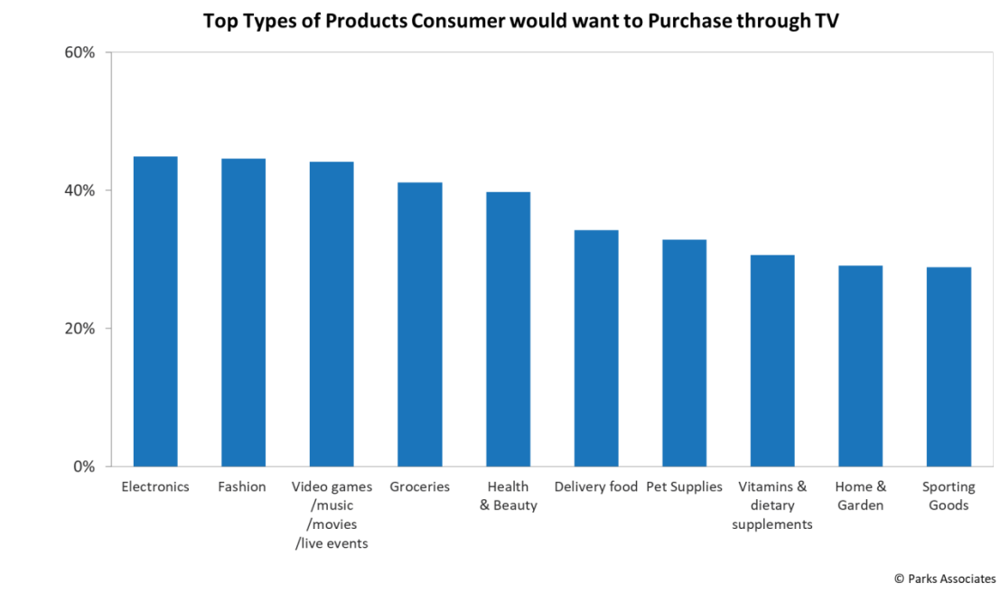

The frequency of consumer shopping online is growing across all platforms, and this trend is also being observed in the realm of Connected TV (CTV), bringing T-commerce noticeable.

The potential for successful T-commerce adoption is with TVs that are connected to a second screen-Mobile. In this scenario, a user who is intrigued by an advertisement on CTV and considering a purchase can proceed with the transaction using mobile phone, without disrupting the programming that is being enjoyed by others on the main screen, as today’s TV viewers are moving from “me” to “we” in the living room.

According to CTV×Commerce survey conducted by INNOD & Roundel, 79% of respondents said they watch most of their video content on streaming platforms, two times more than on traditional and cable TV, 57% of respondents said they use a streaming service supported by ads, 24% higher than last year, and 34% of respondents indicating that they would be willing to scan a QR code while using streaming services to discover a new product.

CTV advertising will increasingly feature shoppable ads. As ad-supported streaming TV adoption increases, it generates greater possibilities for advertisers to enhance engagement with viewers, shorten the conversion funnel, and boost sales.

With increasing streaming content and CTV user penetration, a unique ad format supported by [CTV](/news/how-ctv-is-revolutionizing-advertising) arises for deepen engagement and generates T-commerce. That is aligning QR code with video, the combination of static and video ads. The new ad format supported by CTV, distinct from OTT only supporting video ads, can help advertisers accelerate the strength of digital connection to consumers when combined with mobile growth strategy and reduce friction on the consumer purchase journey, available to bringing users directly to a mobile landing page, app store, or to an app on a mobile device to inspire users to purchase seamlessly, driving sales. Before this process, advertisers must decide where they want to send the users once a QR code is activated. To the app store or the flagship store of e-commerce platform? Both routes can lead to purchase.

The survey also revealed that CTV has contributed 51% of total video impressions in 2022, an increase of 65% compared to 2019. It is a driver up and down the purchase funnel as well, playing an increasingly important role in influencing consumer decisions and enabling shoppable experiences. An example is Else Nutrition, a brand that sells non-soy, plant-based formula for infants, toddlers and young children, launched a CTV campaign in March 2021 resulting in 94% add to cart rate.

In terms of types of products consumer would like to purchase through TV, electronics, fashion and video games/music/movies/live events are the top three categories, according to a research conducted in US by Park Associates.

According to the most recent IAB Video Ad Spend report, buyers score CTV as 57% more effective than linear TV at delivering website/sales actions. While conversion tracking on CTV can be more complex than on other digital platforms, it’s still possible through attribution modelling and re-targeting techniques. Additionally, the latest study of Adweek found that contextual targeting in CTV advertising has resulted in a 41% higher brand recall and a 25% higher purchase intent than standard targeting methods.

With The Trade Desk and MOCA in-house DSP, MOCA can help lower CTV advertising cost through contextual targeting and track all data and make down funnel attribution, giving advertisers quantifiable results from end to end, and enabling them to effectively assess and optimize the performance from TV advertising.

Learn more how to use intent-based CTV plus QR code campaign to drive sales? Contact MOCA at business@moca-tech.net.
