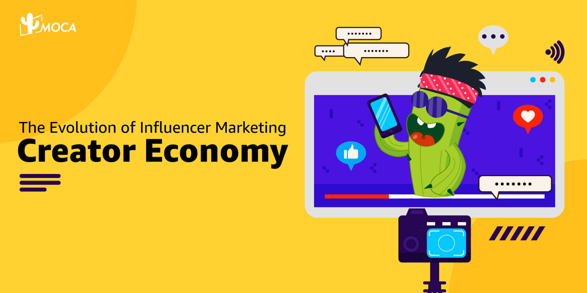

The UGC （User generated content）on social media driven by online careers and birthed the creator economy  is reshaping all industries and professions. Any individual is possible to monetize their own skills and creativity across digital platforms.

Take India market as example, in the last three to five years, the [Indian influencer market](/news/2024-influencer-market-landscape) has experienced significant growth, with individual creator growth exceeding 115% annually, forecasting one million creators with 100,000 followers within three coming years. This growth is underscored by notable recognition from the Prime Minister, who recently felicitated influencers from within the country and beyond during the national creators economy event, highlighting the substantial impact and potency of the influencer medium, and further catalyzing the creator economy in India.

The creator economy, tracing its roots back to 1997, now stands as a multi-billion dollar industry set to reach $480 billion globally by 2027, according to Goldman Sachs. This evolution is propelled by platforms like YouTube, Instagram, Twitter, and TikTok, democratizing content creation and fostering direct connections between creators and audiences, as well as the increasing number of social media users. According to Demand Sage, there are 5.17 billion social media users globally, over 63% of the world’s population, expected to reach 5.42 billion by the end of 2025. This brings increasing monetization opportunities for creators.

For brands, influencer marketing has not only enhances brand visibility but also facilitates quicker content creation compared to traditional methods, allowing them to authentically connect with wider audiences through partnerships with creators.

However, with nano-mega influencers providing abundant options for potential collaborations, it is crucial for brands to do thorough research to ensure alignment between brand value and creator’ content. Utilizing professional influencer marketing platform such as KOLPlanet, brands can streamline this process, offering data-driven insights and analytics to identify the most suitable influencers to realize business goals.

Regulators across Asian countries are revising their frameworks to ensure proper accounting for income generated by sponsored content and brand partnerships. In sensitive sectors like finance and insurance, influencers are now requiring to make upfront declarations identifying paid engagements to protect consumers. For instance, Indonesia has recently prohibited social media operators from facilitating payments in their systems, to separate social commerce from e-commerce and shield micro, small and medium enterprises from predatory pricing.

Additionally, how to make execution transparent and compliant for influencer marketing campaign is also a big concern. Brands should establish appropriate contractual provisions for partnerships with proven record and data to enable better evaluation for  future auditing..

As the influencer marketing ecosystem  continues to evolve, marketers can navigate challenges and leverage the full potential of influencer collaborations, driving growth in the ever-expanding digital landscape, by understanding the dynamics of this ecosystem and implementing best practices.

For expert guidance on the best practices in influencer collaborations, reach out to MOCA at business@moca-tech.net.
