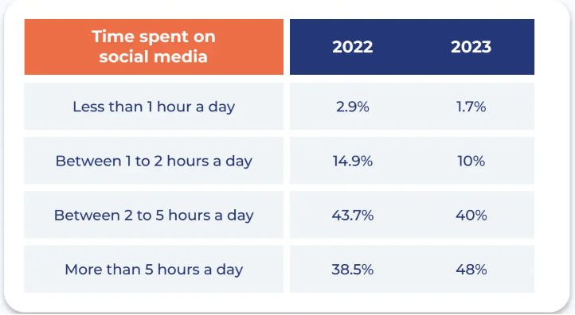
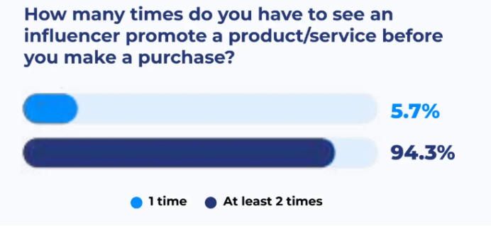
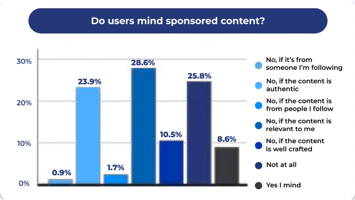
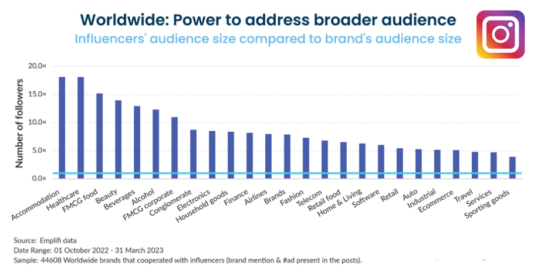

The Global influencer marketing is expected to reach USD 69.92 billion by 2029, at a CAGR of 32.50% during 2022-2029, according to Data Bridge Market Research. In Southeast Asia, the market is estimated to reach $2.59 billion by 2024, as reported in the ‘Asia Pacific: State of Influencer Marketing Report’ by Emplifi.

**With nearly 60% (4.76 billion) of the total global population being social media users, the increase in frequency of brand influencer campaigns is foreseeable. On average, almost 4 in every 10 minutes online is spent on social media platforms.**

*Source: Influencer Marketing 2023, Partipost*

The percentage of brands investing in influencer marketing increased from 73.2% in 2021 to 87.8% in 202**3\. This significant rise can be attributed to the increased number of brands that have collaborated with 51-100 influencers, which grew from 7.3% in 2021 to 18% in 2023**. Moreover, 58% brands said they would spend 10-50% marketing budget in influencer marketing in 2023, according to Partipost’s survey in APAC. Additionally, more than 86% of social media users expressed a preference for influencer accounts over brand accounts as the content of the former is more relatable and with more honest views. The findings align with a survey conducted by Influencer Marketing Hub, which revealed that 61% of customers trust influencer recommendations more than branded content.

When it comes to influencing purchasing decisions, social media influencers have a greater impact compared to product reviews on e-commerce websites. This is particularly evident with nano influencers (those with 5,000 or fewer followers), as 54.4% of users stated that nano influencers motivate them to make a purchase.

However, one-off campaigns are simply not enough for consumers to convert into customers. More than 94% of social media users have to see an influencer promote a product/service at least 2 times before making a purchase.

*Source: Influencer Marketing 2023, Partipost*

In terms of content type, 54% of users also find content authenticity is more important than quality, and more than 90% of users do not mind sponsored content as long as it is authentic and relevant. On average, 67% more sponsored content is posted by influencers whose follower number is less than 10K.

*Source: Influencer Marketing 2023, Partipost*

In terms of content format, brands and celebrities have increased their video usage by 241% in Q1 2023 compared to Q1 2022. Big influencers (followers≥100K）lean heavily into video on Instagram, sharing 27% more video content on average than small influencers （followers ≤50K）.

**Regarding to influencer type, “Arts and music” tops the list** as the most commonly detected interest by influencers sharing sponsored posts on Instagram, the social platform used by 90% influencers, followed by beauty and fashion accessories.

In terms of performance, emplifi data also showed that healthcare brands worldwide, including companies specializing in medical products such as eyewear, medtech, and medication, can potentially increase audience reach by 18x compared to brands within their industry when collaborating with an influencer. **Accommodation brands could see an 18x increase in reach. The beauty industry could see a 14x increase in reach via influencer collaborations.**

Another new trend observed is that brands in various industries, like Home Decor, Fashion, Beauty, and Hospitality, have already tapped into the innovation and reach of virtual influencers. According to Gartner, CMOs are expected to dedicate 30% of their influencer and celebrity budgets to virtual influencers by 2026. In US, 58% of consumers already follow at least one virtual influencer, including 75% of Gen Z.

As a brand, having a clear understanding of the size and category of creators you are looking for simplifies the process of finding influencers. Partnering with diverse social media influencers who have followers aligned with your target audience can reshape your brand and offer a fresh perspective.

Explore how to leverage influencer marketing to reach a vast audience precisely. Contact MOCA at business@moca-tech.net.
