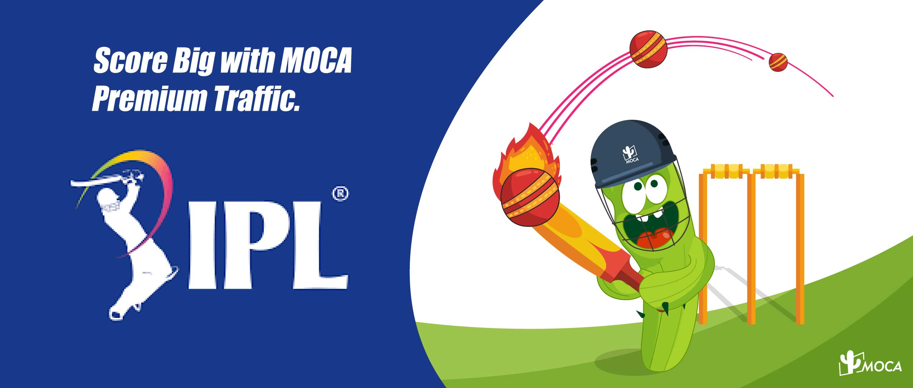
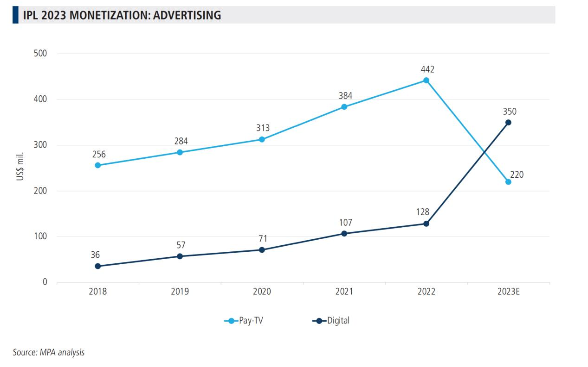
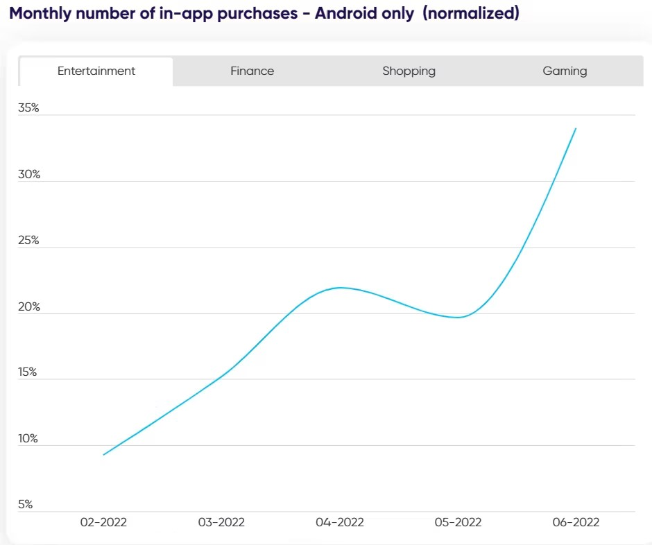

The Indian Premier League (IPL) has attained a status similar to a national festival in India, and its value has surged by almost four times in the past two years, as per the IPL Brand Value Report. The league’s value has risen from $6.2 billion in 2020 to $11 billion in 2022. Star Sports’ coverage of the IPL Auction was viewed by 50 million people, a 35% increase from the previous year and far exceeded the 32 million viewers who watched the FIFA World Cup finals.

**IPL Advertising, especially on Smartphone Greatly Driving Conversions**

The MPA report “The IPL 2023 Test” predicts that the total advertising-income of 2023 IPL is expected to be USD 550 million, including 60% of advertising revenue coming from digital sources.

*However, TV still has the advantage of providing a big-screen experience and fostering whole-family viewing. But when faced with the choice between no viewing and viewing on a small screen, digital wins out. With these small screens, brands have plenty of opportunities to engage with users through various types of content, staying ahead of their mind awareness.*

According to 2022 IPL and the Second Screen Survey, 69% respondents said they watch IPL on TV, 61% on mobile, 28% on laptop, and 9% said they watch on a mix of the above. Moreover,70% of respondents were glued to their smartphones. It means while watching IPL, they continue to use mobile phone to watching match commentary on other platforms & entertainment shows, browsing social media, taking part in online contests and other IPL relevant activities. Brands need leverage this opportunity to catch viewers’ attention and boost conversions. 82% respondents have looked up brands after viewing an ad, 78% said they have downloaded an app after watching an ad during IPL, and 82% said they have bought something after watching an IPL ad.

**Pre-season focus boosts sales mid-to-late season**

Marketers can significantly enhance their sales efforts by targeting the mid-to-late season, with some focus on the pre-season as well. This strategy has consistently proven successful in previous years, as the number of paying users and in-app purchases rises across all categories as excitement builds, according to AppFlyer.

Interestingly, the number of Entertainment purchases peaks in the June post-season, more than 50% higher than the previous month. Shopping apps also see a post-season surge in June.

When it comes to Gaming and Finance, the frequency of in-app purchases experiences a slight increase in March. This is due to Real-Money Gaming Apps bringing onboard new users to complete purchase events by investing money to form new teams. Additionally, fans enthusiastically adopt digital payments for Shopping and Gaming promotions.

**IPL Drives Gaming Industry Growing**

Regarding the gaming industry, fantasy sports platforms have experienced a 20% increase in user base this season, and it is expected to witness a 20-30% growth in user transactions, mainly contributed by gaming users from tier 2 cities.

Real Money Gaming (RMG) platforms are some of the key factors driving the growing adoption of fantasy sports platforms. That’s not all, under its pilot program, Google allows mainly big players like Dream11, MPL Rummy, and Fantasy Cricket on the Google Play Store.

The increasing popularity of IPL greatly pushes the growing of the platforms. According to SocialSamosa, this cricket tournament contributes almost 35-40% of the total annual revenue earned by fantasy gaming platforms. The average revenue contribution per user for this season is expected to be Rs. 440, up from Rs. 410 in IPL 2022.

In terms of Advertising revenue, IPL advertising revenue has grown threefold since 2018, according to moneycontrol. From 2023 to 2027, the TV advertising rate is estimated to be 10% up and digital advertising rate will be 30% higher. With the IPL business soaring to new heights, advertisers end up shelling out high premiums to feature during the matches.

### **Gaming & Shopping marketers should test effectiveness in early playoffs**

Remarketing—particularly in Shopping—experiences a lot of fluctuation, especially during the preseason, when nearly 30% of conversions happen within three weeks, which is more than double the amount during the post-season. Meanwhile, Gaming experiences a surge in conversions, with over 37% occurring during the last five weeks of IPL, compared to just over 23% in the initial five weeks, representing an increase of over 60%. AppsFlyer noted that this increase in conversions led to a surge in sessions during this period.

Therefore, while targeting the late season may be beneficial for Gaming, Shopping marketers should also consider the preseason’s over-indexing and focus on early playoffs to maximize their impact.

Want to know more about IPL Advertising? Contact MOCA at businesss@moca-tech.net
