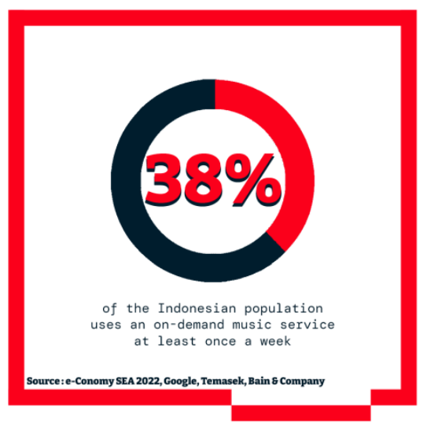
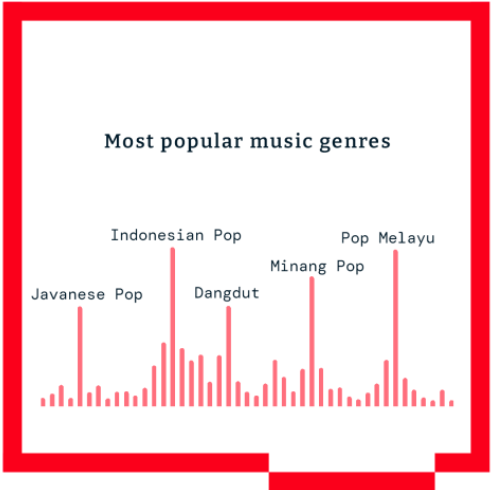

Indonesia, along with China and India, is among the few Asian countries with a large existing user base and rapid expected growth in consumer spending and advertising. **The overall Indonesian Entertainment & Music revenue is expected to grow at a 7.7% CAGR through 2027.**

The OTT streaming platforms increasingly dominate the media & entertainment industry. In Indonesia, OTT market is experiencing 27% annual growth, and it is expected to reach $1.5 billion by 2026. In 2022, when Indonesia discontinued its analog terrestrial broadcasting, it is estimated that [Indonesia market](/news/rising-trends-and-challenges-of-indonesia-fmcg-market) will have the highest OTT adoption rate in Southeast Asia. Currently, nearly one out of every three Indonesians was using streaming platforms, and the total hours spent on these services were increasing by 40% each year.

The flourish market is attracting global giants like Disney+ Hotstar vying for attention alongside with a thriving community of local and regional players such as WeTV, iQiyi and Vidio.

In terms of streaming content, live events—especially sports—to garner huge viewing audiences is a growth driver. In the buoyant Indonesian OTT marketplace, local streaming provider Vidio competes with the global giants by offering premium sports content like English Premier League soccer. In 2022, Vidio was the country’s fastest-growing streaming service, with about 60 million active users per month, said PwC.

The revenue of digital music in South East Asia is projected to reach US$713.40m in 2023, with about 90% contributed by music streaming. Similar market landscape is observed in Indonesia music publishing market, said IFPI’s 2023 Global Report.

As per the report published by Google, Temasek and Bain Company in 2022, 38% of Indonesian use an on-demand music service at least once a week. In comparison, the average is just 28% for the SEA region. And 13% of Indonesian users use music on-demand services for at least one hour per day. It’s particularly true in urban areas, where 57% of digital users use a Music on demand service.

In terms of music consumption, about five years ago,70% was international while 30% was local. Lately, however, the market has become much more local, people consume a lot of Indonesian and Javanese songs. The consumption split has shifted to 60% international and 40% local.

The main music genre here is Indonesian Pop (in the Indonesian language). It then extends to Java pop, which is pop in the Javanese language (55% of people in Indonesia are Javanese). Other local genres include Minangkabau pop, Bataknese Music, Sundanese Music, Manado Music, Papua Music, Ambon Music…

Converting a free user to a paying user is a long and hard process for the DSPs, as it takes time to educate users towards the benefits of a premium model. In other words, the conversion in Indonesia is at early stage, indicating huge market potential to be explored.

Statista said the revenue in the Music Streaming Advertising market is projected to reach US$31.81million in 2023, showing an annual growth rate (CAGR 2023-2027) of 5.02%, resulting in a projected market volume of US$38.69 million by 2027. In terms of user number, it is expected to amount to 21.8 million by 2027, with 7.5% user penetration. This presents a significant opportunity for brands to leverage the growing market to build connections with users.

Want to explore more about how to acquire users from music streaming platform? Contact MOCA at business@moca-tech.net.
