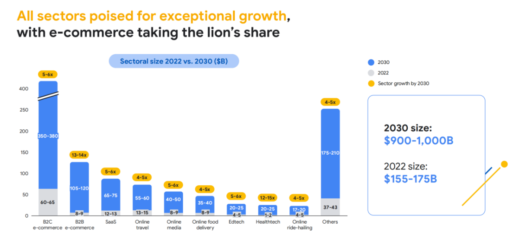
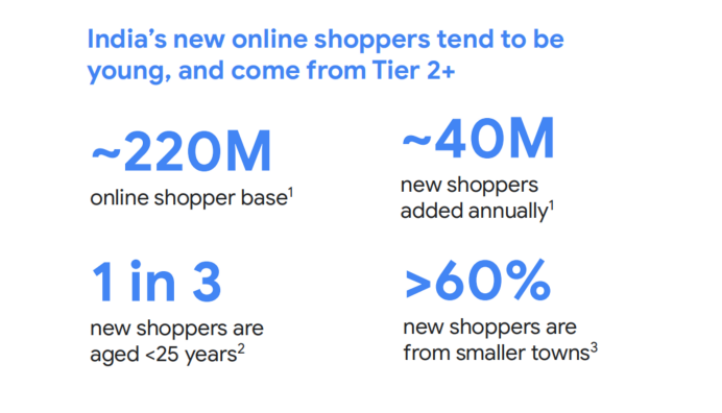
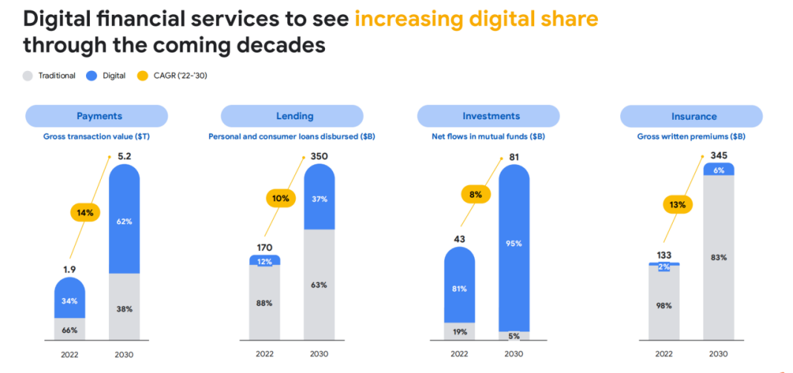
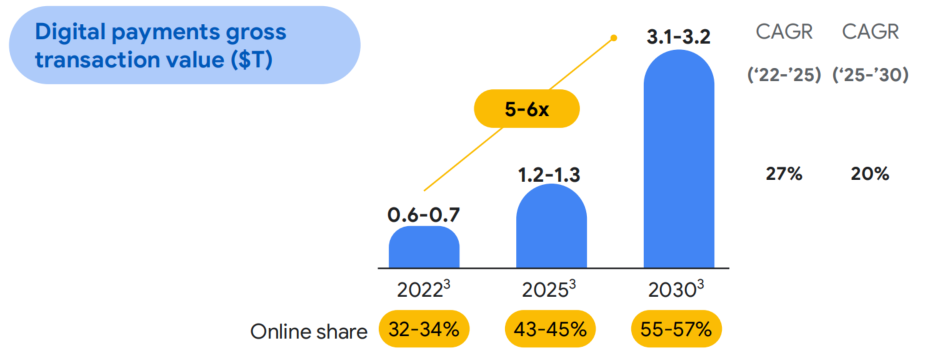
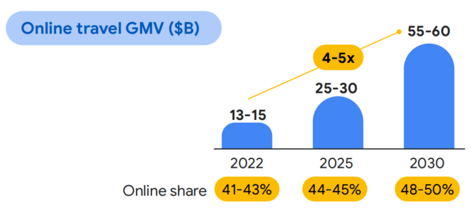
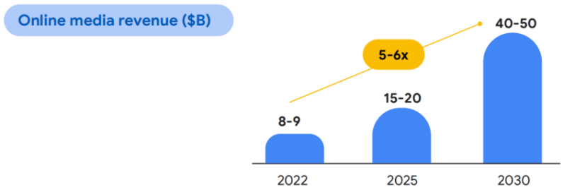

As India undergoes a substantial growth phase, the surge in B2C e-commerce Gross Merchandise Value (GMV), currently at $65 billion, is anticipated to witness a sixfold increase, reaching $380 billion by 2030, predominantly driven by increased penetration in smaller towns and cities, according to the research report jointly developed by Google, Bain & Company and Temasek.

**The Booming B2C Ecommerce in India**

All sectors are poised for exceptional growth, with e-commerce taking the lead. Platform preferences indicates that 65% of consumers prefer purchasing from e-commerce platforms, while only 28% opt for official brand websites and multi-brand stores. 85% of e-commerce shoppers stick to a preferred platform when making significant and/or pricey purchases.

**Digital Opportunities in T2+ Cities in India**

Shifts in Indian consumer habits present significant opportunities in T2+ cities, where over 1 billion people reside and 40 million new shoppers added annually, providing a substantial potential audience for digital players. In 2022, three in five new e-commerce consumers were from T3+ towns, and the trend of rapid digital adoption is expected to continue, with the rural internet projected to grow from ~400 million in 2022 to 480 million by 2025.

Compared to their counterparts in metros and Tier 1 cities, T2+ digital consumers spend more time online, averaging 4.5 hours per day. Moreover, T2+ digital consumers exhibit openness to experimenting with new brands and products, with 83% willing to try new offerings, as digital opened a plethora of new choices and they’re deciding which products and services they like/dislike, unlike Metro consumers, who are more mature. Additionally, 71% of those from T2+ India are open to exploring diverse content on over-the-top (OTT) platforms, regardless of genre, language or which country it comes from, when consuming content via over-the-top (OTT) platforms.

T2+ digital consumers trust local and relatable influencers more than traditional celebrities, driving influencer marketing growth. Indian marketing spend on influencers is projected to exceed $3 billion by 2030, including 70% contributed by non-celebrity influencers.

**Healthcare Preference**

In terms of category, healthcare is a key category that will bring substantial growth to T2+ cities. 71% digital consumers said they are willing to pay a premium for better quality healthcare. Furthermore, a significant portion of digital consumers is open to paying for digital tools that monitor health risks for their parents, provided the data is secure. 84% of T2 digital consumers are comfortable doing e-consultations if they can access a reputable doctor for the best healthcare possible — more than any other segment. This willingness to pay premiums extends to food deliveries, with 78% expressing a preference for fresh, organically-sourced, chemical-free ingredients.

**Digital Transformation in Finance**
In the financial sector, the increasing acceptance of digital tools and solutions by both consumers and merchants push the significant growth of digital financial services, with digital payment leading the market, followed by lending sector. By 2025, the transaction value of digital payment sector js expected to reach $1.3 trillion，about 45% of online share.

Cash maintains a strong foothold in India, with over 50% of Indians preferring to deal in cash transactions, according to a 2021 RBI survey. However, the adoption of UPI and QR code-based payment systems is expanding rapidly, with 2022’s 50M QR codes expected to reach 250M+ by 2025 — and will likely displace cash over time.

Regarding to insurance, 90% of consumers are willing to purchase life insurance from digital channels, including policy aggregators or insurance providers, indicating the market is ready.

**India Online Travel Market Trend**

The online travel sector is to grow steadily and reclaim its role as

key contributor to India’s internet economy, growing at 57% during 2022 to 2023 and expected to grow at 15% in 2023 to 2025. 55% of online travel users are taking leisure trips primarily to explore new destinations or cultures, learn something new, do charitable work, do outdoor activities, or try new cuisines, and 35% of online travel users show preference for spontaneous trips. As income levels rise, travelers will be increasingly willing to pay a premium for flexibility and superior service. Another positive development for the travel industry is the Indian government’s initiative to enhance air connectivity by introducing 80 new airports over the next five years. This expansion is expected to significantly contribute to the further development of the travel market.

*Significant growth in online mediaIndians spend about 3 hours a day watching video content recreationally. 60% of total watch time is spent on paid and subscribed platforms, 73% watch on mobile, and 13% spent on TV. In 2022, 110 million Indians have paid to play online mobile games. With 40-60% of total gaming population coming from T2+ towns, the Ludo King app has garnered 800M+ downloads on the Google Play Store alone. Fantasy gaming has emerged as a favourite — not surprising given cricket’s large fan base in India. Regulations in the segment are still evolving, and incumbents are awaiting more clarity amidst growing demand. eSports, a proven segment globally, remains a whitespace in India. While it is witnessing growing demand among younger Indian gamers, overall uptake has been gradual.*

Across most internet sectors, conveniences like ease of delivery, frictionless payment, ease of checkout, user experience, etc., are among the highest ranked drivers for usage along with value factors like price, promotions, discounts and rewards.

Looking to capitalize on those market and effectively reach your target audience with transparent inventory with performance guaranteed? Contact MOCA at business@moca-tech.net
