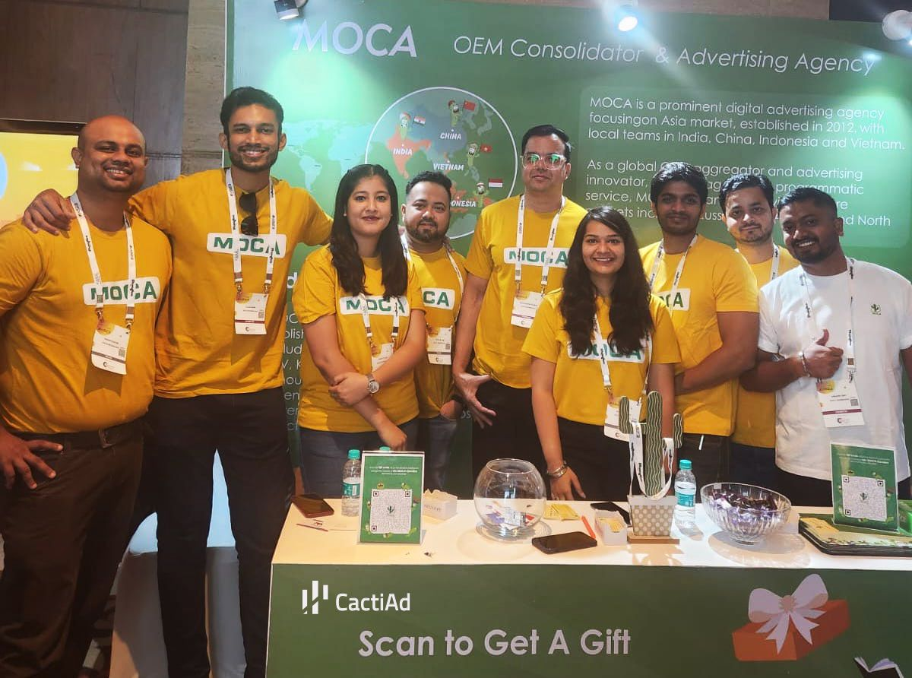
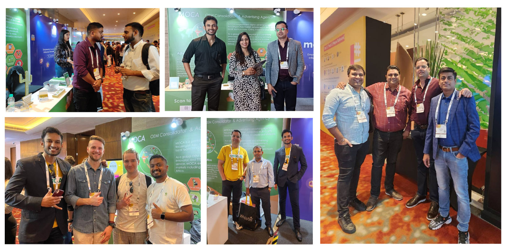

The 9th edition of IAS, India’s top-tier networking event, took place from October 11 to 12, 2023.

At MOCA booth, team had in-depth discussions with numerous visitors from various industries to explore collaboration opportunities, focusing on OEM, CTV, influencer, branding, and app installation.

Heartfelt appreciation for all visitors who standby at the MOCA booth.

The IAS23 has brought together over 7,000 digital marketing professionals from more than 16 countries. and 1000 of them had visited the MOCA booth. According to IAS officials, representatives of over 600 brands were present there, and more than 90 brands had their own exhibitions showcasing their services. Booth No. 2 of MOCA was a catching sight for the attendees, where they engaged in profound and meaningful conversations, delving into a multitude of collaborative possibilities.

With over a decade of experience in the field of digital advertising services and the presence of local teams in China, India, Indonesia, and Vietnam, MOCA is well versed in running advertising campaigns for brands, advertisers, and app developers on the above-stated inventories.

1\. **OEM Inventory:** Xiaomi, Samsung, Vivo, OPPO, Huawei, Infinix, Tecno, Itel, Moto, and Lenovo, including Appstore and PAI/Air install solutions.

**2\. In-app Inventories from direct app developers**: Xender, Share-it, Snaptube, Vidmate, Facemoji, Hippo, Phoenix, mAst, etc.

**3\. CTV Inventory:** MITV (Xiaomi TV) for app installs on TV, branding (Banner & Video on homepage), and brand integration on TV remote.

If you are interested and would like to have further communication about cooperation, feel free to contact MOCA at business@moca-tech.net.
