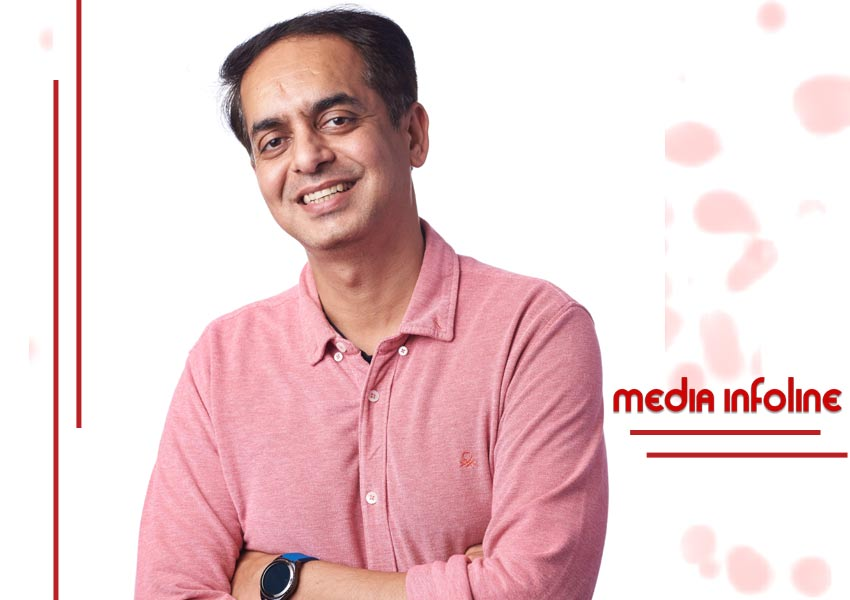
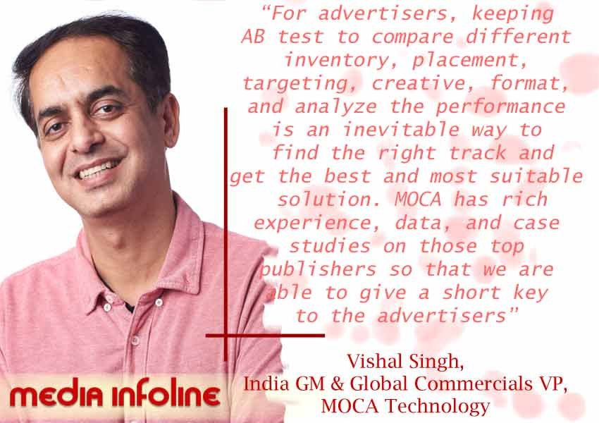

## Moca Technology was established in 2012. The name is an abbreviation of “Mobile Cactus, meaning nourishes the brands to thrive in the markets. [MOCA](https://www.linkedin.com/company/moca-tech/) is one of the largest OEM Consolidators across the globe. It works directly with more than 500 brands across all categories for years.

### ***In a chat with Mr. Vishal Singh, India GM & Global VP, Commercials at MOCA Technology:***

### Q) Tell us more about MOCA Technology.

We are one of the largest OEM consolidators across the globe and an advertising innovator. Partner with many global top-ranking apps, we help advertisers make innovative formats & combinations for contextualized promotion. Furthermore, we provide a one-stop advertising solution including app uploading, air pre-install, user acquisition, re-engagement, and brand awareness on OEM app stores. We have handled many clients across India and SEA markets and have successfully helped them achieve their campaign objectives.

### ***Also read:*** [***Blue Dart Med-Express Consortium To Deliver Vaccine Through Drones To Remote India***](https://www.mediainfoline.com/brand/blue-dart-med-express-consortium-to-deliver-vaccine-through-drone)

### Q) How does MOCA work? What is the procedure?

Providing a wide range of mobile marketing solutions such as user acquisition through OEM, re-engagement solutions, and branding solutions. We facilitate one-stop service solution across all OEM app stores with partners such as Xiaomi, Samsung, Vivo, OPPO, Huawei, Infinix, Tecno, and Itel, that covers 80% share of the smartphone market. Our services include app uploading, air pre-install, user acquisitions, and brand awareness, which help reduce the risk of rejection and control user acquisition and overall cost. For re-engagement solutions, we can reach out to inactive users to engage with the app again, which is a super cost-effective solution that helps advertisers retain their users and keep a large, valuable and active user base. For branding solutions, we have a social, sticker, pre-roll video, music, beauty, weather, SMS, etc. Our solutions cover all user touchpoints as a single solution does not work anymore. We customize advertising solutions to meet client’s objectives. Clients just need to let us know their objectives, target audience, and budgets. We tailor a trackable and cost-effective solution.

### Q) With a wide clientele, how is MOCA dedicating its service to each of them?

> MOCA Technology is always ready to listen to the clients ‘or advertisers  needs. We always thrive to be the most trusted and reliable partner for in  providing one-stop service , improving efficiency and extend effective communications across all OEMs and Top publishers. Additionally our endeavor is to help them reach target audiences and to be the top-of-mind brand on consumer’s recall. As different advertisers have different objectives, target audiences, as well as budgets, we tailor make solutions based on their needs.

### Q) How traceable mobile marketing solutions are helping brands?

Currently, more than 55% of online activities such as online searches, email activities, playing games, online shopping, banking are done through mobile devices since they are more convenient to use and consumers expect to have the best possible user experience. For advertisers, keeping AB test to compare different inventory, placement, targeting, creative, format, and analyze the performance is an inevitable way to find the right track and get the best and most suitable solution. Meanwhile, dealing with multiple publishers and understand all their capability is a time-consuming job and high-cost learning. MOCA has rich experience, data, and case studies on those top publishers so that we are able to give a short key to the advertisers,  to find the right way with cost-effective solutions.

### Q) How has the pandemic turned out for your business?

Pandemic has entirely changed the way people live as well as business logic. People can now easily find a fast and cheap service and solution on mobile phones. Traffic and online user base have become a huge asset, which can be converted to huge value and money in any way and driven by capital. The market is not shared fairly by big, giant, and small companies. To be on the top is the only way to survive and to be seen. The capability of online marketing and user acquisition is more critical than ever. This is what we provide. MOCA provides an overall solution including but not limited to user acquisition, OEM app store promotion, branding, music, beauty, social, game, weather, SMS solution, we help advertisers build high barriers to be the next unicorn.

### ***Also read:*** [***Dineout Donates PromoCash In #IndiaStandsTogether Campaign***](https://www.mediainfoline.com/brand/dineout-donates-promocash-indiastandstogether)

### Q) What are your marketing strategies?

At MOCA our vision is to be known as the most reliable and preferred partner when it comes to advertising solutions across smartphones. Our key marketing strategy is to treat all advertisers as equal; big or small. We cater to the advertising requirements of each advertiser with a tailor-made solution. The team believes in regular conversations with the media and brand fraternity to get engaged with the campaigns at the time of conceptualization, to be able to help with ROI maximization.

### Q) How are you aiming to broaden your work/ presence?

> We have teams across different geographies like India, Indonesia, Vietnam, and China. Recently, we have expanded to Malaysia and Singapore too. We are also working on setting up a team in India to cater to other markets of SEA. Our focus is not only to hire the right talent but also to nurture the talent to become the best in the business. In the last 18 months, during the COVID 19 times, MOCA has worked with more than 200 brands across markets. We are also constantly looking at more relevant partners to tie up so that more value can be added to each and every campaign, branding, and/or performance.

### Q) What are your future plans?

On the product front, we intend to create cross-publisher solutions through our DMP, so as to build a strong connection between user subconsciousness and brands. On the other hand, the intention is to build MOCA as the best place to work with world-class teams across geographies.
